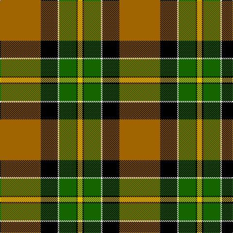

In pattern [RKWGKY](/stripes/rkwgky/).

This was sourced from register-of-tartans.  It is a [6 stripe tartan](/stripes/stripes6/).

Original link https://www.tartanregister.gov.uk/tartanDetails.aspx?ref=339

## Register references

External register numbers recorded for this tartan.

- Scottish Register of Tartans: [339](https://www.tartanregister.gov.uk/tartanDetails.aspx?ref=339)
- Scottish Tartans Authority (ITI): 1884
- Scottish Tartans World Register: 1884

## Thread count
DO/84 K35 W3 G35 K3 Y/10

## Palette
Each colour and the base-6 reference it is a variant of.

| Colour | Shade | Base |
|---|---|---|
| DO | <code style="background-color:#A06400;">#A06400</code> `oklch(55.6% 0.121 69.2)` <small>#A06400</small> | R <code style="background-color:#CC0000;">#CC0000</code> |
| G | <code style="background-color:#146400;">#146400</code> `oklch(43.9% 0.144 140.9)` <small>#146400</small> | G <code style="background-color:#006100;">#006100</code> |
| K | <code style="background-color:#000000;">#000000</code> `oklch(0.0% 0.000 0.0)` <small>#000000</small> | K <code style="background-color:#000000;">#000000</code> |
| W | <code style="background-color:#FFFFFF;">#FFFFFF</code> `oklch(100.0% 0.000 89.9)` <small>#FFFFFF</small> | W <code style="background-color:#F7F7F7;">#F7F7F7</code> |
| Y | <code style="background-color:#DCC000;">#DCC000</code> `oklch(80.7% 0.167 98.6)` <small>#DCC000</small> | Y <code style="background-color:#F2BF00;">#F2BF00</code> |

# Sample pattern

## Nearest tartans

The nearest existing variants by ΔTartan distance, with this tartan at the top so the swatches line up against it.

ΔTartan

Tartan

Sett

—

<a href="/ttd/edit/#slug=o84k35w3g35k3ly10">Brandon (Manitoba)</a> <a class="nn-out" href="/setts/s6/o84k35w3g35k3ly10/" title="open its dictionary page">↗</a>

0.09

<a href="/ttd/edit/#slug=o84k35lr3g35k3ly10">Brandon (Manitoba) (District)</a> <a class="nn-out" href="/setts/s6/o84k35lr3g35k3ly10/" title="open its dictionary page">↗</a>

0.88

<a href="/ttd/edit/#slug=y83k35w3g35k3ly10">Brandon, Manitoba</a> <a class="nn-out" href="/setts/s6/y83k35w3g35k3ly10/" title="open its dictionary page">↗</a>

1.33

<a href="/ttd/edit/#slug=dy30ly5t10k10w2k2~x2">Bryan Wedding (Personal)</a> <a class="nn-out" href="/setts/s6/dy30ly5t10k10w2k2~x2/" title="open its dictionary page">↗</a>

1.36

<a href="/ttd/edit/#slug=k54lr6k6lr6o20lo40k6ly3">Clyde Valley HOG</a> <a class="nn-out" href="/setts/s8/k54lr6k6lr6o20lo40k6ly3/" title="open its dictionary page">↗</a>

1.42

<a href="/ttd/edit/#slug=g3r16w4k6g28r1g3~x2">Pollock</a> <a class="nn-out" href="/setts/s7/g3r16w4k6g28r1g3~x2/" title="open its dictionary page">↗</a>

1.42

<a href="/ttd/edit/#slug=ly4k1dg16k16r1w3~x2">MacLamroc</a> <a class="nn-out" href="/setts/s6/ly4k1dg16k16r1w3~x2/" title="open its dictionary page">↗</a>

1.44

<a href="/ttd/edit/#slug=k6r2g17r16k1t2~x2">Unidentified 12</a> <a class="nn-out" href="/setts/s6/k6r2g17r16k1t2~x2/" title="open its dictionary page">↗</a>

1.45

<a href="/ttd/edit/#slug=lo16k7w1g7k1ly3~x4">Hamilton of Brandon (Fashion)</a> <a class="nn-out" href="/setts/s6/lo16k7w1g7k1ly3~x4/" title="open its dictionary page">↗</a>

1.51

<a href="/ttd/edit/#slug=k3g2k21w11g1y21g2y3~x2">Dalveen (Fashion)</a> <a class="nn-out" href="/setts/s8/k3g2k21w11g1y21g2y3~x2/" title="open its dictionary page">↗</a>

1.62

<a href="/ttd/edit/#slug=r10w2k10w10dy35k5~x2">Loch Ness</a> <a class="nn-out" href="/setts/s6/r10w2k10w10dy35k5~x2/" title="open its dictionary page">↗</a>

## Neighbour map

Every grey dot is one of 14299 variants placed by the first two principal components of the ΔTartan feature space (44% of its variance). Red is this tartan; blue dots are its nearest — click one to open its page.

<svg viewBox="0 0 640 380" role="img" style="max-width:100%;height:auto;border:1px solid #e0e0e0;border-radius:4px;display:block" xmlns="http://www.w3.org/2000/svg"><image href="/nn/cloud.v1.png" width="640" height="380"/><a href="/setts/s6/o84k35lr3g35k3ly10/"><circle cx="263.3" cy="133.1" r="4" fill="#3465a4"><title>Brandon (Manitoba) (District)</title></circle></a><a href="/setts/s6/y83k35w3g35k3ly10/"><circle cx="249.9" cy="133.5" r="4" fill="#3465a4"><title>Brandon, Manitoba</title></circle></a><a href="/setts/s6/dy30ly5t10k10w2k2~x2/"><circle cx="252.7" cy="161.5" r="4" fill="#3465a4"><title>Bryan Wedding (Personal)</title></circle></a><a href="/setts/s8/k54lr6k6lr6o20lo40k6ly3/"><circle cx="229.2" cy="131.4" r="4" fill="#3465a4"><title>Clyde Valley HOG</title></circle></a><a href="/setts/s7/g3r16w4k6g28r1g3~x2/"><circle cx="322.3" cy="141.5" r="4" fill="#3465a4"><title>Pollock</title></circle></a><a href="/setts/s6/ly4k1dg16k16r1w3~x2/"><circle cx="212.8" cy="162.7" r="4" fill="#3465a4"><title>MacLamroc</title></circle></a><a href="/setts/s6/k6r2g17r16k1t2~x2/"><circle cx="235.4" cy="170.5" r="4" fill="#3465a4"><title>Unidentified 12</title></circle></a><a href="/setts/s6/lo16k7w1g7k1ly3~x4/"><circle cx="216.0" cy="162.8" r="4" fill="#3465a4"><title>Hamilton of Brandon (Fashion)</title></circle></a><a href="/setts/s8/k3g2k21w11g1y21g2y3~x2/"><circle cx="198.4" cy="130.7" r="4" fill="#3465a4"><title>Dalveen (Fashion)</title></circle></a><a href="/setts/s6/r10w2k10w10dy35k5~x2/"><circle cx="253.1" cy="169.2" r="4" fill="#3465a4"><title>Loch Ness</title></circle></a><circle cx="260.8" cy="131.6" r="5" fill="#c00000"/></svg>

ID: /setts/s6/o84k35w3g35k3ly10/
