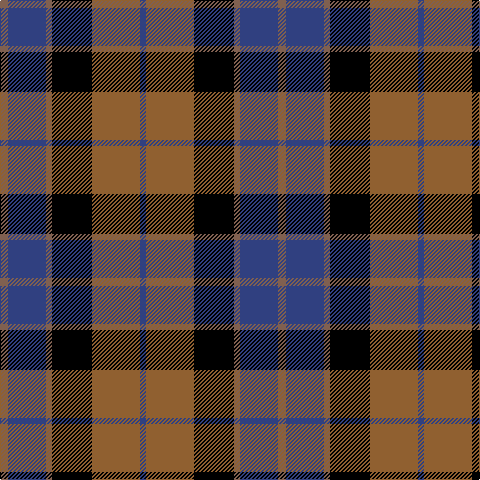

This page is one **sett** — a single exact thread-count. It belongs to the [tartan](/tartans/oi4db19oi3k20o24db3/)
(the same proportion at any scale), whose colour order is pattern [BRKRBR](/stripes/brkrbr/).

Sourced from weddslist.  It is a [6 stripe tartan](/stripes/stripes6/).

Original link http://www.weddslist.com/cgi-bin/tartans/pg.pl?source=sts

## Thread count
LTa/8 B38 LTa6 K40 LT48 B/6

## Palette

Palette: <strong>Ingles Buchan</strong> <small style="color:#888">(1 of 4 colours)</small>
<table><thead><tr><th>Colour</th><th>Threads</th><th>Shade</th><th>Base</th><th>OKLCh</th></tr></thead><tbody><tr><td>LTa/</td><td style="text-align:right;font-variant-numeric:tabular-nums">8</td><td><code style="background-color:#806050;">#806050</code> <small style="color:#888">#806050</small></td><td>R <code style="background-color:#CC0000;">#CC0000</code></td><td><small style="color:#888">oklch(51.7% 0.049 47.8)</small></td></tr><tr><td>B</td><td style="text-align:right;font-variant-numeric:tabular-nums">38</td><td><code style="background-color:#304080;">#304080</code> <small style="color:#888">#304080</small></td><td>B <code style="background-color:#2A418A;">#2A418A</code></td><td><small style="color:#888">oklch(39.4% 0.109 270.2)</small></td></tr><tr><td>LTa</td><td style="text-align:right;font-variant-numeric:tabular-nums">6</td><td><code style="background-color:#806050;">#806050</code> <small style="color:#888">#806050</small></td><td>R <code style="background-color:#CC0000;">#CC0000</code></td><td><small style="color:#888">oklch(51.7% 0.049 47.8)</small></td></tr><tr><td>K</td><td style="text-align:right;font-variant-numeric:tabular-nums">40</td><td><code style="background-color:#000000;">#000000</code> <small style="color:#888">#000000</small></td><td>K <code style="background-color:#000000;">#000000</code></td><td><small style="color:#888">oklch(0.0% 0.000 0.0)</small></td></tr><tr><td>LT</td><td style="text-align:right;font-variant-numeric:tabular-nums">48</td><td><code style="background-color:#906030;">#906030</code> <small style="color:#888">#906030</small></td><td>R <code style="background-color:#CC0000;">#CC0000</code></td><td><small style="color:#888">oklch(53.1% 0.089 63.7)</small></td></tr><tr><td>B/</td><td style="text-align:right;font-variant-numeric:tabular-nums">6</td><td><code style="background-color:#304080;">#304080</code> <small style="color:#888">#304080</small></td><td>B <code style="background-color:#2A418A;">#2A418A</code></td><td><small style="color:#888">oklch(39.4% 0.109 270.2)</small></td></tr></tbody></table>

# Sample pattern

## Nearest tartans

The nearest existing variants by ΔTartan distance, with this tartan at the top so the swatches line up against it.

ΔTartan

Tartan

Sett

—

<a href="/ttd/edit/#slug=oi4db19oi3k20o24db3~x2">Edinburgh International Conference Centre</a> <a class="nn-out" href="/setts/s6/oi4db19oi3k20o24db3~x2/" title="open its dictionary page">↗</a>

0.50

<a href="/ttd/edit/#slug=ly6dg3ly3dg22k23dp23k4~x2">Gordon of Esslemont</a> <a class="nn-out" href="/setts/s7/ly6dg3ly3dg22k23dp23k4~x2/" title="open its dictionary page">↗</a>

0.68

<a href="/ttd/edit/#slug=ly6g3ly3g22k23dp23k4~x2">Gordon of Esslemont Family Tartan Tartan Number: 1064. Earliest known date: c.1830 This sett is called 'Gordon of Esslemont' according to Captain Wolrige-Gordon of Esslemont in recent research. It was previously listed as 'Ancient Gordon' before the story of its origin came to light. Apparently the Duke of Gordon was offered tartans with one, two, and three stripes when he applied to Forsythe of Huntly to provide kilts for his troops. He chose the single stripe and called in the Heads of the families to choose from the others. Esslemont took the three stripe version. See products available Copyright © Blair Urquhart, Comrie, 2015</a> <a class="nn-out" href="/setts/s7/ly6g3ly3g22k23dp23k4~x2/" title="open its dictionary page">↗</a>

0.71

<a href="/ttd/edit/#slug=k1dg8r6db8k1~x4">Edinburgh Military Tattoo 50th</a> <a class="nn-out" href="/setts/s5/k1dg8r6db8k1~x4/" title="open its dictionary page">↗</a>

0.86

<a href="/ttd/edit/#slug=w2r3dg9r3db2r3db3w1~x6">Utah (US State)</a> <a class="nn-out" href="/setts/s8/w2r3dg9r3db2r3db3w1~x6/" title="open its dictionary page">↗</a>

0.93

<a href="/ttd/edit/#slug=k3g17w2k18p17g3~x2">Wilson's, No 76</a> <a class="nn-out" href="/setts/s6/k3g17w2k18p17g3~x2/" title="open its dictionary page">↗</a>

0.95

<a href="/ttd/edit/#slug=k3g17ly2k18p17g3~x2">Wilson's, No 100</a> <a class="nn-out" href="/setts/s6/k3g17ly2k18p17g3~x2/" title="open its dictionary page">↗</a>

0.96

<a href="/ttd/edit/#slug=ly8k4o39k37dt36k6dt7">Oceanic (Corporate?)</a> <a class="nn-out" href="/setts/s7/ly8k4o39k37dt36k6dt7/" title="open its dictionary page">↗</a>

0.97

<a href="/ttd/edit/#slug=p3k1p8k6g8k1w2~x2">Baillie</a> <a class="nn-out" href="/setts/s7/p3k1p8k6g8k1w2~x2/" title="open its dictionary page">↗</a>

1.00

<a href="/ttd/edit/#slug=k1db8r6g8k1~x4">Edinburgh Tattoo 50th (Commemorative</a> <a class="nn-out" href="/setts/s5/k1db8r6g8k1~x4/" title="open its dictionary page">↗</a>

1.02

<a href="/ttd/edit/#slug=db6k1db6k8r1g8r2~x2">Fletcher of Dunans</a> <a class="nn-out" href="/setts/s7/db6k1db6k8r1g8r2~x2/" title="open its dictionary page">↗</a>

## Neighbour map

Every grey dot is one of 14359 variants placed by the first two principal components of the ΔTartan feature space (44% of its variance). Red is this tartan; blue dots are its nearest — click one to open its page.

<svg viewBox="0 0 640 380" role="img" style="max-width:100%;height:auto;border:1px solid #e0e0e0;border-radius:4px;display:block" xmlns="http://www.w3.org/2000/svg"><image href="/nn/cloud.v1.png" width="640" height="380"/><a href="/setts/s7/ly6dg3ly3dg22k23dp23k4~x2/"><circle cx="148.6" cy="218.4" r="4" fill="#3465a4"><title>Gordon of Esslemont</title></circle></a><a href="/setts/s7/ly6g3ly3g22k23dp23k4~x2/"><circle cx="143.4" cy="212.1" r="4" fill="#3465a4"><title>Gordon of Esslemont Family Tartan Tartan Number: 1064. Earliest known date: c.1830 This sett is called 'Gordon of Esslemont' according to Captain Wolrige-Gordon of Esslemont in recent research. It was previously listed as 'Ancient Gordon' before the story of its origin came to light. Apparently the Duke of Gordon was offered tartans with one, two, and three stripes when he applied to Forsythe of Huntly to provide kilts for his troops. He chose the single stripe and called in the Heads of the families to choose from the others. Esslemont took the three stripe version. See products available Copyright © Blair Urquhart, Comrie, 2015</title></circle></a><a href="/setts/s5/k1dg8r6db8k1~x4/"><circle cx="167.7" cy="247.2" r="4" fill="#3465a4"><title>Edinburgh Military Tattoo 50th</title></circle></a><a href="/setts/s8/w2r3dg9r3db2r3db3w1~x6/"><circle cx="158.4" cy="207.6" r="4" fill="#3465a4"><title>Utah (US State)</title></circle></a><a href="/setts/s6/k3g17w2k18p17g3~x2/"><circle cx="154.6" cy="213.7" r="4" fill="#3465a4"><title>Wilson's, No 76</title></circle></a><a href="/setts/s6/k3g17ly2k18p17g3~x2/"><circle cx="155.6" cy="214.0" r="4" fill="#3465a4"><title>Wilson's, No 100</title></circle></a><a href="/setts/s7/ly8k4o39k37dt36k6dt7/"><circle cx="173.0" cy="210.4" r="4" fill="#3465a4"><title>Oceanic (Corporate?)</title></circle></a><a href="/setts/s7/p3k1p8k6g8k1w2~x2/"><circle cx="147.8" cy="208.7" r="4" fill="#3465a4"><title>Baillie</title></circle></a><a href="/setts/s5/k1db8r6g8k1~x4/"><circle cx="142.3" cy="233.8" r="4" fill="#3465a4"><title>Edinburgh Tattoo 50th (Commemorative</title></circle></a><a href="/setts/s7/db6k1db6k8r1g8r2~x2/"><circle cx="147.1" cy="229.1" r="4" fill="#3465a4"><title>Fletcher of Dunans</title></circle></a><circle cx="153.2" cy="224.2" r="5" fill="#c00000"/></svg>

ID: /setts/s6/oi4db19oi3k20o24db3~x2/
