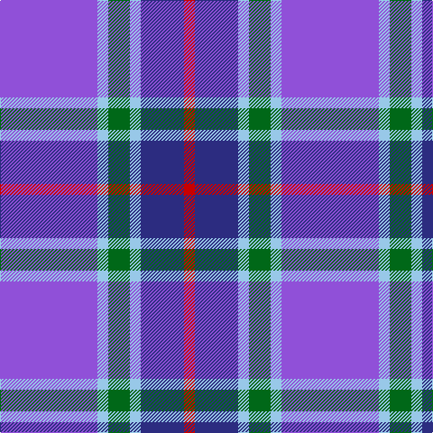

In pattern [BWGWBR](/stripes/bwgwbr/).

This was sourced from register-of-tartans.  It is a [6 stripe tartan](/stripes/stripes6/).

Original link https://www.tartanregister.gov.uk/tartanDetails.aspx?ref=2889

## Attestations

This cloth appears in 2 source records; the oldest owns this page.

- 01/03/2003 — McIntosh, Georgina (Personal) (register-of-tartans, [record](https://www.tartanregister.gov.uk/tartanDetails.aspx?ref=2889))
- pre 2007 — McIntosh, Georgina (Personal) (tartans-authority, [record](http://www.tartansauthority.com/tartan-ferret/display/7382/))

## Register references

External register numbers recorded for this tartan.

- Scottish Register of Tartans: [2889](https://www.tartanregister.gov.uk/tartanDetails.aspx?ref=2889)
- Scottish Tartans Authority (ITI): 7382
- Scottish Tartans World Register: 2936

## Thread count
P/108 LB12 G24 LB12 DB48 R/12

## Palette
Each colour and the base-6 reference it is a variant of.

| Colour | Shade | Base |
|---|---|---|
| DB | <code style="background-color:#2C2C80;">#2C2C80</code> `oklch(35.0% 0.138 276.6)` <small>#2C2C80</small> | B <code style="background-color:#2A418A;">#2A418A</code> |
| G | <code style="background-color:#006818;">#006818</code> `oklch(45.0% 0.142 145.0)` <small>#006818</small> | G <code style="background-color:#006100;">#006100</code> |
| LB | <code style="background-color:#98C8E8;">#98C8E8</code> `oklch(81.0% 0.068 237.9)` <small>#98C8E8</small> | W <code style="background-color:#F7F7F7;">#F7F7F7</code> |
| P | <code style="background-color:#9050D8;">#9050D8</code> `oklch(57.3% 0.201 302.1)` <small>#9050D8</small> | B <code style="background-color:#2A418A;">#2A418A</code> |
| R | <code style="background-color:#C80000;">#C80000</code> `oklch(52.3% 0.215 29.2)` <small>#C80000</small> | R <code style="background-color:#CC0000;">#CC0000</code> |

# Sample pattern

## Nearest tartans

The nearest existing variants by ΔTartan distance.

1. [Lennox Primary School](/setts/s7/dp2lp1dp10db1y10k1y2~x4/) — ΔT 1.26
1. [Aberdeen Academy of Performing Art](/setts/s6/db4dp2dp3db24t24w3~x2/) — ΔT 1.37
1. [Scottish Highlander Dress (Fashion)](/setts/s8/p26w2p3db15o26r2o3db4~x2/) — ΔT 1.50
1. [Pride of the Nation (Fashion)](/setts/s8/t12db6t50db39p12dp6p6w4/) — ΔT 1.60
1. [SABA](/setts/s5/w3dt2db15t15r2~x4/) — ΔT 1.64
1. [Woodcock (2014)](/setts/s7/db30dp9g6dp9r4db17w5~x2/) — ΔT 1.67
1. [Bryson (1988)](/setts/s5/y16r8b57db56lb8/) — ΔT 1.70
1. [Wrigglesworth (Name)](/setts/s7/db30b10lb10db5m3ly3g3~x2/) — ΔT 1.73
1. [Lands of Liberty](/setts/s5/r10w5db30b20r3~x4/) — ΔT 1.73
1. [Learmonth Family (Herts) (Personal)](/setts/s10/p16lp2p5dp12p8lg2db4p8dp23lg4~x2/) — ΔT 1.75

## Neighbour map

Every grey dot is one of 14299 variants placed by the first two principal components of the ΔTartan feature space (44% of its variance). Red is this tartan; blue dots are its nearest — click one to open its page.

<svg viewBox="0 0 640 380" role="img" style="max-width:100%;height:auto;border:1px solid #e0e0e0;border-radius:4px;display:block" xmlns="http://www.w3.org/2000/svg"><image href="/nn/cloud.v1.png" width="640" height="380"/><a href="/setts/s7/dp2lp1dp10db1y10k1y2~x4/"><circle cx="278.5" cy="182.0" r="4" fill="#3465a4"><title>Lennox Primary School</title></circle></a><a href="/setts/s6/db4dp2dp3db24t24w3~x2/"><circle cx="266.1" cy="183.5" r="4" fill="#3465a4"><title>Aberdeen Academy of Performing Art</title></circle></a><a href="/setts/s8/p26w2p3db15o26r2o3db4~x2/"><circle cx="213.5" cy="163.1" r="4" fill="#3465a4"><title>Scottish Highlander Dress (Fashion)</title></circle></a><a href="/setts/s8/t12db6t50db39p12dp6p6w4/"><circle cx="217.4" cy="153.1" r="4" fill="#3465a4"><title>Pride of the Nation (Fashion)</title></circle></a><a href="/setts/s5/w3dt2db15t15r2~x4/"><circle cx="203.2" cy="218.5" r="4" fill="#3465a4"><title>SABA</title></circle></a><a href="/setts/s7/db30dp9g6dp9r4db17w5~x2/"><circle cx="282.2" cy="213.4" r="4" fill="#3465a4"><title>Woodcock (2014)</title></circle></a><a href="/setts/s5/y16r8b57db56lb8/"><circle cx="177.2" cy="220.1" r="4" fill="#3465a4"><title>Bryson (1988)</title></circle></a><a href="/setts/s7/db30b10lb10db5m3ly3g3~x2/"><circle cx="238.7" cy="159.6" r="4" fill="#3465a4"><title>Wrigglesworth (Name)</title></circle></a><a href="/setts/s5/r10w5db30b20r3~x4/"><circle cx="210.6" cy="215.7" r="4" fill="#3465a4"><title>Lands of Liberty</title></circle></a><a href="/setts/s10/p16lp2p5dp12p8lg2db4p8dp23lg4~x2/"><circle cx="241.4" cy="176.1" r="4" fill="#3465a4"><title>Learmonth Family (Herts) (Personal)</title></circle></a><circle cx="248.9" cy="186.2" r="5" fill="#c00000"/></svg>

ID: /setts/s6/p9lb1g2lb1db4r1~x12/
