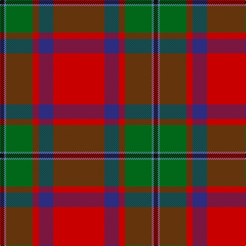

In pattern [KBGRBR](/patterns/kbgrbr/).

This was sourced from house-of-tartan.  It is a [6 stripes tartan](/stripes/stripes6/).

Original link http://www.house-of-tartan.scotland.net/house/TartanViewjs.asp?colr=Def&tnam=1028

## Thread count
K/8 B4 G52 R12 DB28 R/100

## Palette
Each colour and its ΔE from the base-6 reference it is a variant of.

| Colour | Shade | Base | ΔE (OKLab) |
|---|---|---|---|
| B | <code style="background-color:#5C8CA8;">#5C8CA8</code> `#5C8CA8` | B <code style="background-color:#2A418A;">#2A418A</code> | 0.23 |
| DB | <code style="background-color:#2C2C80;">#2C2C80</code> `#2C2C80` | B <code style="background-color:#2A418A;">#2A418A</code> | 0.06 |
| G | <code style="background-color:#006818;">#006818</code> `#006818` | G <code style="background-color:#006100;">#006100</code> | 0.02 |
| K | <code style="background-color:#101010;">#101010</code> `#101010` | K <code style="background-color:#000000;">#000000</code> | 0.17 |
| R | <code style="background-color:#C80000;">#C80000</code> `#C80000` | R <code style="background-color:#CC0000;">#CC0000</code> | 0.01 |

# Sample pattern

## Nearest tartans

The nearest existing variants by ΔTartan distance.

1. [MacPhail](/setts/s6/r100b28r12g52ba4k8-b304080-ba5480b0-g008000-k000000-rc00000/) — ΔT 0.41
1. [MacLeay (Clan)](/setts/s7/r108g16k16g16k16b24y4-b2c2c80-g006818-k101010-rc80000-yd09800/) — ΔT 0.79
1. [Livingstone MacLay MacLeay Clan Tartan Tartan Number: 1488. Earliest known date: 1934 Nothing See products available Copyright © Blair Urquhart, Comrie, 2015](/setts/s7/r56g8k8g8k8b12y2-b5c8ca8-g006818-k101010-rc80000-ye8c000/) — ΔT 0.80
1. [MacPhail (Blue Bands)](/setts/s6/r80b16r12g48ba2k8-b1474b4-ba5c8ca8-g006818-k101010-rc80000/) — ΔT 0.81
1. [MacLeay](/setts/s7/r108g16k16g16k16b24y4-b5c8ca8-g789484-k101010-rc80000-yd09800/) — ΔT 0.83
1. [MacGleish Formal (Personal)](/setts/s5/r100k50g20ra10y4-g285800-k101010-ra03400-ra888888-yc4a868/) — ΔT 0.83
1. [MacGleish Formal (Personal)](/setts/s5/r100k50g20ra10y4-g006818-k101010-rc80000-ra888888-ye8c000/) — ΔT 0.89
1. [MacDuff](/setts/s7/r96b16g34ga48r18k6r9-b2c4084-g002814-ga005020-k101010-rdc0000/) — ΔT 0.92
1. [Plummer (Personal)](/setts/s6/r200k30g96b10r14b32-b2c2c80-g006818-k101010-rc80000/) — ΔT 0.95
1. [Fraser (1745)](/setts/s6/r4b24r4g24r48w2-b2c2c80-g006818-rc80000-wfcfcfc/) — ΔT 0.96

## Neighbour map

Every grey dot is one of 15726 variants placed by the first two principal components of the ΔTartan feature space (44% of its variance). Red is this tartan; blue dots are its nearest — click one to open its page.

<svg viewBox="0 0 640 380" role="img" style="max-width:100%;height:auto;border:1px solid #e0e0e0;border-radius:4px;display:block" xmlns="http://www.w3.org/2000/svg"><image href="/nn/cloud.v1.png" width="640" height="380"/><a href="/setts/s6/r100b28r12g52ba4k8-b304080-ba5480b0-g008000-k000000-rc00000/"><circle cx="327.4" cy="142.6" r="4" fill="#3465a4"><title>MacPhail</title></circle></a><a href="/setts/s7/r108g16k16g16k16b24y4-b2c2c80-g006818-k101010-rc80000-yd09800/"><circle cx="324.3" cy="120.5" r="4" fill="#3465a4"><title>MacLeay (Clan)</title></circle></a><a href="/setts/s7/r56g8k8g8k8b12y2-b5c8ca8-g006818-k101010-rc80000-ye8c000/"><circle cx="329.5" cy="115.5" r="4" fill="#3465a4"><title>Livingstone MacLay MacLeay Clan Tartan Tartan Number: 1488. Earliest known date: 1934 Nothing See products available Copyright © Blair Urquhart, Comrie, 2015</title></circle></a><a href="/setts/s6/r80b16r12g48ba2k8-b1474b4-ba5c8ca8-g006818-k101010-rc80000/"><circle cx="363.1" cy="129.6" r="4" fill="#3465a4"><title>MacPhail (Blue Bands)</title></circle></a><a href="/setts/s7/r108g16k16g16k16b24y4-b5c8ca8-g789484-k101010-rc80000-yd09800/"><circle cx="324.0" cy="117.1" r="4" fill="#3465a4"><title>MacLeay</title></circle></a><a href="/setts/s5/r100k50g20ra10y4-g285800-k101010-ra03400-ra888888-yc4a868/"><circle cx="340.5" cy="163.2" r="4" fill="#3465a4"><title>MacGleish Formal (Personal)</title></circle></a><a href="/setts/s5/r100k50g20ra10y4-g006818-k101010-rc80000-ra888888-ye8c000/"><circle cx="321.7" cy="147.4" r="4" fill="#3465a4"><title>MacGleish Formal (Personal)</title></circle></a><a href="/setts/s7/r96b16g34ga48r18k6r9-b2c4084-g002814-ga005020-k101010-rdc0000/"><circle cx="293.4" cy="156.1" r="4" fill="#3465a4"><title>MacDuff</title></circle></a><a href="/setts/s6/r200k30g96b10r14b32-b2c2c80-g006818-k101010-rc80000/"><circle cx="355.9" cy="163.3" r="4" fill="#3465a4"><title>Plummer (Personal)</title></circle></a><a href="/setts/s6/r4b24r4g24r48w2-b2c2c80-g006818-rc80000-wfcfcfc/"><circle cx="332.7" cy="163.3" r="4" fill="#3465a4"><title>Fraser (1745)</title></circle></a><circle cx="337.2" cy="145.5" r="5" fill="#c00000"/></svg>

ID: /setts/s6/r100b28r12g52ba4k8-b2c2c80-ba5c8ca8-g006818-k101010-rc80000/
