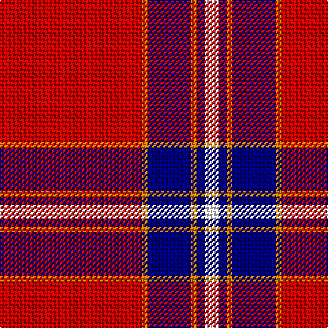

In pattern [RYBYBW](/patterns/rybybw/).

This was sourced from register-of-tartans.  It is a [6 stripes tartan](/stripes/stripes6/).

Original link https://www.tartanregister.gov.uk/tartanDetails.aspx?ref=11577

## Thread count
R/104 O4 DB32 O4 DB6 W/10

## Palette
Each colour and its ΔE from the base-6 reference it is a variant of.

| Colour | Shade | Base | ΔE (OKLab) |
|---|---|---|---|
| DB | <code style="background-color:#000080;">#000080</code> `#000080` | B <code style="background-color:#2C4084;">#2C4084</code> | 0.14 |
| O | <code style="background-color:#D87C00;">#D87C00</code> `#D87C00` | Y <code style="background-color:#E8C000;">#E8C000</code> | 0.17 |
| R | <code style="background-color:#C80000;">#C80000</code> `#C80000` | R <code style="background-color:#C80000;">#C80000</code> | 0.00 |
| W | <code style="background-color:#FCFCFC;">#FCFCFC</code> `#FCFCFC` | W <code style="background-color:#F4F4F0;">#F4F4F0</code> | 0.03 |

# Sample pattern

## Nearest tartans

The nearest existing variants by ΔTartan distance.

1. [Texas Lone Star (Fashion)](/setts/s7/r100b28w12b18y6b8r8-b202060-rc80000-wfcfcfc-ybc8c00/) — ΔT 0.96
1. [Solberg-Wormald (Personal)](/setts/s7/r155w16k34b48r18y6r9-b240090-k101010-rc80000-w98c8e8-ye8c000/) — ΔT 1.08
1. [Texas Lone Star](/setts/s7/r100b28w12b18y6b8r8-b000080-rff0000-wffffff-yffe600/) — ΔT 1.17
1. [Irn Bru (Corporate)](/setts/s8/r98b32k4w6b4w4b6r4-b2c2c80-k101010-re86008-wfcfcfc/) — ΔT 1.25
1. [Wcwm 4907-1](/setts/s7/r160b32y32r16y4r16ya32-b202060-r800028-yd09800-yab8b8b8/) — ΔT 1.27
1. [Turner (Personal)](/setts/s5/r96k24ra14k10w6-k101010-rc80000-ra888888-wfcfcfc/) — ΔT 1.29
1. [Aberdeen F. C. (2002) (Sports)](/setts/s8/k8r8y4r82k8r8k24w4-k101010-rc80000-wfcfcfc-yfccc00/) — ΔT 1.31
1. [Stuart of Bute](/setts/s9/r48g24k4g8k4g4k24r96w8-g789484-k101010-rc80000-wffffff/) — ΔT 1.34
1. [Ostermeier (2015)](/setts/s8/r22w2r64k16b12k2b32k2-b2c2c80-k101010-rff0000-wffffff/) — ΔT 1.35
1. [Instakilt, Pink (Fashion)](/setts/s7/r16w8r100k24r8k30ra10-k101010-rd84c70-rab468ac-wf8f8f8/) — ΔT 1.36

## Neighbour map

Every grey dot is one of 15726 variants placed by the first two principal components of the ΔTartan feature space (44% of its variance). Red is this tartan; blue dots are its nearest — click one to open its page.

<svg viewBox="0 0 640 380" role="img" style="max-width:100%;height:auto;border:1px solid #e0e0e0;border-radius:4px;display:block" xmlns="http://www.w3.org/2000/svg"><image href="/nn/cloud.v1.png" width="640" height="380"/><a href="/setts/s7/r100b28w12b18y6b8r8-b202060-rc80000-wfcfcfc-ybc8c00/"><circle cx="372.7" cy="141.2" r="4" fill="#3465a4"><title>Texas Lone Star (Fashion)</title></circle></a><a href="/setts/s7/r155w16k34b48r18y6r9-b240090-k101010-rc80000-w98c8e8-ye8c000/"><circle cx="382.2" cy="112.8" r="4" fill="#3465a4"><title>Solberg-Wormald (Personal)</title></circle></a><a href="/setts/s7/r100b28w12b18y6b8r8-b000080-rff0000-wffffff-yffe600/"><circle cx="350.6" cy="127.8" r="4" fill="#3465a4"><title>Texas Lone Star</title></circle></a><a href="/setts/s8/r98b32k4w6b4w4b6r4-b2c2c80-k101010-re86008-wfcfcfc/"><circle cx="419.4" cy="101.5" r="4" fill="#3465a4"><title>Irn Bru (Corporate)</title></circle></a><a href="/setts/s7/r160b32y32r16y4r16ya32-b202060-r800028-yd09800-yab8b8b8/"><circle cx="443.6" cy="123.8" r="4" fill="#3465a4"><title>Wcwm 4907-1</title></circle></a><a href="/setts/s5/r96k24ra14k10w6-k101010-rc80000-ra888888-wfcfcfc/"><circle cx="396.5" cy="163.8" r="4" fill="#3465a4"><title>Turner (Personal)</title></circle></a><a href="/setts/s8/k8r8y4r82k8r8k24w4-k101010-rc80000-wfcfcfc-yfccc00/"><circle cx="438.6" cy="122.7" r="4" fill="#3465a4"><title>Aberdeen F. C. (2002) (Sports)</title></circle></a><a href="/setts/s9/r48g24k4g8k4g4k24r96w8-g789484-k101010-rc80000-wffffff/"><circle cx="414.4" cy="122.3" r="4" fill="#3465a4"><title>Stuart of Bute</title></circle></a><a href="/setts/s8/r22w2r64k16b12k2b32k2-b2c2c80-k101010-rff0000-wffffff/"><circle cx="352.6" cy="116.6" r="4" fill="#3465a4"><title>Ostermeier (2015)</title></circle></a><a href="/setts/s7/r16w8r100k24r8k30ra10-k101010-rd84c70-rab468ac-wf8f8f8/"><circle cx="366.6" cy="156.6" r="4" fill="#3465a4"><title>Instakilt, Pink (Fashion)</title></circle></a><circle cx="420.9" cy="122.4" r="5" fill="#c00000"/></svg>

ID: /setts/s6/r104y4b32y4b6w10-b000080-rc80000-wfcfcfc-yd87c00/
