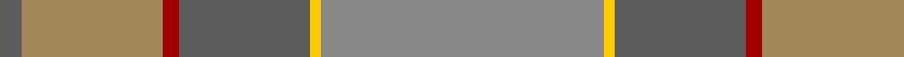

In pattern [BYRBYR](/patterns/byrbyr/).

This was sourced from tartans-authority.  It is a [6 stripes tartan](/stripes/stripes6/).

Original link http://www.tartansauthority.com/tartan-ferret/display/11113/

## Thread count
N/8 LT52 DR6 N48 Y4 Na/104

## Palette
Each colour and its ΔE from the base-6 reference it is a variant of.

| Colour | Shade | Base | ΔE (OKLab) |
|---|---|---|---|
| DR | <code style="background-color:#A00000;">#A00000</code> `#A00000` | R <code style="background-color:#CC0000;">#CC0000</code> | 0.09 |
| LT | <code style="background-color:#A08858;">#A08858</code> `#A08858` | Y <code style="background-color:#F2BF00;">#F2BF00</code> | 0.21 |
| N | <code style="background-color:#5C5C5C;">#5C5C5C</code> `#5C5C5C` | B <code style="background-color:#2A418A;">#2A418A</code> | 0.15 |
| Na | <code style="background-color:#888888;">#888888</code> `#888888` | R <code style="background-color:#CC0000;">#CC0000</code> | 0.24 |
| Y | <code style="background-color:#FCCC00;">#FCCC00</code> `#FCCC00` | Y <code style="background-color:#F2BF00;">#F2BF00</code> | 0.04 |

# Sample pattern

## Nearest tartans

The nearest existing variants by ΔTartan distance.

1. [Outlander #1](/setts/s6/g104y4b48r6ya52b8-b5c5c5c-g808080-r960000-ye8c000-yaa08858/) — ΔT 0.57
1. [Rikaco Morning Dew #2](/setts/s8/y6w6y2g50y30ya10w8yb4-g789484-w98c8e8-yb8b8b8-yae08070-ybe8c000/) — ΔT 1.46
1. [Isle of Cumbrae (Corporate)](/setts/s7/k6g6r6g56b56w4b4-b5c5c5c-g787468-k101010-r901c38-wbcc8c4/) — ΔT 1.58
1. [Tricor](/setts/s12/g16w4g16ga24gb24r16g92r16gb24ga24g16w4-g8c7038-ga00643c-gb604000-r98481c-wc0c0c0/) — ΔT 2.06
1. [Roddy's Highland Spirit (Fashion)](/setts/s10/g60b6g6b6g6b20ga20gb40r4ga10-b80588c-g5c6428-ga3c6434-gb608064-rb07cc8/) — ΔT 2.14
1. [Jardine](/setts/s8/b36r36g36ra4ga4r36ga4ra4-b5c5c5c-g787878-ga789484-ra46000-rac80000/) — ΔT 2.14
1. [Clyde](/setts/s10/r10b6r44ra6b12ba34ra4ba8ra4ba8-b646464-ba5c5c5c-r8c8c8c-ra8c0000/) — ΔT 2.16
1. [Granite City (Fashion)](/setts/s8/k6b6k6b42ba42k6ba6y2-b5c5c5c-ba505050-k101010-ya0a0a0/) — ΔT 2.17
1. [Cladish](/setts/s8/g10y5g54y2w32ya54b4ya10-b1474b4-g8c7038-we8ccb8-ydc943c-yaa08858/) — ΔT 2.18
1. [McWilliams (2014)](/setts/s4/g88b4ga88r16-b780078-g8c7038-ga5c6428-rc80000/) — ΔT 2.21

## Neighbour map

Every grey dot is one of 15726 variants placed by the first two principal components of the ΔTartan feature space (44% of its variance). Red is this tartan; blue dots are its nearest — click one to open its page.

<svg viewBox="0 0 640 380" role="img" style="max-width:100%;height:auto;border:1px solid #e0e0e0;border-radius:4px;display:block" xmlns="http://www.w3.org/2000/svg"><image href="/nn/cloud.v1.png" width="640" height="380"/><a href="/setts/s6/g104y4b48r6ya52b8-b5c5c5c-g808080-r960000-ye8c000-yaa08858/"><circle cx="420.5" cy="215.9" r="4" fill="#3465a4"><title>Outlander #1</title></circle></a><a href="/setts/s8/y6w6y2g50y30ya10w8yb4-g789484-w98c8e8-yb8b8b8-yae08070-ybe8c000/"><circle cx="370.3" cy="179.3" r="4" fill="#3465a4"><title>Rikaco Morning Dew #2</title></circle></a><a href="/setts/s7/k6g6r6g56b56w4b4-b5c5c5c-g787468-k101010-r901c38-wbcc8c4/"><circle cx="392.3" cy="209.7" r="4" fill="#3465a4"><title>Isle of Cumbrae (Corporate)</title></circle></a><a href="/setts/s12/g16w4g16ga24gb24r16g92r16gb24ga24g16w4-g8c7038-ga00643c-gb604000-r98481c-wc0c0c0/"><circle cx="381.3" cy="178.7" r="4" fill="#3465a4"><title>Tricor</title></circle></a><a href="/setts/s10/g60b6g6b6g6b20ga20gb40r4ga10-b80588c-g5c6428-ga3c6434-gb608064-rb07cc8/"><circle cx="355.4" cy="222.5" r="4" fill="#3465a4"><title>Roddy's Highland Spirit (Fashion)</title></circle></a><a href="/setts/s8/b36r36g36ra4ga4r36ga4ra4-b5c5c5c-g787878-ga789484-ra46000-rac80000/"><circle cx="354.7" cy="252.3" r="4" fill="#3465a4"><title>Jardine</title></circle></a><a href="/setts/s10/r10b6r44ra6b12ba34ra4ba8ra4ba8-b646464-ba5c5c5c-r8c8c8c-ra8c0000/"><circle cx="334.6" cy="224.9" r="4" fill="#3465a4"><title>Clyde</title></circle></a><a href="/setts/s8/k6b6k6b42ba42k6ba6y2-b5c5c5c-ba505050-k101010-ya0a0a0/"><circle cx="390.6" cy="212.0" r="4" fill="#3465a4"><title>Granite City (Fashion)</title></circle></a><a href="/setts/s8/g10y5g54y2w32ya54b4ya10-b1474b4-g8c7038-we8ccb8-ydc943c-yaa08858/"><circle cx="318.3" cy="167.1" r="4" fill="#3465a4"><title>Cladish</title></circle></a><a href="/setts/s4/g88b4ga88r16-b780078-g8c7038-ga5c6428-rc80000/"><circle cx="467.3" cy="278.7" r="4" fill="#3465a4"><title>McWilliams (2014)</title></circle></a><circle cx="405.6" cy="208.0" r="5" fill="#c00000"/></svg>

ID: /setts/s6/r104y4b48ra6ya52b8-b5c5c5c-r888888-raa00000-yfccc00-yaa08858/
