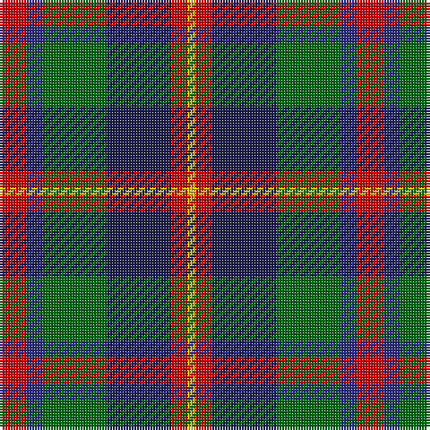

In pattern [RBGBRY](/patterns/rbgbry/).

This was sourced from tartans-authority.  It is a [6 stripes tartan](/stripes/stripes6/).

Original link http://www.tartansauthority.com/tartan-ferret/display/10030/

## Thread count
R/10 DB6 G24 DBa24 R6 Y/3

## Palette
Each colour and its ΔE from the base-6 reference it is a variant of.

| Colour | Shade | Base | ΔE (OKLab) |
|---|---|---|---|
| DB | <code style="background-color:#2C2C80;">#2C2C80</code> `#2C2C80` | B <code style="background-color:#2C4084;">#2C4084</code> | 0.05 |
| DBa | <code style="background-color:#1C1C50;">#1C1C50</code> `#1C1C50` | B <code style="background-color:#2C4084;">#2C4084</code> | 0.14 |
| G | <code style="background-color:#006818;">#006818</code> `#006818` | G <code style="background-color:#006400;">#006400</code> | 0.02 |
| R | <code style="background-color:#C80000;">#C80000</code> `#C80000` | R <code style="background-color:#C80000;">#C80000</code> | 0.00 |
| Y | <code style="background-color:#E8C000;">#E8C000</code> `#E8C000` | Y <code style="background-color:#E8C000;">#E8C000</code> | 0.00 |

# Sample pattern

## Nearest tartans

The nearest existing variants by ΔTartan distance.

1. [Patterson, John](/setts/s6/g6b24w2ga24r24ga4-b304080-g008000-ga003000-rc00000-we0e0e0/) — ΔT 0.70
1. [Thompson's Fancy Personal Tartan Tartan Number: 286. Earliest known date: pre 2003 Designed for his own use. See products available Copyright © Blair Urquhart, Comrie, 2015](/setts/s6/r12g48b12ba24k24ba6-b2c2c80-ba5c8ca8-g604000-k101010-rc80000/) — ΔT 0.75
1. [Patterson, John (Personal)](/setts/s6/g6b24w2ga24r24ga4-b2c2c80-g006818-ga003820-rc80000-wfcfcfc/) — ΔT 0.80
1. [Swankie (Personal)](/setts/s7/k8b42g20ga8k40r12b6-b1474b4-g604000-ga8c7038-k101010-rc80000/) — ΔT 0.80
1. [Patterson, John (Personal)](/setts/s6/g6b24w2ba24r24ba4-b2c4084-ba002814-g005020-rdc0000-we0e0e0/) — ΔT 0.82
1. [Gold Brothers](/setts/s6/b12g54b6k38ba54w6-b2c2c80-ba780078-g006818-k101010-wf8f8f8/) — ΔT 0.82
1. [Commonwealth Games Council (Corp.)](/setts/s6/r6k34b22r4ra40w4-b484848-k101010-rb468ac-ra888888-we0e0e0/) — ΔT 0.84
1. [Leslie Hunting Clan Tartan Tartan Number: 1113. Earliest known date: 1810-15 Said to have been worn by George 14th Earl of Rothes who died in 1841. This sett is shown by Smibert (1850) and by W & A Smith (1850) but without the definition of 'Hunting'. This sett is very similar to Duncan, the difference lies in the broad black present in the Leslie Hunting which is green in the Duncan See products available Copyright © Blair Urquhart, Comrie, 2015](/setts/s6/r4b16k16w2g16k2-b2c2c80-g006818-k101010-rc80000-we0e0e0/) — ΔT 0.85
1. [Thom(p)son's, Fancy](/setts/s6/r12ra48b12ba24k24ba6-b304080-ba5480b0-k000000-rc00000-ra806050/) — ΔT 0.87
1. [Sikh](/setts/s8/r56k12r7k12r7g50b50y10-b2c2c80-g006818-k101010-rb84c00-ye8c000/) — ΔT 0.87

## Neighbour map

Every grey dot is one of 15726 variants placed by the first two principal components of the ΔTartan feature space (44% of its variance). Red is this tartan; blue dots are its nearest — click one to open its page.

<svg viewBox="0 0 640 380" role="img" style="max-width:100%;height:auto;border:1px solid #e0e0e0;border-radius:4px;display:block" xmlns="http://www.w3.org/2000/svg"><image href="/nn/cloud.v1.png" width="640" height="380"/><a href="/setts/s6/g6b24w2ga24r24ga4-b304080-g008000-ga003000-rc00000-we0e0e0/"><circle cx="166.7" cy="198.6" r="4" fill="#3465a4"><title>Patterson, John</title></circle></a><a href="/setts/s6/r12g48b12ba24k24ba6-b2c2c80-ba5c8ca8-g604000-k101010-rc80000/"><circle cx="160.7" cy="222.4" r="4" fill="#3465a4"><title>Thompson's Fancy Personal Tartan Tartan Number: 286. Earliest known date: pre 2003 Designed for his own use. See products available Copyright © Blair Urquhart, Comrie, 2015</title></circle></a><a href="/setts/s6/g6b24w2ga24r24ga4-b2c2c80-g006818-ga003820-rc80000-wfcfcfc/"><circle cx="166.0" cy="197.6" r="4" fill="#3465a4"><title>Patterson, John (Personal)</title></circle></a><a href="/setts/s7/k8b42g20ga8k40r12b6-b1474b4-g604000-ga8c7038-k101010-rc80000/"><circle cx="143.7" cy="210.9" r="4" fill="#3465a4"><title>Swankie (Personal)</title></circle></a><a href="/setts/s6/g6b24w2ba24r24ba4-b2c4084-ba002814-g005020-rdc0000-we0e0e0/"><circle cx="160.3" cy="194.1" r="4" fill="#3465a4"><title>Patterson, John (Personal)</title></circle></a><a href="/setts/s6/b12g54b6k38ba54w6-b2c2c80-ba780078-g006818-k101010-wf8f8f8/"><circle cx="137.2" cy="204.6" r="4" fill="#3465a4"><title>Gold Brothers</title></circle></a><a href="/setts/s6/r6k34b22r4ra40w4-b484848-k101010-rb468ac-ra888888-we0e0e0/"><circle cx="156.8" cy="190.0" r="4" fill="#3465a4"><title>Commonwealth Games Council (Corp.)</title></circle></a><a href="/setts/s6/r4b16k16w2g16k2-b2c2c80-g006818-k101010-rc80000-we0e0e0/"><circle cx="135.1" cy="217.5" r="4" fill="#3465a4"><title>Leslie Hunting Clan Tartan Tartan Number: 1113. Earliest known date: 1810-15 Said to have been worn by George 14th Earl of Rothes who died in 1841. This sett is shown by Smibert (1850) and by W &amp; A Smith (1850) but without the definition of 'Hunting'. This sett is very similar to Duncan, the difference lies in the broad black present in the Leslie Hunting which is green in the Duncan See products available Copyright © Blair Urquhart, Comrie, 2015</title></circle></a><a href="/setts/s6/r12ra48b12ba24k24ba6-b304080-ba5480b0-k000000-rc00000-ra806050/"><circle cx="132.6" cy="210.0" r="4" fill="#3465a4"><title>Thom(p)son's, Fancy</title></circle></a><a href="/setts/s8/r56k12r7k12r7g50b50y10-b2c2c80-g006818-k101010-rb84c00-ye8c000/"><circle cx="139.3" cy="186.9" r="4" fill="#3465a4"><title>Sikh</title></circle></a><circle cx="139.1" cy="212.2" r="5" fill="#c00000"/></svg>

ID: /setts/s6/r10b6g24ba24r6y3-b2c2c80-ba1c1c50-g006818-rc80000-ye8c000/
