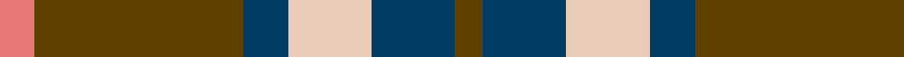

This page is one **sett** — a single exact thread-count. It belongs to the [tartan](/tartans/lra10t60db13lr24db24t8/)
(the same proportion at any scale), whose colour order is pattern [GBWBGR](/stripes/gbwbgr/).

Sourced from tartans-authority.  It is a [6 stripe tartan](/stripes/stripes6/).

Original link http://www.tartansauthority.com/tartan-ferret/display/10815/

## Thread count
LRa/10 T60 DB13 LR24 DB24 T/8

## Palette
Each colour and the base-6 reference it is a variant of.

| Colour | Shade | Base |
|---|---|---|
| DB | <code style="background-color:#003C64;">#003C64</code> `oklch(34.5% 0.089 246.0)` <small>#003C64</small> | B <code style="background-color:#2A418A;">#2A418A</code> |
| LR | <code style="background-color:#E8CCB8;">#E8CCB8</code> `oklch(86.3% 0.042 57.7)` <small>#E8CCB8</small> | W <code style="background-color:#F7F7F7;">#F7F7F7</code> |
| LRa | <code style="background-color:#E87878;">#E87878</code> `oklch(70.0% 0.139 21.2)` <small>#E87878</small> | R <code style="background-color:#CC0000;">#CC0000</code> |
| T | <code style="background-color:#604000;">#604000</code> `oklch(39.8% 0.083 76.8)` <small>#604000</small> | G <code style="background-color:#006100;">#006100</code> |

# Sample pattern

## Nearest tartans

The nearest existing variants by ΔTartan distance, with this tartan at the top so the swatches line up against it.

ΔTartan

Tartan

Sett

—

<a href="/ttd/edit/#slug=r10dy60dt13lb24dt24dy8">Bronte House Check (Fashion)</a> <a class="nn-out" href="/setts/s6/r10dy60dt13lb24dt24dy8/" title="open its dictionary page">↗</a>

0.77

<a href="/ttd/edit/#slug=r2dg17r8db8ly2~x4">British Hills</a> <a class="nn-out" href="/setts/s5/r2dg17r8db8ly2~x4/" title="open its dictionary page">↗</a>

0.85

<a href="/ttd/edit/#slug=k4lb4k4o15r2~x4">Oban Grey (Fashion)</a> <a class="nn-out" href="/setts/s5/k4lb4k4o15r2~x4/" title="open its dictionary page">↗</a>

0.86

<a href="/ttd/edit/#slug=r3y27k6lo13k14r3~x2">Thompson/Thomson/MacTavish special grey</a> <a class="nn-out" href="/setts/s6/r3y27k6lo13k14r3~x2/" title="open its dictionary page">↗</a>

0.98

<a href="/ttd/edit/#slug=m10dy60dt13lo24dt24dy8">Bronte House Check</a> <a class="nn-out" href="/setts/s6/m10dy60dt13lo24dt24dy8/" title="open its dictionary page">↗</a>

0.98

<a href="/ttd/edit/#slug=g15r3p11t2~x2">MacNab 7</a> <a class="nn-out" href="/setts/s4/g15r3p11t2~x2/" title="open its dictionary page">↗</a>

1.00

<a href="/ttd/edit/#slug=m3dg6lo2db2lo11dg2lo2m3~x2">Invertere (Daks #1) (Fashion)</a> <a class="nn-out" href="/setts/s8/m3dg6lo2db2lo11dg2lo2m3~x2/" title="open its dictionary page">↗</a>

1.05

<a href="/ttd/edit/#slug=t4o28g6t12k12t3~x2">MacTavish / Thom(p)son, hunting</a> <a class="nn-out" href="/setts/s6/t4o28g6t12k12t3~x2/" title="open its dictionary page">↗</a>

1.07

<a href="/ttd/edit/#slug=lo3t7do2m2do14t2do2lo3~x2">Daks (Blue Loden)</a> <a class="nn-out" href="/setts/s8/lo3t7do2m2do14t2do2lo3~x2/" title="open its dictionary page">↗</a>

1.08

<a href="/ttd/edit/#slug=o5dp3o18k16ly3~x4">New York State Police Pipe Band</a> <a class="nn-out" href="/setts/s5/o5dp3o18k16ly3~x4/" title="open its dictionary page">↗</a>

1.09

<a href="/ttd/edit/#slug=k3g25o3k15lr24g3~x2">Un-named (D C Dalgliesh) #3</a> <a class="nn-out" href="/setts/s6/k3g25o3k15lr24g3~x2/" title="open its dictionary page">↗</a>

## Neighbour map

Every grey dot is one of 14299 variants placed by the first two principal components of the ΔTartan feature space (44% of its variance). Red is this tartan; blue dots are its nearest — click one to open its page.

<svg viewBox="0 0 640 380" role="img" style="max-width:100%;height:auto;border:1px solid #e0e0e0;border-radius:4px;display:block" xmlns="http://www.w3.org/2000/svg"><image href="/nn/cloud.v1.png" width="640" height="380"/><a href="/setts/s5/r2dg17r8db8ly2~x4/"><circle cx="220.6" cy="221.1" r="4" fill="#3465a4"><title>British Hills</title></circle></a><a href="/setts/s5/k4lb4k4o15r2~x4/"><circle cx="242.6" cy="217.8" r="4" fill="#3465a4"><title>Oban Grey (Fashion)</title></circle></a><a href="/setts/s6/r3y27k6lo13k14r3~x2/"><circle cx="192.4" cy="206.6" r="4" fill="#3465a4"><title>Thompson/Thomson/MacTavish special grey</title></circle></a><a href="/setts/s6/m10dy60dt13lo24dt24dy8/"><circle cx="248.8" cy="222.4" r="4" fill="#3465a4"><title>Bronte House Check</title></circle></a><a href="/setts/s4/g15r3p11t2~x2/"><circle cx="252.2" cy="248.6" r="4" fill="#3465a4"><title>MacNab 7</title></circle></a><a href="/setts/s8/m3dg6lo2db2lo11dg2lo2m3~x2/"><circle cx="231.4" cy="224.9" r="4" fill="#3465a4"><title>Invertere (Daks #1) (Fashion)</title></circle></a><a href="/setts/s6/t4o28g6t12k12t3~x2/"><circle cx="202.5" cy="212.7" r="4" fill="#3465a4"><title>MacTavish / Thom(p)son, hunting</title></circle></a><a href="/setts/s8/lo3t7do2m2do14t2do2lo3~x2/"><circle cx="267.1" cy="206.3" r="4" fill="#3465a4"><title>Daks (Blue Loden)</title></circle></a><a href="/setts/s5/o5dp3o18k16ly3~x4/"><circle cx="235.5" cy="233.9" r="4" fill="#3465a4"><title>New York State Police Pipe Band</title></circle></a><a href="/setts/s6/k3g25o3k15lr24g3~x2/"><circle cx="180.1" cy="205.9" r="4" fill="#3465a4"><title>Un-named (D C Dalgliesh) #3</title></circle></a><circle cx="232.2" cy="220.2" r="5" fill="#c00000"/></svg>

ID: /setts/s6/r10dy60dt13lb24dt24dy8/
