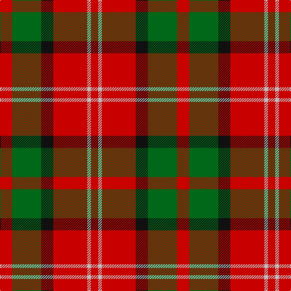

In pattern [RGKRWR](/stripes/rgkrwr/).

This was sourced from register-of-tartans.  It is a [6 stripe tartan](/stripes/stripes6/).

Original link https://www.tartanregister.gov.uk/tartanDetails.aspx?ref=3140

## Attestations

This cloth appears in 2 source records; the oldest owns this page.

- 01/01/1842 — Nisbet (register-of-tartans, [record](https://www.tartanregister.gov.uk/tartanDetails.aspx?ref=3140))
- 1842 — Nisbet (Clan) (tartans-authority, [record](http://www.tartansauthority.com/tartan-ferret/display/2115/))

## Register references

External register numbers recorded for this tartan.

- Scottish Register of Tartans: [3140](https://www.tartanregister.gov.uk/tartanDetails.aspx?ref=3140)
- Scottish Tartans Authority (ITI): 2115
- Scottish Tartans World Register: 2115

## Thread count
R/20 G48 K20 R56 N6 R/12

## Palette
Each colour and the base-6 reference it is a variant of.

| Colour | Shade | Base |
|---|---|---|
| G | <code style="background-color:#006818;">#006818</code> `oklch(45.0% 0.142 145.0)` <small>#006818</small> | G <code style="background-color:#006100;">#006100</code> |
| K | <code style="background-color:#101010;">#101010</code> `oklch(17.3% 0.000 89.9)` <small>#101010</small> | K <code style="background-color:#000000;">#000000</code> |
| N | <code style="background-color:#C0C0C0;">#C0C0C0</code> `oklch(80.8% 0.000 89.9)` <small>#C0C0C0</small> | W <code style="background-color:#F7F7F7;">#F7F7F7</code> |
| R | <code style="background-color:#C80000;">#C80000</code> `oklch(52.3% 0.215 29.2)` <small>#C80000</small> | R <code style="background-color:#CC0000;">#CC0000</code> |

# Sample pattern

## Nearest tartans

The nearest existing variants by ΔTartan distance, with this tartan at the top so the swatches line up against it.

ΔTartan

Tartan

Sett

—

<a href="/ttd/edit/#slug=r10g24k10r28lb3r6~x2">Nisbet</a> <a class="nn-out" href="/setts/s6/r10g24k10r28lb3r6~x2/" title="open its dictionary page">↗</a>

0.86

<a href="/ttd/edit/#slug=r36lt9k12g17r10k3r10~x2">MacDuff #6</a> <a class="nn-out" href="/setts/s7/r36lt9k12g17r10k3r10~x2/" title="open its dictionary page">↗</a>

0.87

<a href="/ttd/edit/#slug=r36db9k12g17r10k3r10~x2">MacDuff - 1819 (Clan)</a> <a class="nn-out" href="/setts/s7/r36db9k12g17r10k3r10~x2/" title="open its dictionary page">↗</a>

0.89

<a href="/ttd/edit/#slug=g5w2g8r9k3r4k3r17g3~x2">Morrison</a> <a class="nn-out" href="/setts/s9/g5w2g8r9k3r4k3r17g3~x2/" title="open its dictionary page">↗</a>

0.93

<a href="/ttd/edit/#slug=r6g1r6db1g3k3g3~x4">MacTavish</a> <a class="nn-out" href="/setts/s7/r6g1r6db1g3k3g3~x4/" title="open its dictionary page">↗</a>

0.99

<a href="/ttd/edit/#slug=r22g17w2t6r13~x2">Menzies</a> <a class="nn-out" href="/setts/s5/r22g17w2t6r13~x2/" title="open its dictionary page">↗</a>

1.04

<a href="/ttd/edit/#slug=k1r9dg2r2dg4lb1dg4r1~x2">Comyn</a> <a class="nn-out" href="/setts/s8/k1r9dg2r2dg4lb1dg4r1~x2/" title="open its dictionary page">↗</a>

1.05

<a href="/ttd/edit/#slug=r5w2r28k12dg16r3~x2">MacKintosh #4</a> <a class="nn-out" href="/setts/s6/r5w2r28k12dg16r3~x2/" title="open its dictionary page">↗</a>

1.05

<a href="/ttd/edit/#slug=r22t8k9dg14r10t2r10~x2">MacDuff #2</a> <a class="nn-out" href="/setts/s7/r22t8k9dg14r10t2r10~x2/" title="open its dictionary page">↗</a>

1.06

<a href="/ttd/edit/#slug=r10g3k1g3b1~x16">Espy (Fashion?)</a> <a class="nn-out" href="/setts/s5/r10g3k1g3b1~x16/" title="open its dictionary page">↗</a>

1.07

<a href="/ttd/edit/#slug=r22t8k9g14r10t2r10~x2">MacDuff</a> <a class="nn-out" href="/setts/s7/r22t8k9g14r10t2r10~x2/" title="open its dictionary page">↗</a>

## Neighbour map

Every grey dot is one of 14299 variants placed by the first two principal components of the ΔTartan feature space (44% of its variance). Red is this tartan; blue dots are its nearest — click one to open its page.

<svg viewBox="0 0 640 380" role="img" style="max-width:100%;height:auto;border:1px solid #e0e0e0;border-radius:4px;display:block" xmlns="http://www.w3.org/2000/svg"><image href="/nn/cloud.v1.png" width="640" height="380"/><a href="/setts/s7/r36lt9k12g17r10k3r10~x2/"><circle cx="292.6" cy="190.1" r="4" fill="#3465a4"><title>MacDuff #6</title></circle></a><a href="/setts/s7/r36db9k12g17r10k3r10~x2/"><circle cx="309.8" cy="199.6" r="4" fill="#3465a4"><title>MacDuff - 1819 (Clan)</title></circle></a><a href="/setts/s9/g5w2g8r9k3r4k3r17g3~x2/"><circle cx="286.1" cy="194.9" r="4" fill="#3465a4"><title>Morrison</title></circle></a><a href="/setts/s7/r6g1r6db1g3k3g3~x4/"><circle cx="247.0" cy="240.2" r="4" fill="#3465a4"><title>MacTavish</title></circle></a><a href="/setts/s5/r22g17w2t6r13~x2/"><circle cx="322.5" cy="231.0" r="4" fill="#3465a4"><title>Menzies</title></circle></a><a href="/setts/s8/k1r9dg2r2dg4lb1dg4r1~x2/"><circle cx="283.3" cy="191.8" r="4" fill="#3465a4"><title>Comyn</title></circle></a><a href="/setts/s6/r5w2r28k12dg16r3~x2/"><circle cx="301.3" cy="181.1" r="4" fill="#3465a4"><title>MacKintosh #4</title></circle></a><a href="/setts/s7/r22t8k9dg14r10t2r10~x2/"><circle cx="268.5" cy="215.7" r="4" fill="#3465a4"><title>MacDuff #2</title></circle></a><a href="/setts/s5/r10g3k1g3b1~x16/"><circle cx="338.3" cy="208.3" r="4" fill="#3465a4"><title>Espy (Fashion?)</title></circle></a><a href="/setts/s7/r22t8k9g14r10t2r10~x2/"><circle cx="254.4" cy="212.9" r="4" fill="#3465a4"><title>MacDuff</title></circle></a><circle cx="286.6" cy="216.8" r="5" fill="#c00000"/></svg>

ID: /setts/s6/r10g24k10r28lb3r6~x2/
