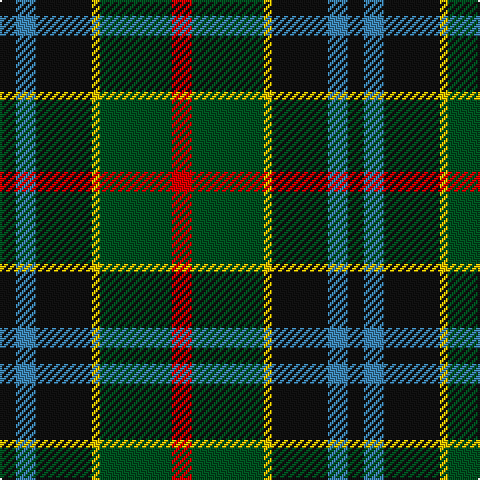

In pattern [KBKYGR](/patterns/kbkygr/).

This was sourced from register-of-tartans.  It is a [6 stripes tartan](/stripes/stripes6/).

Original link https://www.tartanregister.gov.uk/tartanDetails.aspx?ref=4333

## Thread count
K/8 B10 K28 Y4 G36 R/10

## Palette
Each colour and its ΔE from the base-6 reference it is a variant of.

| Colour | Shade | Base | ΔE (OKLab) |
|---|---|---|---|
| B | <code style="background-color:#3C82AF;">#3C82AF</code> `#3C82AF` | B <code style="background-color:#2C4084;">#2C4084</code> | 0.20 |
| G | <code style="background-color:#005020;">#005020</code> `#005020` | G <code style="background-color:#006400;">#006400</code> | 0.08 |
| K | <code style="background-color:#101010;">#101010</code> `#101010` | K <code style="background-color:#000000;">#000000</code> | 0.17 |
| R | <code style="background-color:#DC0000;">#DC0000</code> `#DC0000` | R <code style="background-color:#C80000;">#C80000</code> | 0.04 |
| Y | <code style="background-color:#E8C000;">#E8C000</code> `#E8C000` | Y <code style="background-color:#E8C000;">#E8C000</code> | 0.00 |

# Sample pattern

## Nearest tartans

The nearest existing variants by ΔTartan distance.

1. [Royal College of Physicians (Corp)](/setts/s6/b36r6k18r6g46y6-b2c2c80-g006818-k101010-rc80000-ye8c000/) — ΔT 0.74
1. [Forsyth Clan Tartan Tartan Number: 1122. Earliest known date: 1872 (1830) This sett has a close resemblance to the the Leslie tartan in which white replaces yellow. A description of the tartan appears in Jennie Forsyth Jeffrie's 'History of the Forsyth Family' (1918). Clan Chief, Alistair Forsyth, was recognised by Lord Lyon in 1978 - the first for over 300 years. See products available Copyright © Blair Urquhart, Comrie, 2015](/setts/s6/k8g44y4k32b36r8-b2c2c80-g006818-k101010-rc80000-ye8c000/) — ΔT 0.84
1. [Nelson Mandela (Personal)](/setts/s7/b54g10y16k40y6g30r6-b202060-g006818-k101010-rc80000-yd8b000/) — ΔT 0.85
1. [Brodie Hunting](/setts/s7/r8b32g32k32y4k32r8-b5c8ca8-g006818-k101010-rc80000-yd09800/) — ΔT 0.90
1. [Nelson Mandela (Personal)](/setts/s7/b54g10y16k40y6g30r6-b202060-g006818-k101010-rc80000-ye8c000/) — ΔT 0.92
1. [Canine All Dogs (Fashion)](/setts/s6/r10b6g24ba24r6y3-b2c2c80-ba1c1c50-g006818-rc80000-ye8c000/) — ΔT 0.94
1. [Leslie Hunting](/setts/s6/k4g32w4k32b32r4-b202060-g006818-k101010-rc80000-we0e0e0/) — ΔT 0.94
1. [Rose Hunting](/setts/s6/k16w4g40k40b40r8-b2c2c80-g006818-k101010-rc80000-wfcfcfc/) — ΔT 0.95
1. [Dunfermline Bank of Scotland (Corp)](/setts/s8/g48k10g12r12g12k40b40w4-b1474b4-g285800-k101010-rc80000-wfcfcfc/) — ΔT 0.95
1. [MacLeish](/setts/s8/k36b24k10g8r12g24k4y8-b1c0070-g006818-k101010-rc80000-ybc8c00/) — ΔT 0.95

## Neighbour map

Every grey dot is one of 15726 variants placed by the first two principal components of the ΔTartan feature space (44% of its variance). Red is this tartan; blue dots are its nearest — click one to open its page.

<svg viewBox="0 0 640 380" role="img" style="max-width:100%;height:auto;border:1px solid #e0e0e0;border-radius:4px;display:block" xmlns="http://www.w3.org/2000/svg"><image href="/nn/cloud.v1.png" width="640" height="380"/><a href="/setts/s6/b36r6k18r6g46y6-b2c2c80-g006818-k101010-rc80000-ye8c000/"><circle cx="165.1" cy="208.4" r="4" fill="#3465a4"><title>Royal College of Physicians (Corp)</title></circle></a><a href="/setts/s6/k8g44y4k32b36r8-b2c2c80-g006818-k101010-rc80000-ye8c000/"><circle cx="159.0" cy="209.7" r="4" fill="#3465a4"><title>Forsyth Clan Tartan Tartan Number: 1122. Earliest known date: 1872 (1830) This sett has a close resemblance to the the Leslie tartan in which white replaces yellow. A description of the tartan appears in Jennie Forsyth Jeffrie's 'History of the Forsyth Family' (1918). Clan Chief, Alistair Forsyth, was recognised by Lord Lyon in 1978 - the first for over 300 years. See products available Copyright © Blair Urquhart, Comrie, 2015</title></circle></a><a href="/setts/s7/b54g10y16k40y6g30r6-b202060-g006818-k101010-rc80000-yd8b000/"><circle cx="123.2" cy="197.2" r="4" fill="#3465a4"><title>Nelson Mandela (Personal)</title></circle></a><a href="/setts/s7/r8b32g32k32y4k32r8-b5c8ca8-g006818-k101010-rc80000-yd09800/"><circle cx="152.9" cy="216.7" r="4" fill="#3465a4"><title>Brodie Hunting</title></circle></a><a href="/setts/s7/b54g10y16k40y6g30r6-b202060-g006818-k101010-rc80000-ye8c000/"><circle cx="117.4" cy="194.4" r="4" fill="#3465a4"><title>Nelson Mandela (Personal)</title></circle></a><a href="/setts/s6/r10b6g24ba24r6y3-b2c2c80-ba1c1c50-g006818-rc80000-ye8c000/"><circle cx="139.1" cy="212.2" r="4" fill="#3465a4"><title>Canine All Dogs (Fashion)</title></circle></a><a href="/setts/s6/k4g32w4k32b32r4-b202060-g006818-k101010-rc80000-we0e0e0/"><circle cx="156.3" cy="217.7" r="4" fill="#3465a4"><title>Leslie Hunting</title></circle></a><a href="/setts/s6/k16w4g40k40b40r8-b2c2c80-g006818-k101010-rc80000-wfcfcfc/"><circle cx="162.8" cy="220.1" r="4" fill="#3465a4"><title>Rose Hunting</title></circle></a><a href="/setts/s8/g48k10g12r12g12k40b40w4-b1474b4-g285800-k101010-rc80000-wfcfcfc/"><circle cx="178.1" cy="190.7" r="4" fill="#3465a4"><title>Dunfermline Bank of Scotland (Corp)</title></circle></a><a href="/setts/s8/k36b24k10g8r12g24k4y8-b1c0070-g006818-k101010-rc80000-ybc8c00/"><circle cx="152.8" cy="207.1" r="4" fill="#3465a4"><title>MacLeish</title></circle></a><circle cx="167.7" cy="210.7" r="5" fill="#c00000"/></svg>

ID: /setts/s6/r10g36y4k28b10k8-b3c82af-g005020-k101010-rdc0000-ye8c000/
