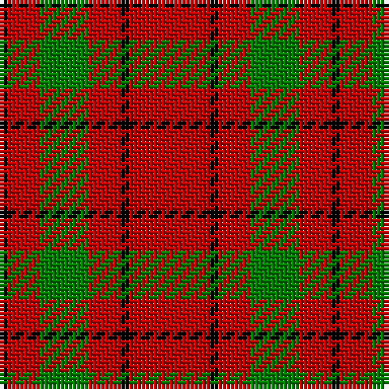

In pattern [KRGRKR](/patterns/krgrkr/).

This was sourced from weddslist.  It is a [6 stripes tartan](/stripes/stripes6/).

Original link http://www.weddslist.com/cgi-bin/tartans/pg.pl?source=sts

## Thread count
K/2 R8 G12 R8 K2 R/20

## Palette
Each colour and its ΔE from the base-6 reference it is a variant of.

| Colour | Shade | Base | ΔE (OKLab) |
|---|---|---|---|
| G | <code style="background-color:#008000;">#008000</code> `#008000` | G <code style="background-color:#006100;">#006100</code> | 0.10 |
| K | <code style="background-color:#000000;">#000000</code> `#000000` | K <code style="background-color:#000000;">#000000</code> | 0.00 |
| R | <code style="background-color:#C00000;">#C00000</code> `#C00000` | R <code style="background-color:#CC0000;">#CC0000</code> | 0.03 |

# Sample pattern

## Nearest tartans

The nearest existing variants by ΔTartan distance.

1. [MacQuarrie #7](/setts/s7/r4g5r2k6r18k2r4~g005020-k101010-rdc0000~x2/) — ΔT 1.03
1. [MacQuarrie 5](/setts/s7/r4g5r2k6r18k2r4~g008000-k000000-rc00000~x2/) — ΔT 1.16
1. [Auld Lang Syne (red) Tartan Tartan Number: 2402. Earliest known date: Threadcount and colours aren't 100% original. Generated manually. See products available Copyright © Blair Urquhart, Comrie, 2015](/setts/s7/r4g14r5k6r24g2r4~g006818-k101010-rc80000~x2/) — ΔT 1.18
1. [MacKeane](/setts/s5/r4k8r12k1y1~k101010-rc80000-ye8c000~x2/) — ΔT 1.28
1. [Sinclair Dress](/setts/s5/r28g16k4w7r28~g004c00-k000000-rc80000-wd0d0d0/) — ΔT 1.29
1. [MacDonald of Sleat](/setts/s5/g7r3g1r9k1~g004c00-k000000-rc80000~x2/) — ΔT 1.37
1. [Crawford](/setts/s7/r6w2r30g12r3g12r3~g004c00-rc80000-wd0d0d0/) — ΔT 1.38
1. [MacDonell of Keppach](/setts/s11/r9g4r6k2r4k2r8g14r24k2r4~g008000-k000000-rc00000~x2/) — ΔT 1.40
1. [Sinclair](/setts/s5/r30g12k5w8r30~g004c00-k000000-rc80000-wd0d0d0/) — ΔT 1.41
1. [Cameron](/setts/s6/r2g6r2g6r16y1~g004c00-rc80000-yffc800~x2/) — ΔT 1.42

## Neighbour map

Every grey dot is one of 15726 variants placed by the first two principal components of the ΔTartan feature space (44% of its variance). Red is this tartan; blue dots are its nearest — click one to open its page.

<svg viewBox="0 0 640 380" role="img" style="max-width:100%;height:auto;border:1px solid #e0e0e0;border-radius:4px;display:block" xmlns="http://www.w3.org/2000/svg"><image href="/nn/cloud.v1.png" width="640" height="380"/><a href="/setts/s7/r4g5r2k6r18k2r4~g005020-k101010-rdc0000~x2/"><circle cx="409.2" cy="211.2" r="4" fill="#3465a4"><title>MacQuarrie #7</title></circle></a><a href="/setts/s7/r4g5r2k6r18k2r4~g008000-k000000-rc00000~x2/"><circle cx="390.5" cy="209.7" r="4" fill="#3465a4"><title>MacQuarrie 5</title></circle></a><a href="/setts/s7/r4g14r5k6r24g2r4~g006818-k101010-rc80000~x2/"><circle cx="395.2" cy="210.1" r="4" fill="#3465a4"><title>Auld Lang Syne (red) Tartan Tartan Number: 2402. Earliest known date: Threadcount and colours aren't 100% original. Generated manually. See products available Copyright © Blair Urquhart, Comrie, 2015</title></circle></a><a href="/setts/s5/r4k8r12k1y1~k101010-rc80000-ye8c000~x2/"><circle cx="385.3" cy="220.7" r="4" fill="#3465a4"><title>MacKeane</title></circle></a><a href="/setts/s5/r28g16k4w7r28~g004c00-k000000-rc80000-wd0d0d0/"><circle cx="348.3" cy="241.4" r="4" fill="#3465a4"><title>Sinclair Dress</title></circle></a><a href="/setts/s5/g7r3g1r9k1~g004c00-k000000-rc80000~x2/"><circle cx="354.7" cy="241.9" r="4" fill="#3465a4"><title>MacDonald of Sleat</title></circle></a><a href="/setts/s7/r6w2r30g12r3g12r3~g004c00-rc80000-wd0d0d0/"><circle cx="417.8" cy="197.9" r="4" fill="#3465a4"><title>Crawford</title></circle></a><a href="/setts/s11/r9g4r6k2r4k2r8g14r24k2r4~g008000-k000000-rc00000~x2/"><circle cx="421.2" cy="185.2" r="4" fill="#3465a4"><title>MacDonell of Keppach</title></circle></a><a href="/setts/s5/r30g12k5w8r30~g004c00-k000000-rc80000-wd0d0d0/"><circle cx="365.8" cy="243.0" r="4" fill="#3465a4"><title>Sinclair</title></circle></a><a href="/setts/s6/r2g6r2g6r16y1~g004c00-rc80000-yffc800~x2/"><circle cx="415.1" cy="203.2" r="4" fill="#3465a4"><title>Cameron</title></circle></a><circle cx="408.8" cy="232.5" r="5" fill="#c00000"/></svg>

ID: /setts/s6/r10k1r4g6r4k1~g008000-k000000-rc00000~x2/
