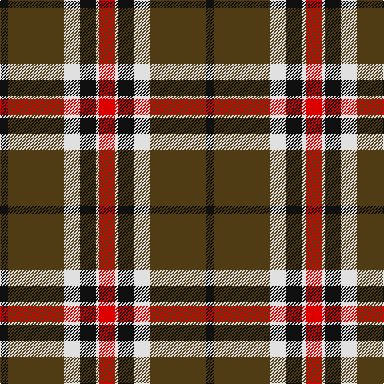

In pattern [KGWKWR](/patterns/kgwkwr/).

This was sourced from register-of-tartans.  It is a [6 stripes tartan](/stripes/stripes6/).

Original link https://www.tartanregister.gov.uk/tartanDetails.aspx?ref=2155

## Register references

External register numbers recorded for this tartan.

- Scottish Register of Tartans: [2155](https://www.tartanregister.gov.uk/tartanDetails.aspx?ref=2155)
- Scottish Tartans World Register: 1219

## Thread count
K/10 T70 LN20 K20 LN4 R/20

## Palette
Each colour and its ΔE from the base-6 reference it is a variant of.

| Colour | Shade | Base | ΔE (OKLab) |
|---|---|---|---|
| K | <code style="background-color:#101010;">#101010</code> `#101010` | K <code style="background-color:#000000;">#000000</code> | 0.17 |
| LN | <code style="background-color:#E0E0E0;">#E0E0E0</code> `#E0E0E0` | W <code style="background-color:#F7F7F7;">#F7F7F7</code> | 0.07 |
| R | <code style="background-color:#DC0000;">#DC0000</code> `#DC0000` | R <code style="background-color:#CC0000;">#CC0000</code> | 0.03 |
| T | <code style="background-color:#503C14;">#503C14</code> `#503C14` | G <code style="background-color:#006100;">#006100</code> | 0.14 |

# Sample pattern

## Nearest tartans

The nearest existing variants by ΔTartan distance.

1. [Loch Ness Trade Tartan Tartan Number: 1219. Earliest known date: pre 2003 Nothing See products available Copyright © Blair Urquhart, Comrie, 2015](/setts/s6/r10w2k10w10g35k5~g604000-k101010-rc80000-we0e0e0~x2/) — ΔT 0.22
1. [Loch Ness](/setts/s6/r10w2k10w10ra35k5~k000000-rc00000-ra806050-we0e0e0~x2/) — ΔT 0.58
1. [Thomson Camel (Jedburgh Mill)](/setts/s6/r4k2w10k10g28k3~g8c7038-k101010-rc80000-wc0c0c0~x2/) — ΔT 0.74
1. [Braemar or Blair Atholl](/setts/s8/b2w2k6b3k2r14k1r1~b441800-k101010-ra07c58-wffffff~x4/) — ΔT 0.90
1. [Merric Dark Camel.. Trade Tartan Tartan Number: 1688. Earliest known date: 1985 School colours. See products available Copyright © Blair Urquhart, Comrie, 2015](/setts/s7/r2w8k14g25w2k2w2~g604000-k101010-rc80000-we0e0e0~x2/) — ΔT 0.90
1. [Distripress Annual Congress 2012](/setts/s8/r12k2w8k4b16r2k31b2~b666666-k101010-rff0000-wffffff/) — ΔT 0.96
1. [Ruthven (V.S.) (Name)](/setts/s6/w6g15b18r30g2r4~b202060-g006818-rc80000-we0e0e0~x2/) — ΔT 0.97
1. [Blair Atholl (Fashion)](/setts/s8/b2y2k6b3k2r14k1r1~b441800-k101010-ra07c58-yb8b8b8~x4/) — ΔT 0.97
1. [Unidentified 12](/setts/s6/k6r2g17r16k1b2~b5480b0-g008000-k000000-rc00000~x2/) — ΔT 0.99
1. [Island of Innis, The](/setts/s8/k15g1k3r9g1r3y11k1~g285800-k101010-ra00000-yd09800~x4/) — ΔT 1.01

## Neighbour map

Every grey dot is one of 15726 variants placed by the first two principal components of the ΔTartan feature space (44% of its variance). Red is this tartan; blue dots are its nearest — click one to open its page.

<svg viewBox="0 0 640 380" role="img" style="max-width:100%;height:auto;border:1px solid #e0e0e0;border-radius:4px;display:block" xmlns="http://www.w3.org/2000/svg"><image href="/nn/cloud.v1.png" width="640" height="380"/><a href="/setts/s6/r10w2k10w10g35k5~g604000-k101010-rc80000-we0e0e0~x2/"><circle cx="254.5" cy="172.5" r="4" fill="#3465a4"><title>Loch Ness Trade Tartan Tartan Number: 1219. Earliest known date: pre 2003 Nothing See products available Copyright © Blair Urquhart, Comrie, 2015</title></circle></a><a href="/setts/s6/r10w2k10w10ra35k5~k000000-rc00000-ra806050-we0e0e0~x2/"><circle cx="239.3" cy="165.6" r="4" fill="#3465a4"><title>Loch Ness</title></circle></a><a href="/setts/s6/r4k2w10k10g28k3~g8c7038-k101010-rc80000-wc0c0c0~x2/"><circle cx="259.6" cy="179.5" r="4" fill="#3465a4"><title>Thomson Camel (Jedburgh Mill)</title></circle></a><a href="/setts/s8/b2w2k6b3k2r14k1r1~b441800-k101010-ra07c58-wffffff~x4/"><circle cx="254.5" cy="157.5" r="4" fill="#3465a4"><title>Braemar or Blair Atholl</title></circle></a><a href="/setts/s7/r2w8k14g25w2k2w2~g604000-k101010-rc80000-we0e0e0~x2/"><circle cx="231.9" cy="166.3" r="4" fill="#3465a4"><title>Merric Dark Camel.. Trade Tartan Tartan Number: 1688. Earliest known date: 1985 School colours. See products available Copyright © Blair Urquhart, Comrie, 2015</title></circle></a><a href="/setts/s8/r12k2w8k4b16r2k31b2~b666666-k101010-rff0000-wffffff/"><circle cx="235.7" cy="154.2" r="4" fill="#3465a4"><title>Distripress Annual Congress 2012</title></circle></a><a href="/setts/s6/w6g15b18r30g2r4~b202060-g006818-rc80000-we0e0e0~x2/"><circle cx="238.0" cy="186.5" r="4" fill="#3465a4"><title>Ruthven (V.S.) (Name)</title></circle></a><a href="/setts/s8/b2y2k6b3k2r14k1r1~b441800-k101010-ra07c58-yb8b8b8~x4/"><circle cx="266.2" cy="162.7" r="4" fill="#3465a4"><title>Blair Atholl (Fashion)</title></circle></a><a href="/setts/s6/k6r2g17r16k1b2~b5480b0-g008000-k000000-rc00000~x2/"><circle cx="233.6" cy="173.6" r="4" fill="#3465a4"><title>Unidentified 12</title></circle></a><a href="/setts/s8/k15g1k3r9g1r3y11k1~g285800-k101010-ra00000-yd09800~x4/"><circle cx="232.0" cy="165.4" r="4" fill="#3465a4"><title>Island of Innis, The</title></circle></a><circle cx="251.4" cy="172.5" r="5" fill="#c00000"/></svg>

ID: /setts/s6/r10w2k10w10g35k5~g503c14-k101010-rdc0000-we0e0e0~x2/
