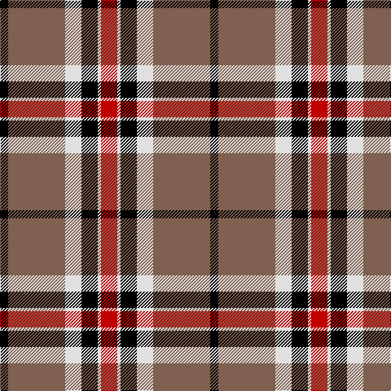

In pattern [KRWKWR](/stripes/krwkwr/).

This was sourced from weddslist.  It is a [6 stripe tartan](/stripes/stripes6/).

Original link http://www.weddslist.com/cgi-bin/tartans/pg.pl?source=sts

## Thread count
R/20 LN4 K20 LN20 LT70 K/10

## Palette
Each colour and the base-6 reference it is a variant of.

| Colour | Shade | Base |
|---|---|---|
| K | <code style="background-color:#000000;">#000000</code> `oklch(0.0% 0.000 0.0)` <small>#000000</small> | K <code style="background-color:#000000;">#000000</code> |
| LN | <code style="background-color:#E0E0E0;">#E0E0E0</code> `oklch(90.7% 0.000 89.9)` <small>#E0E0E0</small> | W <code style="background-color:#F7F7F7;">#F7F7F7</code> |
| LT | <code style="background-color:#806050;">#806050</code> `oklch(51.7% 0.049 47.8)` <small>#806050</small> | R <code style="background-color:#CC0000;">#CC0000</code> |
| R | <code style="background-color:#C00000;">#C00000</code> `oklch(50.7% 0.208 29.2)` <small>#C00000</small> | R <code style="background-color:#CC0000;">#CC0000</code> |

# Sample pattern

## Nearest tartans

The nearest existing variants by ΔTartan distance, with this tartan at the top so the swatches line up against it.

ΔTartan

Tartan

Sett

—

<a href="/ttd/edit/#slug=r10w2k10w10o35k5~x2">Loch Ness</a> <a class="nn-out" href="/setts/s6/r10w2k10w10o35k5~x2/" title="open its dictionary page">↗</a>

0.58

<a href="/ttd/edit/#slug=r10w2k10w10dy35k5~x2">Loch Ness</a> <a class="nn-out" href="/setts/s6/r10w2k10w10dy35k5~x2/" title="open its dictionary page">↗</a>

0.82

<a href="/ttd/edit/#slug=r12k2w8k4n16r2k31n2">Distripress Annual Congress 2012</a> <a class="nn-out" href="/setts/s8/r12k2w8k4n16r2k31n2/" title="open its dictionary page">↗</a>

0.96

<a href="/ttd/edit/#slug=k30w2lr4lo10w9k3lr5~x2">Virginia Commonwealth University</a> <a class="nn-out" href="/setts/s7/k30w2lr4lo10w9k3lr5~x2/" title="open its dictionary page">↗</a>

0.98

<a href="/ttd/edit/#slug=r2w8k14o25w2k2w2~x2">Merric, Dark Camel..</a> <a class="nn-out" href="/setts/s7/r2w8k14o25w2k2w2~x2/" title="open its dictionary page">↗</a>

1.02

<a href="/ttd/edit/#slug=r2w8k14dy25w2k2w2~x2">Merric Dark Camel.. Trade Tartan Tartan Number: 1688. Earliest known date: 1985 School colours. See products available Copyright © Blair Urquhart, Comrie, 2015</a> <a class="nn-out" href="/setts/s7/r2w8k14dy25w2k2w2~x2/" title="open its dictionary page">↗</a>

1.02

<a href="/ttd/edit/#slug=r4k2lb10k10y28k3~x2">Thomson Camel (Jedburgh Mill)</a> <a class="nn-out" href="/setts/s6/r4k2lb10k10y28k3~x2/" title="open its dictionary page">↗</a>

1.05

<a href="/ttd/edit/#slug=k40w25k10ly8k3ly8k10r25w4~x2">Buchanan Old Dress</a> <a class="nn-out" href="/setts/s9/k40w25k10ly8k3ly8k10r25w4~x2/" title="open its dictionary page">↗</a>

1.06

<a href="/ttd/edit/#slug=do2w2k6do3k2o14k1o1~x4">Braemar or Blair Atholl</a> <a class="nn-out" href="/setts/s8/do2w2k6do3k2o14k1o1~x4/" title="open its dictionary page">↗</a>

1.10

<a href="/ttd/edit/#slug=r4o30k6w13k13w3~x2">Thom(p)son camel</a> <a class="nn-out" href="/setts/s6/r4o30k6w13k13w3~x2/" title="open its dictionary page">↗</a>

1.17

<a href="/ttd/edit/#slug=k6w6k6o21r2~x4">Burberry, Check</a> <a class="nn-out" href="/setts/s5/k6w6k6o21r2~x4/" title="open its dictionary page">↗</a>

## Neighbour map

Every grey dot is one of 14299 variants placed by the first two principal components of the ΔTartan feature space (44% of its variance). Red is this tartan; blue dots are its nearest — click one to open its page.

<svg viewBox="0 0 640 380" role="img" style="max-width:100%;height:auto;border:1px solid #e0e0e0;border-radius:4px;display:block" xmlns="http://www.w3.org/2000/svg"><image href="/nn/cloud.v1.png" width="640" height="380"/><a href="/setts/s6/r10w2k10w10dy35k5~x2/"><circle cx="253.1" cy="169.2" r="4" fill="#3465a4"><title>Loch Ness</title></circle></a><a href="/setts/s8/r12k2w8k4n16r2k31n2/"><circle cx="237.8" cy="150.1" r="4" fill="#3465a4"><title>Distripress Annual Congress 2012</title></circle></a><a href="/setts/s7/k30w2lr4lo10w9k3lr5~x2/"><circle cx="248.2" cy="152.4" r="4" fill="#3465a4"><title>Virginia Commonwealth University</title></circle></a><a href="/setts/s7/r2w8k14o25w2k2w2~x2/"><circle cx="221.6" cy="156.4" r="4" fill="#3465a4"><title>Merric, Dark Camel..</title></circle></a><a href="/setts/s7/r2w8k14dy25w2k2w2~x2/"><circle cx="234.2" cy="162.9" r="4" fill="#3465a4"><title>Merric Dark Camel.. Trade Tartan Tartan Number: 1688. Earliest known date: 1985 School colours. See products available Copyright © Blair Urquhart, Comrie, 2015</title></circle></a><a href="/setts/s6/r4k2lb10k10y28k3~x2/"><circle cx="261.2" cy="176.9" r="4" fill="#3465a4"><title>Thomson Camel (Jedburgh Mill)</title></circle></a><a href="/setts/s9/k40w25k10ly8k3ly8k10r25w4~x2/"><circle cx="200.0" cy="157.1" r="4" fill="#3465a4"><title>Buchanan Old Dress</title></circle></a><a href="/setts/s8/do2w2k6do3k2o14k1o1~x4/"><circle cx="256.5" cy="154.6" r="4" fill="#3465a4"><title>Braemar or Blair Atholl</title></circle></a><a href="/setts/s6/r4o30k6w13k13w3~x2/"><circle cx="185.0" cy="187.3" r="4" fill="#3465a4"><title>Thom(p)son camel</title></circle></a><a href="/setts/s5/k6w6k6o21r2~x4/"><circle cx="239.9" cy="196.7" r="4" fill="#3465a4"><title>Burberry, Check</title></circle></a><circle cx="241.0" cy="160.8" r="5" fill="#c00000"/></svg>

ID: /setts/s6/r10w2k10w10o35k5~x2/
