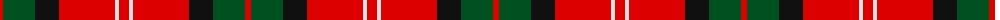

In pattern [RGKRWR](/patterns/rgkrwr/).

This was sourced from register-of-tartans.  It is a [6 stripes tartan](/stripes/stripes6/).

Original link https://www.tartanregister.gov.uk/tartanDetails.aspx?ref=2562

## Thread count
R/6 G32 K24 R56 LN4 R/10

## Palette
Each colour and its ΔE from the base-6 reference it is a variant of.

| Colour | Shade | Base | ΔE (OKLab) |
|---|---|---|---|
| G | <code style="background-color:#005020;">#005020</code> `#005020` | G <code style="background-color:#006400;">#006400</code> | 0.08 |
| K | <code style="background-color:#101010;">#101010</code> `#101010` | K <code style="background-color:#000000;">#000000</code> | 0.17 |
| LN | <code style="background-color:#E0E0E0;">#E0E0E0</code> `#E0E0E0` | W <code style="background-color:#F4F4F0;">#F4F4F0</code> | 0.06 |
| R | <code style="background-color:#DC0000;">#DC0000</code> `#DC0000` | R <code style="background-color:#C80000;">#C80000</code> | 0.04 |

# Sample pattern

## Nearest tartans

The nearest existing variants by ΔTartan distance.

1. [Nisbet Family Tartan Tartan Number: 2115. Earliest known date: 1842 This is the sett that appears in the Vestiarium Scoticum as Mackintosh. There is no connection between the names, historically, to explain the position and it is interesting to note the similarity with the Dunbar tartan which also originates in the Vestiarium. The Nisbets came from the old barony of Nisbet in the parish of Edrom, Berwickshire, as early as 1160. See products available Copyright © Blair Urquhart, Comrie, 2015](/setts/s6/r10w4r56k24g32r6-g006818-k101010-rc80000-we0e0e0/) — ΔT 0.36
1. [MacDuff #6](/setts/s7/r72w18k24g34r20k6r20-g006818-k101010-rc80000-w82cffd/) — ΔT 0.70
1. [Tipperary](/setts/s7/r66k16b24g24r16b4r16-b401000-g008000-k000000-rc00000/) — ΔT 0.75
1. [MacKintosh 6](/setts/s6/r10w4r56k24g32r6-g008000-k000000-rc00000-we0e0e0/) — ΔT 0.77
1. [MacDuff](/setts/s7/r72b18k24g34r20k6r20-b304080-g008000-k000000-rc00000/) — ΔT 0.77
1. [MacDuff #4](/setts/s7/r8k4r48k12b12g32r6-b2c4084-g005020-k101010-rdc0000/) — ΔT 0.80
1. [MacAulay](/setts/s6/k2r16g6r3g8w1-g004c00-k000000-rc80000-wd0d0d0/) — ΔT 0.82
1. [MacDuff - 1819 (Clan)](/setts/s7/r72b18k24g34r20k6r20-b2c2c80-g006818-k101010-rc80000/) — ΔT 0.86
1. [Grant of Lurg](/setts/s6/r4b20r4g20r50w4-b2c2c80-g006818-rc80000-wf8f8f8/) — ΔT 0.88
1. [Dunbar #2](/setts/s6/k8r52k8w4k26y8-k101010-rdc0000-we0e0e0-ye8c000/) — ΔT 0.90

## Neighbour map

Every grey dot is one of 15726 variants placed by the first two principal components of the ΔTartan feature space (44% of its variance). Red is this tartan; blue dots are its nearest — click one to open its page.

<svg viewBox="0 0 640 380" role="img" style="max-width:100%;height:auto;border:1px solid #e0e0e0;border-radius:4px;display:block" xmlns="http://www.w3.org/2000/svg"><image href="/nn/cloud.v1.png" width="640" height="380"/><a href="/setts/s6/r10w4r56k24g32r6-g006818-k101010-rc80000-we0e0e0/"><circle cx="305.9" cy="187.2" r="4" fill="#3465a4"><title>Nisbet Family Tartan Tartan Number: 2115. Earliest known date: 1842 This is the sett that appears in the Vestiarium Scoticum as Mackintosh. There is no connection between the names, historically, to explain the position and it is interesting to note the similarity with the Dunbar tartan which also originates in the Vestiarium. The Nisbets came from the old barony of Nisbet in the parish of Edrom, Berwickshire, as early as 1160. See products available Copyright © Blair Urquhart, Comrie, 2015</title></circle></a><a href="/setts/s7/r72w18k24g34r20k6r20-g006818-k101010-rc80000-w82cffd/"><circle cx="293.5" cy="192.2" r="4" fill="#3465a4"><title>MacDuff #6</title></circle></a><a href="/setts/s7/r66k16b24g24r16b4r16-b401000-g008000-k000000-rc00000/"><circle cx="329.9" cy="179.5" r="4" fill="#3465a4"><title>Tipperary</title></circle></a><a href="/setts/s6/r10w4r56k24g32r6-g008000-k000000-rc00000-we0e0e0/"><circle cx="284.2" cy="180.2" r="4" fill="#3465a4"><title>MacKintosh 6</title></circle></a><a href="/setts/s7/r72b18k24g34r20k6r20-b304080-g008000-k000000-rc00000/"><circle cx="288.4" cy="193.0" r="4" fill="#3465a4"><title>MacDuff</title></circle></a><a href="/setts/s7/r8k4r48k12b12g32r6-b2c4084-g005020-k101010-rdc0000/"><circle cx="278.6" cy="183.4" r="4" fill="#3465a4"><title>MacDuff #4</title></circle></a><a href="/setts/s6/k2r16g6r3g8w1-g004c00-k000000-rc80000-wd0d0d0/"><circle cx="322.4" cy="184.7" r="4" fill="#3465a4"><title>MacAulay</title></circle></a><a href="/setts/s7/r72b18k24g34r20k6r20-b2c2c80-g006818-k101010-rc80000/"><circle cx="310.6" cy="200.4" r="4" fill="#3465a4"><title>MacDuff - 1819 (Clan)</title></circle></a><a href="/setts/s6/r4b20r4g20r50w4-b2c2c80-g006818-rc80000-wf8f8f8/"><circle cx="328.6" cy="180.1" r="4" fill="#3465a4"><title>Grant of Lurg</title></circle></a><a href="/setts/s6/k8r52k8w4k26y8-k101010-rdc0000-we0e0e0-ye8c000/"><circle cx="281.7" cy="168.7" r="4" fill="#3465a4"><title>Dunbar #2</title></circle></a><circle cx="301.9" cy="183.1" r="5" fill="#c00000"/></svg>

ID: /setts/s6/r10w4r56k24g32r6-g005020-k101010-rdc0000-we0e0e0/
