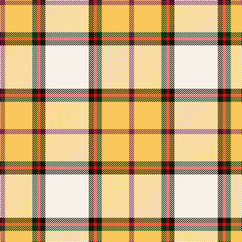

In pattern [RYGRKW](/patterns/rygrkw/).

This was sourced from house-of-tartan.  It is a [6 stripes tartan](/stripes/stripes6/).

Original link http://www.house-of-tartan.scotland.net/house/TartanViewjs.asp?colr=Def&tnam=10701

## Thread count
DR/10 LG54 DG10 R6 K10 W/86

## Palette
Each colour and its ΔE from the base-6 reference it is a variant of.

| Colour | Shade | Base | ΔE (OKLab) |
|---|---|---|---|
| DG | <code style="background-color:#052F14;">#052F14</code> `#052F14` | G <code style="background-color:#006400;">#006400</code> | 0.19 |
| DR | <code style="background-color:#832A4F;">#832A4F</code> `#832A4F` | R <code style="background-color:#C80000;">#C80000</code> | 0.16 |
| K | <code style="background-color:#120A01;">#120A01</code> `#120A01` | K <code style="background-color:#000000;">#000000</code> | 0.15 |
| LG | <code style="background-color:#F9C75C;">#F9C75C</code> `#F9C75C` | Y <code style="background-color:#E8C000;">#E8C000</code> | 0.05 |
| R | <code style="background-color:#DD1212;">#DD1212</code> `#DD1212` | R <code style="background-color:#C80000;">#C80000</code> | 0.05 |
| W | <code style="background-color:#F7F1E8;">#F7F1E8</code> `#F7F1E8` | W <code style="background-color:#F4F4F0;">#F4F4F0</code> | 0.01 |

# Sample pattern

ID: /setts/s6/r10y54g10ra6k10w86-g052f14-k120a01-r832a4f-radd1212-wf7f1e8-yf9c75c/
