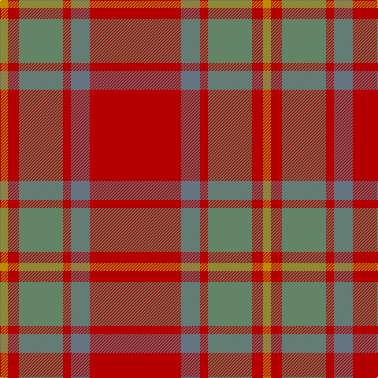

In pattern [RBRGRY](/patterns/rbrgry/).

This was sourced from tartans-authority.  It is a [6 stripes tartan](/stripes/stripes6/).

Original link http://www.tartansauthority.com/tartan-ferret/display/8123/

## Thread count
DY/10 R14 N56 R10 B24 R/116

## Palette
Each colour and its ΔE from the base-6 reference it is a variant of.

| Colour | Shade | Base | ΔE (OKLab) |
|---|---|---|---|
| B | <code style="background-color:#647480;">#647480</code> `#647480` | B <code style="background-color:#2C4084;">#2C4084</code> | 0.18 |
| DY | <code style="background-color:#BC8C00;">#BC8C00</code> `#BC8C00` | Y <code style="background-color:#E8C000;">#E8C000</code> | 0.16 |
| N | <code style="background-color:#648468;">#648468</code> `#648468` | G <code style="background-color:#006400;">#006400</code> | 0.17 |
| R | <code style="background-color:#B40000;">#B40000</code> `#B40000` | R <code style="background-color:#C80000;">#C80000</code> | 0.04 |

# Sample pattern

## Nearest tartans

The nearest existing variants by ΔTartan distance.

1. [Chisholm](/setts/s8/r24b4y2b4r6g16r6b2-b6e5058-g11450d-raa0000-yaaaaaa/) — ΔT 1.17
1. [Chisholm](/setts/s8/r12b2y1b2r3g8r3b1-b6e5058-g11450d-raa0000-yaaaaaa/) — ΔT 1.17
1. [Glen Shee](/setts/s5/r74ra18r6g18ra6-g008000-r900030-ra806050/) — ΔT 1.32
1. [MacIver of Strathendry Htg (Personal](/setts/s9/r6ra56b10ra10b66ra10b10ra56y6-b441800-r880000-ra98481c-ybc8c00/) — ΔT 1.39
1. [Maguire, Black (Name)](/setts/s6/r116g8r8g8r24y84-g00643c-rd0002c-ybc8c00/) — ΔT 1.45
1. [Glen Shee Trade Tartan Tartan Number: 1662. Earliest known date: pre 2003 May have been obtained from a hand made design procured in the Highlands for The Highland Society of London. See products available Copyright © Blair Urquhart, Comrie, 2015](/setts/s5/r74g18r6ga18g6-g604000-ga006818-ra00048/) — ΔT 1.47
1. [Cetoloni](/setts/s6/b4r44g22ga4g22b4-b304080-g604000-ga908000-rc00020/) — ΔT 1.57
1. [Scottish Piping Soc. of London (Corp](/setts/s7/r60g6b10g42r6g42b4-b202060-g5c6428-rc8002c/) — ΔT 1.68
1. [Burnett of Powis (Personal)](/setts/s8/b6r42g6r6g38y6g38r6-b2888c4-g5c6428-rc80000-ye8c000/) — ΔT 1.70
1. [MacColl](/setts/s14/r24g2r2ra16r4ra2r2b6r2ra2r24g2r2g8-b304080-g008000-rc00000-ra806050/) — ΔT 1.80

## Neighbour map

Every grey dot is one of 15726 variants placed by the first two principal components of the ΔTartan feature space (44% of its variance). Red is this tartan; blue dots are its nearest — click one to open its page.

<svg viewBox="0 0 640 380" role="img" style="max-width:100%;height:auto;border:1px solid #e0e0e0;border-radius:4px;display:block" xmlns="http://www.w3.org/2000/svg"><image href="/nn/cloud.v1.png" width="640" height="380"/><a href="/setts/s8/r24b4y2b4r6g16r6b2-b6e5058-g11450d-raa0000-yaaaaaa/"><circle cx="376.9" cy="202.9" r="4" fill="#3465a4"><title>Chisholm</title></circle></a><a href="/setts/s8/r12b2y1b2r3g8r3b1-b6e5058-g11450d-raa0000-yaaaaaa/"><circle cx="376.9" cy="202.9" r="4" fill="#3465a4"><title>Chisholm</title></circle></a><a href="/setts/s5/r74ra18r6g18ra6-g008000-r900030-ra806050/"><circle cx="489.4" cy="235.5" r="4" fill="#3465a4"><title>Glen Shee</title></circle></a><a href="/setts/s9/r6ra56b10ra10b66ra10b10ra56y6-b441800-r880000-ra98481c-ybc8c00/"><circle cx="420.4" cy="211.8" r="4" fill="#3465a4"><title>MacIver of Strathendry Htg (Personal</title></circle></a><a href="/setts/s6/r116g8r8g8r24y84-g00643c-rd0002c-ybc8c00/"><circle cx="456.3" cy="204.6" r="4" fill="#3465a4"><title>Maguire, Black (Name)</title></circle></a><a href="/setts/s5/r74g18r6ga18g6-g604000-ga006818-ra00048/"><circle cx="496.3" cy="236.9" r="4" fill="#3465a4"><title>Glen Shee Trade Tartan Tartan Number: 1662. Earliest known date: pre 2003 May have been obtained from a hand made design procured in the Highlands for The Highland Society of London. See products available Copyright © Blair Urquhart, Comrie, 2015</title></circle></a><a href="/setts/s6/b4r44g22ga4g22b4-b304080-g604000-ga908000-rc00020/"><circle cx="354.0" cy="227.8" r="4" fill="#3465a4"><title>Cetoloni</title></circle></a><a href="/setts/s7/r60g6b10g42r6g42b4-b202060-g5c6428-rc8002c/"><circle cx="390.3" cy="215.8" r="4" fill="#3465a4"><title>Scottish Piping Soc. of London (Corp</title></circle></a><a href="/setts/s8/b6r42g6r6g38y6g38r6-b2888c4-g5c6428-rc80000-ye8c000/"><circle cx="352.4" cy="222.4" r="4" fill="#3465a4"><title>Burnett of Powis (Personal)</title></circle></a><a href="/setts/s14/r24g2r2ra16r4ra2r2b6r2ra2r24g2r2g8-b304080-g008000-rc00000-ra806050/"><circle cx="412.7" cy="162.5" r="4" fill="#3465a4"><title>MacColl</title></circle></a><circle cx="428.5" cy="211.5" r="5" fill="#c00000"/></svg>

ID: /setts/s6/r116b24r10g56r14y10-b647480-g648468-rb40000-ybc8c00/
