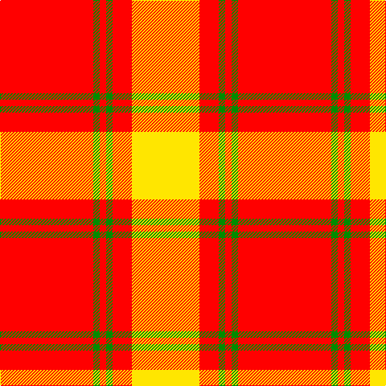

In pattern [RGRGRY](/patterns/rgrgry/).

This was sourced from register-of-tartans.  It is a [6 stripes tartan](/stripes/stripes6/).

Original link https://www.tartanregister.gov.uk/tartanDetails.aspx?ref=2785

## Thread count
R/116 G8 R8 G8 R24 Y/84

## Palette
Each colour and its ΔE from the base-6 reference it is a variant of.

| Colour | Shade | Base | ΔE (OKLab) |
|---|---|---|---|
| G | <code style="background-color:#008B00;">#008B00</code> `#008B00` | G <code style="background-color:#006400;">#006400</code> | 0.12 |
| R | <code style="background-color:#FF0000;">#FF0000</code> `#FF0000` | R <code style="background-color:#C80000;">#C80000</code> | 0.11 |
| Y | <code style="background-color:#FFE600;">#FFE600</code> `#FFE600` | Y <code style="background-color:#E8C000;">#E8C000</code> | 0.10 |

# Sample pattern

## Nearest tartans

The nearest existing variants by ΔTartan distance.

1. [Masai Shuka 16 (Artefact)](/setts/s6/y16k6y8k4r60y12-k101010-rc80000-ye8c000/) — ΔT 1.37
1. [MacMillan](/setts/s9/r6y2r24y4r6y16r4y16r2-rc00000-yf0c000/) — ΔT 1.67
1. [Shire of Hornwood (USA)](/setts/s5/r36y6r36y60k8-k101010-rff0000-yffe600/) — ΔT 1.71
1. [Glassary #3](/setts/s8/b16y4r48y8r8y48r4y16-b2c2c80-rc80000-ye8c000/) — ΔT 1.77
1. [Shire of Hornwood (Corporate)](/setts/s5/r36y6r36y60k8-k101010-rc80000-yfccc00/) — ΔT 1.80
1. [MacMillan Dress Clan Tartan Tartan Number: 1723. Earliest known date: 1906 The modern Dress MacMillan incorporates red and yellow stripes from the ancient design but omits the greens and blues of the Vestiarium version. See products available Copyright © Blair Urquhart, Comrie, 2015](/setts/s9/r12y4r36y6r8y24r6y20r4-rc80000-ye8c000/) — ΔT 1.84
1. [MacMillan](/setts/s9/r3y1r12y2r3y8r2y8r1-rc80000-yc8c800/) — ΔT 1.85
1. [Maver (Buckie)](/setts/s7/g4y4g4w4g40r80y4-g006400-rff0000-wffffff-yffe600/) — ΔT 1.95
1. [Queen Alexandra Tartan Tartan Number: 972. Earliest known date: pre 2003 The Scottish Tartans Society received a sample from A.C.Lumsden which is slightly different. (The black and the dark blue are almost indistinguishable). The colours of the tartan are taken from the Provincial Coat of Arms. The tartan is not registered with Lord Lyon. See products available Copyright © Blair Urquhart, Comrie, 2015](/setts/s10/g8r4g4r42w4r6w4r6w16r8-g006818-rc80000-we0e0e0/) — ΔT 2.12
1. [Loch Morar Trade Tartan Tartan Number: 1701. Earliest known date: pre 2003 Nothing See products available Copyright © Blair Urquhart, Comrie, 2015](/setts/s5/r76w18r6b18w6-b441800-rc80000-we0e0e0/) — ΔT 2.12

## Neighbour map

Every grey dot is one of 15726 variants placed by the first two principal components of the ΔTartan feature space (44% of its variance). Red is this tartan; blue dots are its nearest — click one to open its page.

<svg viewBox="0 0 640 380" role="img" style="max-width:100%;height:auto;border:1px solid #e0e0e0;border-radius:4px;display:block" xmlns="http://www.w3.org/2000/svg"><image href="/nn/cloud.v1.png" width="640" height="380"/><a href="/setts/s6/y16k6y8k4r60y12-k101010-rc80000-ye8c000/"><circle cx="363.9" cy="166.6" r="4" fill="#3465a4"><title>Masai Shuka 16 (Artefact)</title></circle></a><a href="/setts/s9/r6y2r24y4r6y16r4y16r2-rc00000-yf0c000/"><circle cx="367.5" cy="197.5" r="4" fill="#3465a4"><title>MacMillan</title></circle></a><a href="/setts/s5/r36y6r36y60k8-k101010-rff0000-yffe600/"><circle cx="288.3" cy="210.0" r="4" fill="#3465a4"><title>Shire of Hornwood (USA)</title></circle></a><a href="/setts/s8/b16y4r48y8r8y48r4y16-b2c2c80-rc80000-ye8c000/"><circle cx="299.5" cy="174.9" r="4" fill="#3465a4"><title>Glassary #3</title></circle></a><a href="/setts/s5/r36y6r36y60k8-k101010-rc80000-yfccc00/"><circle cx="293.9" cy="216.7" r="4" fill="#3465a4"><title>Shire of Hornwood (Corporate)</title></circle></a><a href="/setts/s9/r12y4r36y6r8y24r6y20r4-rc80000-ye8c000/"><circle cx="368.1" cy="213.5" r="4" fill="#3465a4"><title>MacMillan Dress Clan Tartan Tartan Number: 1723. Earliest known date: 1906 The modern Dress MacMillan incorporates red and yellow stripes from the ancient design but omits the greens and blues of the Vestiarium version. See products available Copyright © Blair Urquhart, Comrie, 2015</title></circle></a><a href="/setts/s9/r3y1r12y2r3y8r2y8r1-rc80000-yc8c800/"><circle cx="361.9" cy="199.4" r="4" fill="#3465a4"><title>MacMillan</title></circle></a><a href="/setts/s7/g4y4g4w4g40r80y4-g006400-rff0000-wffffff-yffe600/"><circle cx="370.1" cy="121.0" r="4" fill="#3465a4"><title>Maver (Buckie)</title></circle></a><a href="/setts/s10/g8r4g4r42w4r6w4r6w16r8-g006818-rc80000-we0e0e0/"><circle cx="386.0" cy="160.9" r="4" fill="#3465a4"><title>Queen Alexandra Tartan Tartan Number: 972. Earliest known date: pre 2003 The Scottish Tartans Society received a sample from A.C.Lumsden which is slightly different. (The black and the dark blue are almost indistinguishable). The colours of the tartan are taken from the Provincial Coat of Arms. The tartan is not registered with Lord Lyon. See products available Copyright © Blair Urquhart, Comrie, 2015</title></circle></a><a href="/setts/s5/r76w18r6b18w6-b441800-rc80000-we0e0e0/"><circle cx="417.5" cy="186.1" r="4" fill="#3465a4"><title>Loch Morar Trade Tartan Tartan Number: 1701. Earliest known date: pre 2003 Nothing See products available Copyright © Blair Urquhart, Comrie, 2015</title></circle></a><circle cx="386.3" cy="166.7" r="5" fill="#c00000"/></svg>

ID: /setts/s6/r116g8r8g8r24y84-g008b00-rff0000-yffe600/
