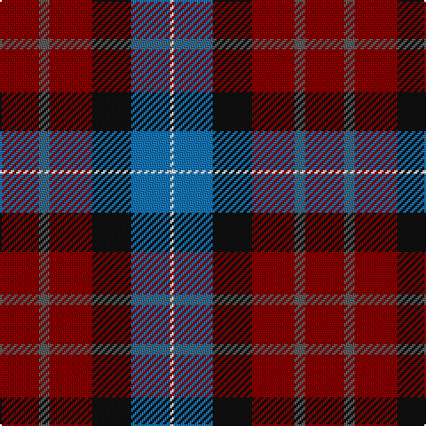

In pattern [RBRKBW](/patterns/rbrkbw/).

This was sourced from register-of-tartans.  It is a [6 stripes tartan](/stripes/stripes6/).

Original link https://www.tartanregister.gov.uk/tartanDetails.aspx?ref=1043

## Register references

External register numbers recorded for this tartan.

- Scottish Register of Tartans: [1043](https://www.tartanregister.gov.uk/tartanDetails.aspx?ref=1043)
- Scottish Tartans Authority (ITI): 5773

## Thread count
DR/22 N6 DR24 K22 B22 W/2

## Palette
Each colour and its ΔE from the base-6 reference it is a variant of.

| Colour | Shade | Base | ΔE (OKLab) |
|---|---|---|---|
| B | <code style="background-color:#1474B4;">#1474B4</code> `#1474B4` | B <code style="background-color:#2A418A;">#2A418A</code> | 0.15 |
| DR | <code style="background-color:#880000;">#880000</code> `#880000` | R <code style="background-color:#CC0000;">#CC0000</code> | 0.15 |
| K | <code style="background-color:#101010;">#101010</code> `#101010` | K <code style="background-color:#000000;">#000000</code> | 0.17 |
| N | <code style="background-color:#5C5C5C;">#5C5C5C</code> `#5C5C5C` | B <code style="background-color:#2A418A;">#2A418A</code> | 0.15 |
| W | <code style="background-color:#FCFCFC;">#FCFCFC</code> `#FCFCFC` | W <code style="background-color:#F7F7F7;">#F7F7F7</code> | 0.01 |

# Sample pattern

## Nearest tartans

The nearest existing variants by ΔTartan distance.

1. [Kilgour](/setts/s6/b14g21b4r21b14y2~b080848-g005020-rdc0000-ye8c000~x2/) — ΔT 1.32
1. [Dundas](/setts/s7/b9r24g24k24b24y2b9~b2c4084-g005020-k101010-rdc0000-ye8c000/) — ΔT 1.34
1. [Baillie of Polkemmet Red](/setts/s5/w3b12k12r20g2~b1870a4-g006818-k101010-rc80000-we0e0e0~x2/) — ΔT 1.37
1. [Harrower, John Anthony (Personal)](/setts/s8/g8b5k1b17r10b2r10ra2~b2c2c80-g003820-k101010-rc80000-ra888888~x2/) — ΔT 1.40
1. [Fife (McGill)](/setts/s6/b31ba4b6k19r20y4~b2c2c80-ba5c8ca8-k101010-rc80000-ye8c000~x2/) — ΔT 1.42
1. [Ross Dempster (Personal)](/setts/s7/b4ba29g10r10ra18g2ba4~b0000ff-ba141e46-g003c14-r960000-rac80028~x2/) — ΔT 1.44
1. [Wilson's No.229](/setts/s8/g14b11ba3k5ba3b11g14w2~b780078-ba5c8ca8-g285800-k101010-wfcfcfc~x2/) — ΔT 1.45
1. [MacQuarrie LO](/setts/s7/r6g16r4b12r16ba1r2~b000052-ba4367ae-g11450d-raa0000~x2/) — ΔT 1.45
1. [MacQuarrie LO](/setts/s7/r6g16r4b12r16ba1r2~b000052-ba4367ae-g11450d-raa0000/) — ΔT 1.45
1. [McCurdy-Stribbling (Personal)](/setts/s5/b15ba20bb12r34w3~b2c2c80-ba506878-bb404040-rc80000-wcccccc~x2/) — ΔT 1.47

## Neighbour map

Every grey dot is one of 15726 variants placed by the first two principal components of the ΔTartan feature space (44% of its variance). Red is this tartan; blue dots are its nearest — click one to open its page.

<svg viewBox="0 0 640 380" role="img" style="max-width:100%;height:auto;border:1px solid #e0e0e0;border-radius:4px;display:block" xmlns="http://www.w3.org/2000/svg"><image href="/nn/cloud.v1.png" width="640" height="380"/><a href="/setts/s6/b14g21b4r21b14y2~b080848-g005020-rdc0000-ye8c000~x2/"><circle cx="195.5" cy="228.2" r="4" fill="#3465a4"><title>Kilgour</title></circle></a><a href="/setts/s7/b9r24g24k24b24y2b9~b2c4084-g005020-k101010-rdc0000-ye8c000/"><circle cx="145.8" cy="211.7" r="4" fill="#3465a4"><title>Dundas</title></circle></a><a href="/setts/s5/w3b12k12r20g2~b1870a4-g006818-k101010-rc80000-we0e0e0~x2/"><circle cx="168.9" cy="200.4" r="4" fill="#3465a4"><title>Baillie of Polkemmet Red</title></circle></a><a href="/setts/s8/g8b5k1b17r10b2r10ra2~b2c2c80-g003820-k101010-rc80000-ra888888~x2/"><circle cx="246.3" cy="173.1" r="4" fill="#3465a4"><title>Harrower, John Anthony (Personal)</title></circle></a><a href="/setts/s6/b31ba4b6k19r20y4~b2c2c80-ba5c8ca8-k101010-rc80000-ye8c000~x2/"><circle cx="186.3" cy="208.9" r="4" fill="#3465a4"><title>Fife (McGill)</title></circle></a><a href="/setts/s7/b4ba29g10r10ra18g2ba4~b0000ff-ba141e46-g003c14-r960000-rac80028~x2/"><circle cx="223.0" cy="180.6" r="4" fill="#3465a4"><title>Ross Dempster (Personal)</title></circle></a><a href="/setts/s8/g14b11ba3k5ba3b11g14w2~b780078-ba5c8ca8-g285800-k101010-wfcfcfc~x2/"><circle cx="181.0" cy="217.0" r="4" fill="#3465a4"><title>Wilson's No.229</title></circle></a><a href="/setts/s7/r6g16r4b12r16ba1r2~b000052-ba4367ae-g11450d-raa0000~x2/"><circle cx="288.6" cy="200.4" r="4" fill="#3465a4"><title>MacQuarrie LO</title></circle></a><a href="/setts/s7/r6g16r4b12r16ba1r2~b000052-ba4367ae-g11450d-raa0000/"><circle cx="288.6" cy="200.4" r="4" fill="#3465a4"><title>MacQuarrie LO</title></circle></a><a href="/setts/s5/b15ba20bb12r34w3~b2c2c80-ba506878-bb404040-rc80000-wcccccc~x2/"><circle cx="205.6" cy="219.0" r="4" fill="#3465a4"><title>McCurdy-Stribbling (Personal)</title></circle></a><circle cx="214.0" cy="216.8" r="5" fill="#c00000"/></svg>

ID: /setts/s6/r11b3r12k11ba11w1~b5c5c5c-ba1474b4-k101010-r880000-wfcfcfc~x2/
