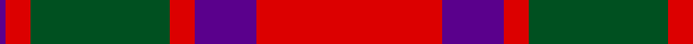

In pattern [BRGRBR](/patterns/brgrbr/).

This was sourced from register-of-tartans.  It is a [6 stripes tartan](/stripes/stripes6/).

Original link https://www.tartanregister.gov.uk/tartanDetails.aspx?ref=470

## Thread count
P/4 R16 G90 R16 P40 R/120

## Palette
Each colour and its ΔE from the base-6 reference it is a variant of.

| Colour | Shade | Base | ΔE (OKLab) |
|---|---|---|---|
| G | <code style="background-color:#005020;">#005020</code> `#005020` | G <code style="background-color:#006400;">#006400</code> | 0.08 |
| P | <code style="background-color:#5A008C;">#5A008C</code> `#5A008C` | B <code style="background-color:#2C4084;">#2C4084</code> | 0.12 |
| R | <code style="background-color:#DC0000;">#DC0000</code> `#DC0000` | R <code style="background-color:#C80000;">#C80000</code> | 0.04 |

# Sample pattern

## Nearest tartans

The nearest existing variants by ΔTartan distance.

1. [Caledonian - 1819 (Fashion?)](/setts/s6/r60b20r8g45r8b2-b440044-g006818-rc80000/) — ΔT 0.62
1. [Caledonian District Tartan Tartan Number: 526. Earliest known date: 1819 In view of its widespread use as a foundation for other tartans it is perhaps not surprising that Wilson's named the Mackintosh tartan 'Caledonian'. They also called it 'Lovat or Fraser'. For this reason the tartan is not suitable for persons seeking a Caledonian tartan unless they are also Frasers of Lovat or Mackintoshes. See products available Copyright © Blair Urquhart, Comrie, 2015](/setts/s6/r120b40r16g90r16b4-b780078-g006818-rc80000/) — ΔT 0.72
1. [Caledonian](/setts/s6/r120b40r16g90r16b4-b800080-g008000-rc00000/) — ΔT 0.74
1. [MacKintosh](/setts/s6/r70b20r10g40r10b3-b2c2c80-g006818-rc80000/) — ΔT 0.83
1. [Robertson](/setts/s6/r4g40r4b16r72g2-b2c4084-g005020-rdc0000/) — ΔT 0.92
1. [Franklin Museum Unidentified 2](/setts/s8/r20g80r100b4r100b80r20b4-b202060-g006818-rc80000/) — ΔT 0.94
1. [Dunbar Family Tartan Tartan Number: 1472. Earliest known date: 1842 The sett for this Lowland family first appeared in the Vestiarium Scoticum. There is also a Dunbar district tartan woven by Wilson's of Bannockburn around 1850. It is not possible to say whether Wilson's pattern was intended as a district or a family sett. The Chief of the Dunbars, Sir Jean Dunbar of Mochrum, once a jockey, lives in Florida, U.S.A. See products available Copyright © Blair Urquhart, Comrie, 2015](/setts/s6/r12g42k16r56k2r8-g006818-k101010-rc80000/) — ΔT 0.94
1. [MacKintosh #2](/setts/s6/r136b36r18g68r18b6-b2c4084-g005020-rdc0000/) — ΔT 0.95
1. [MacKintosh](/setts/s6/r48b12r6g24r8b2-b000064-g004c00-rc80000/) — ΔT 1.01
1. [Fraser (1745)](/setts/s6/r4b24r4g24r48w2-b2c2c80-g006818-rc80000-wfcfcfc/) — ΔT 1.05

## Neighbour map

Every grey dot is one of 15726 variants placed by the first two principal components of the ΔTartan feature space (44% of its variance). Red is this tartan; blue dots are its nearest — click one to open its page.

<svg viewBox="0 0 640 380" role="img" style="max-width:100%;height:auto;border:1px solid #e0e0e0;border-radius:4px;display:block" xmlns="http://www.w3.org/2000/svg"><image href="/nn/cloud.v1.png" width="640" height="380"/><a href="/setts/s6/r60b20r8g45r8b2-b440044-g006818-rc80000/"><circle cx="378.9" cy="178.6" r="4" fill="#3465a4"><title>Caledonian - 1819 (Fashion?)</title></circle></a><a href="/setts/s6/r120b40r16g90r16b4-b780078-g006818-rc80000/"><circle cx="387.7" cy="180.6" r="4" fill="#3465a4"><title>Caledonian District Tartan Tartan Number: 526. Earliest known date: 1819 In view of its widespread use as a foundation for other tartans it is perhaps not surprising that Wilson's named the Mackintosh tartan 'Caledonian'. They also called it 'Lovat or Fraser'. For this reason the tartan is not suitable for persons seeking a Caledonian tartan unless they are also Frasers of Lovat or Mackintoshes. See products available Copyright © Blair Urquhart, Comrie, 2015</title></circle></a><a href="/setts/s6/r120b40r16g90r16b4-b800080-g008000-rc00000/"><circle cx="380.2" cy="178.1" r="4" fill="#3465a4"><title>Caledonian</title></circle></a><a href="/setts/s6/r70b20r10g40r10b3-b2c2c80-g006818-rc80000/"><circle cx="401.9" cy="187.5" r="4" fill="#3465a4"><title>MacKintosh</title></circle></a><a href="/setts/s6/r4g40r4b16r72g2-b2c4084-g005020-rdc0000/"><circle cx="425.1" cy="154.2" r="4" fill="#3465a4"><title>Robertson</title></circle></a><a href="/setts/s8/r20g80r100b4r100b80r20b4-b202060-g006818-rc80000/"><circle cx="381.7" cy="180.6" r="4" fill="#3465a4"><title>Franklin Museum Unidentified 2</title></circle></a><a href="/setts/s6/r12g42k16r56k2r8-g006818-k101010-rc80000/"><circle cx="380.8" cy="182.2" r="4" fill="#3465a4"><title>Dunbar Family Tartan Tartan Number: 1472. Earliest known date: 1842 The sett for this Lowland family first appeared in the Vestiarium Scoticum. There is also a Dunbar district tartan woven by Wilson's of Bannockburn around 1850. It is not possible to say whether Wilson's pattern was intended as a district or a family sett. The Chief of the Dunbars, Sir Jean Dunbar of Mochrum, once a jockey, lives in Florida, U.S.A. See products available Copyright © Blair Urquhart, Comrie, 2015</title></circle></a><a href="/setts/s6/r136b36r18g68r18b6-b2c4084-g005020-rdc0000/"><circle cx="413.9" cy="181.2" r="4" fill="#3465a4"><title>MacKintosh #2</title></circle></a><a href="/setts/s6/r48b12r6g24r8b2-b000064-g004c00-rc80000/"><circle cx="411.9" cy="179.7" r="4" fill="#3465a4"><title>MacKintosh</title></circle></a><a href="/setts/s6/r4b24r4g24r48w2-b2c2c80-g006818-rc80000-wfcfcfc/"><circle cx="332.7" cy="163.3" r="4" fill="#3465a4"><title>Fraser (1745)</title></circle></a><circle cx="370.6" cy="172.3" r="5" fill="#c00000"/></svg>

ID: /setts/s6/r120b40r16g90r16b4-b5a008c-g005020-rdc0000/
