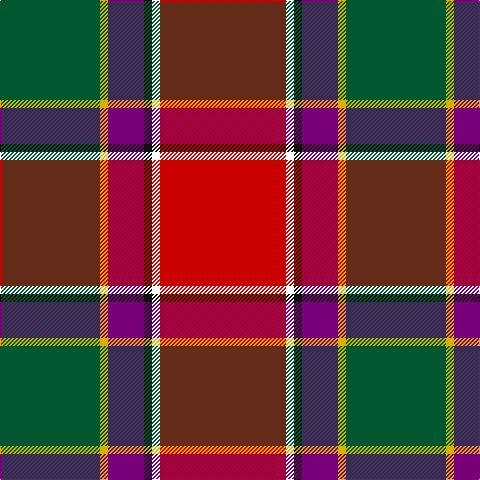

In pattern [GYBKWR](/patterns/gybkwr/).

This was sourced from tartans-authority.  It is a [6 stripes tartan](/stripes/stripes6/).

Original link http://www.tartansauthority.com/tartan-ferret/display/955/

## Thread count
G/100 Y8 P36 K8 W8 R/126

## Palette
Each colour and its ΔE from the base-6 reference it is a variant of.

| Colour | Shade | Base | ΔE (OKLab) |
|---|---|---|---|
| G | <code style="background-color:#005830;">#005830</code> `#005830` | G <code style="background-color:#006400;">#006400</code> | 0.06 |
| K | <code style="background-color:#101010;">#101010</code> `#101010` | K <code style="background-color:#000000;">#000000</code> | 0.17 |
| P | <code style="background-color:#780078;">#780078</code> `#780078` | B <code style="background-color:#2C4084;">#2C4084</code> | 0.16 |
| R | <code style="background-color:#C80000;">#C80000</code> `#C80000` | R <code style="background-color:#C80000;">#C80000</code> | 0.00 |
| W | <code style="background-color:#FCFCFC;">#FCFCFC</code> `#FCFCFC` | W <code style="background-color:#F4F4F0;">#F4F4F0</code> | 0.03 |
| Y | <code style="background-color:#D8B000;">#D8B000</code> `#D8B000` | Y <code style="background-color:#E8C000;">#E8C000</code> | 0.05 |

# Sample pattern

## Nearest tartans

The nearest existing variants by ΔTartan distance.

1. [Hewitt (Name)](/setts/s7/r60b24k6g24y4g6w4-b2c2c80-g006818-k101010-rc80000-we0e0e0-ye8c000/) — ΔT 0.57
1. [Hewitt](/setts/s7/r60b24k12g24y4g6w4-b2c4084-g005020-k101010-rdc0000-we0e0e0-ye8c000/) — ΔT 0.70
1. [Gordon of Abergeldie (Red..) Portrait Tartan Tartan Number: 955. Earliest known date: 1723 This sett was reconstructed from a scarf in a painting of Rachael Gordon, hanging in Abergeldie Castle, painted by Alexander in 1723. The count and colour desciption was taken by the Lord Lyon in 1953. See products available Copyright © Blair Urquhart, Comrie, 2015](/setts/s6/r40w2k2ra12y2g36-g006818-k101010-rc80000-rab468ac-we0e0e0-ye8c000/) — ΔT 0.80
1. [Scottish American Soc. of Michigan](/setts/s6/r96b32y10g34w16ga6-b1474b4-g006818-ga604000-rc80000-we0e0e0-ybc8c00/) — ΔT 0.80
1. [Scottish American Society of Michigan (Official)](/setts/s6/r96b32y10g34w16k6-b5f749c-g23321b-k000000-rb62531-wf9f5ef-ye0a126/) — ΔT 0.84
1. [Gordon of Abergeldie, (Red..)](/setts/s6/r40w2k2b12y2g36-b800070-g008000-k000000-rc00000-we0e0e0-yf0c000/) — ΔT 0.91
1. [Round Table Sweden](/setts/s8/r6y30g8b12w4r60b12ya6-b003c64-g006818-ra00000-wfcfcfc-yd09800-yafccc00/) — ΔT 0.93
1. [Dundhuin Ladies (Personal)](/setts/s6/b12ba10k4g36r56w4-b1474b4-ba780078-g006818-k101010-ra00048-we0e0e0/) — ΔT 1.02
1. [Rei Okamoto (Personal)](/setts/s6/r120k80y6b10ba6g24-b783080-ba944cb8-g005448-k101010-rc80000-yd0b404/) — ΔT 1.03
1. [Bombeiros Voluntarios De Galicia (Co](/setts/s7/r6b4r50ra24k50w4wa4-b5c5c5c-k101010-rc80000-ra888888-we0e0e0-waa8ace8/) — ΔT 1.07

## Neighbour map

Every grey dot is one of 15726 variants placed by the first two principal components of the ΔTartan feature space (44% of its variance). Red is this tartan; blue dots are its nearest — click one to open its page.

<svg viewBox="0 0 640 380" role="img" style="max-width:100%;height:auto;border:1px solid #e0e0e0;border-radius:4px;display:block" xmlns="http://www.w3.org/2000/svg"><image href="/nn/cloud.v1.png" width="640" height="380"/><a href="/setts/s7/r60b24k6g24y4g6w4-b2c2c80-g006818-k101010-rc80000-we0e0e0-ye8c000/"><circle cx="228.6" cy="129.5" r="4" fill="#3465a4"><title>Hewitt (Name)</title></circle></a><a href="/setts/s7/r60b24k12g24y4g6w4-b2c4084-g005020-k101010-rdc0000-we0e0e0-ye8c000/"><circle cx="205.4" cy="131.5" r="4" fill="#3465a4"><title>Hewitt</title></circle></a><a href="/setts/s6/r40w2k2ra12y2g36-g006818-k101010-rc80000-rab468ac-we0e0e0-ye8c000/"><circle cx="252.0" cy="132.1" r="4" fill="#3465a4"><title>Gordon of Abergeldie (Red..) Portrait Tartan Tartan Number: 955. Earliest known date: 1723 This sett was reconstructed from a scarf in a painting of Rachael Gordon, hanging in Abergeldie Castle, painted by Alexander in 1723. The count and colour desciption was taken by the Lord Lyon in 1953. See products available Copyright © Blair Urquhart, Comrie, 2015</title></circle></a><a href="/setts/s6/r96b32y10g34w16ga6-b1474b4-g006818-ga604000-rc80000-we0e0e0-ybc8c00/"><circle cx="242.0" cy="140.3" r="4" fill="#3465a4"><title>Scottish American Soc. of Michigan</title></circle></a><a href="/setts/s6/r96b32y10g34w16k6-b5f749c-g23321b-k000000-rb62531-wf9f5ef-ye0a126/"><circle cx="230.5" cy="135.6" r="4" fill="#3465a4"><title>Scottish American Society of Michigan (Official)</title></circle></a><a href="/setts/s6/r40w2k2b12y2g36-b800070-g008000-k000000-rc00000-we0e0e0-yf0c000/"><circle cx="241.9" cy="128.7" r="4" fill="#3465a4"><title>Gordon of Abergeldie, (Red..)</title></circle></a><a href="/setts/s8/r6y30g8b12w4r60b12ya6-b003c64-g006818-ra00000-wfcfcfc-yd09800-yafccc00/"><circle cx="228.2" cy="120.6" r="4" fill="#3465a4"><title>Round Table Sweden</title></circle></a><a href="/setts/s6/b12ba10k4g36r56w4-b1474b4-ba780078-g006818-k101010-ra00048-we0e0e0/"><circle cx="237.3" cy="155.7" r="4" fill="#3465a4"><title>Dundhuin Ladies (Personal)</title></circle></a><a href="/setts/s6/r120k80y6b10ba6g24-b783080-ba944cb8-g005448-k101010-rc80000-yd0b404/"><circle cx="272.9" cy="126.7" r="4" fill="#3465a4"><title>Rei Okamoto (Personal)</title></circle></a><a href="/setts/s7/r6b4r50ra24k50w4wa4-b5c5c5c-k101010-rc80000-ra888888-we0e0e0-waa8ace8/"><circle cx="183.9" cy="136.0" r="4" fill="#3465a4"><title>Bombeiros Voluntarios De Galicia (Co</title></circle></a><circle cx="240.4" cy="140.5" r="5" fill="#c00000"/></svg>

ID: /setts/s6/r126w8k8b36y8g100-b780078-g005830-k101010-rc80000-wfcfcfc-yd8b000/
