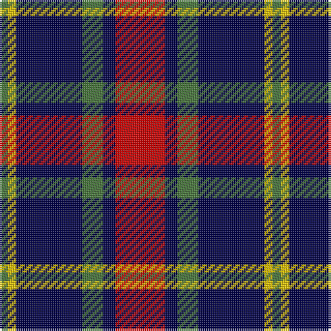

In pattern [GYBGBR](/patterns/gybgbr/).

This was sourced from tartans-authority.  It is a [6 stripes tartan](/stripes/stripes6/).

Original link http://www.tartansauthority.com/tartan-ferret/display/954/

## Thread count
G/4 Y4 DB32 G10 DB6 R/24

## Palette
Each colour and its ΔE from the base-6 reference it is a variant of.

| Colour | Shade | Base | ΔE (OKLab) |
|---|---|---|---|
| DB | <code style="background-color:#000048;">#000048</code> `#000048` | B <code style="background-color:#2A418A;">#2A418A</code> | 0.22 |
| G | <code style="background-color:#447438;">#447438</code> `#447438` | G <code style="background-color:#006100;">#006100</code> | 0.09 |
| R | <code style="background-color:#C80000;">#C80000</code> `#C80000` | R <code style="background-color:#CC0000;">#CC0000</code> | 0.01 |
| Y | <code style="background-color:#E8C000;">#E8C000</code> `#E8C000` | Y <code style="background-color:#F2BF00;">#F2BF00</code> | 0.02 |

# Sample pattern

## Nearest tartans

The nearest existing variants by ΔTartan distance.

1. [University of Notre Dame](/setts/s6/r5b35k25b8y10r5x2~b2c2c80-k101010-rc80000-yfccc00/) — ΔT 0.66
1. [Wcwm 759-3](/setts/s6/w5r34k24r4ra24r4x2~k000000-r8c8c8c-ra8c0000-wc8c8c8/) — ΔT 0.91
1. [Greystone (Burberry Grey)](/setts/s5/k3w3k3b10r1x6~b646464-k000000-r8c0000-wc8c8c8/) — ΔT 0.98
1. [Clerk](/setts/s6/b5k1g1k1r3k1x4~b304080-g008000-k000000-rc00000/) — ΔT 1.01
1. [MacTavish](/setts/s6/b2r12ba2b6k6b1x2~b4367ae-ba000052-k000000-raa0000/) — ΔT 1.04
1. [MacTavish](/setts/s6/b2r12ba2b6k6b1~b4367ae-ba000052-k000000-raa0000/) — ΔT 1.04
1. [MacKean (Personal)](/setts/s7/r8k18r6k18b27k2w3x2~b1474b4-k101010-rc80000-wfcfcfc/) — ΔT 1.04
1. [Fife](/setts/s6/b31ba4b6k19r20y4x2~b304080-ba5480b0-k000000-rc00000-yf0c000/) — ΔT 1.07
1. [Edinburgh Bus Company (Corporate)](/setts/s6/b3r2g5r8b12w3x2~b202060-g006818-rc80000-wfcfcfc/) — ΔT 1.07
1. [Thompson Black (Fashion)](/setts/s6/g3k15r8g2ra8k2x4~g006818-k101010-rc80000-ra888888/) — ΔT 1.12

## Neighbour map

Every grey dot is one of 15726 variants placed by the first two principal components of the ΔTartan feature space (44% of its variance). Red is this tartan; blue dots are its nearest — click one to open its page.

<svg viewBox="0 0 640 380" role="img" style="max-width:100%;height:auto;border:1px solid #e0e0e0;border-radius:4px;display:block" xmlns="http://www.w3.org/2000/svg"><image href="/nn/cloud.v1.png" width="640" height="380"/><a href="/setts/s6/r5b35k25b8y10r5x2~b2c2c80-k101010-rc80000-yfccc00/"><circle cx="218.2" cy="223.1" r="4" fill="#3465a4"><title>University of Notre Dame</title></circle></a><a href="/setts/s6/w5r34k24r4ra24r4x2~k000000-r8c8c8c-ra8c0000-wc8c8c8/"><circle cx="188.8" cy="206.0" r="4" fill="#3465a4"><title>Wcwm 759-3</title></circle></a><a href="/setts/s5/k3w3k3b10r1x6~b646464-k000000-r8c0000-wc8c8c8/"><circle cx="228.3" cy="213.3" r="4" fill="#3465a4"><title>Greystone (Burberry Grey)</title></circle></a><a href="/setts/s6/b5k1g1k1r3k1x4~b304080-g008000-k000000-rc00000/"><circle cx="169.6" cy="234.6" r="4" fill="#3465a4"><title>Clerk</title></circle></a><a href="/setts/s6/b2r12ba2b6k6b1x2~b4367ae-ba000052-k000000-raa0000/"><circle cx="208.4" cy="198.0" r="4" fill="#3465a4"><title>MacTavish</title></circle></a><a href="/setts/s6/b2r12ba2b6k6b1~b4367ae-ba000052-k000000-raa0000/"><circle cx="208.4" cy="198.0" r="4" fill="#3465a4"><title>MacTavish</title></circle></a><a href="/setts/s7/r8k18r6k18b27k2w3x2~b1474b4-k101010-rc80000-wfcfcfc/"><circle cx="227.6" cy="196.3" r="4" fill="#3465a4"><title>MacKean (Personal)</title></circle></a><a href="/setts/s6/b31ba4b6k19r20y4x2~b304080-ba5480b0-k000000-rc00000-yf0c000/"><circle cx="168.7" cy="203.7" r="4" fill="#3465a4"><title>Fife</title></circle></a><a href="/setts/s6/b3r2g5r8b12w3x2~b202060-g006818-rc80000-wfcfcfc/"><circle cx="180.2" cy="233.0" r="4" fill="#3465a4"><title>Edinburgh Bus Company (Corporate)</title></circle></a><a href="/setts/s6/g3k15r8g2ra8k2x4~g006818-k101010-rc80000-ra888888/"><circle cx="199.1" cy="224.1" r="4" fill="#3465a4"><title>Thompson Black (Fashion)</title></circle></a><circle cx="221.4" cy="212.4" r="5" fill="#c00000"/></svg>

ID: /setts/s6/r12b3g5b16y2g2x2~b000048-g447438-rc80000-ye8c000/
