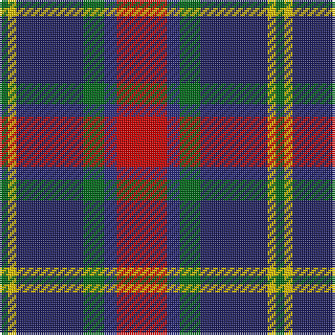

In pattern [GYBGBR](/patterns/gybgbr/).

This was sourced from house-of-tartan.  It is a [6 stripes tartan](/stripes/stripes6/).

Original link http://www.house-of-tartan.scotland.net/house/TartanViewjs.asp?colr=Def&tnam=954

## Thread count
G/4 Y4 DBa32 G10 DB6 R/24

## Palette
Each colour and its ΔE from the base-6 reference it is a variant of.

| Colour | Shade | Base | ΔE (OKLab) |
|---|---|---|---|
| DB | <code style="background-color:#2C2C80;">#2C2C80</code> `#2C2C80` | B <code style="background-color:#2A418A;">#2A418A</code> | 0.06 |
| DBa | <code style="background-color:#202060;">#202060</code> `#202060` | B <code style="background-color:#2A418A;">#2A418A</code> | 0.11 |
| G | <code style="background-color:#006818;">#006818</code> `#006818` | G <code style="background-color:#006100;">#006100</code> | 0.02 |
| R | <code style="background-color:#C80000;">#C80000</code> `#C80000` | R <code style="background-color:#CC0000;">#CC0000</code> | 0.01 |
| Y | <code style="background-color:#E8C000;">#E8C000</code> `#E8C000` | Y <code style="background-color:#F2BF00;">#F2BF00</code> | 0.02 |

# Sample pattern

## Nearest tartans

The nearest existing variants by ΔTartan distance.

1. [Dunbog, Primary School](/setts/s6/r12b3g5ba16y2g2~b304080-ba000050-g008000-rc00000-yf0c000~x2/) — ΔT 0.81
1. [Fife (McGill)](/setts/s6/b31ba4b6k19r20y4~b2c2c80-ba5c8ca8-k101010-rc80000-ye8c000~x2/) — ΔT 0.86
1. [Thom(p)son's, Fancy](/setts/s6/r2ra8b2ba4k4ba1~b304080-ba5480b0-k000000-rc00000-ra806050~x6/) — ΔT 0.88
1. [Commonwealth Games Council (Corp.)](/setts/s6/r3k17b11r2ra20w2~b484848-k101010-rb468ac-ra888888-we0e0e0~x2/) — ΔT 0.89
1. [Patterson, John (Personal)](/setts/s6/g3b12w1ga12r12ga2~b2c4084-g005020-ga002814-rdc0000-we0e0e0~x2/) — ΔT 0.93
1. [Stovell (2015)](/setts/s6/b15r6g8k2w2k2~b202060-g005020-k101010-rb03000-wf8f4d0~x6/) — ΔT 0.93
1. [Zangenberg (Personal)](/setts/s7/b2r2b16k17g16k2y2~b780078-g285800-k101010-rc80000-ye8c000~x2/) — ΔT 0.94
1. [Patterson, John (Personal)](/setts/s6/g3b12w1ga12r12ga2~b2c2c80-g006818-ga003820-rc80000-wfcfcfc~x2/) — ΔT 0.98
1. [Akins](/setts/s8/r21ra3r3ra3r3b19g22ba3~b000050-ba8080d0-g008000-r802040-ra900030~x2/) — ΔT 0.99
1. [Afternoon Tea / Assam](/setts/s6/r15ra98b72ba25b8w15~b202060-ba5c8ca8-rc80000-ra880000-wfcfcfc/) — ΔT 0.99

## Neighbour map

Every grey dot is one of 15726 variants placed by the first two principal components of the ΔTartan feature space (44% of its variance). Red is this tartan; blue dots are its nearest — click one to open its page.

<svg viewBox="0 0 640 380" role="img" style="max-width:100%;height:auto;border:1px solid #e0e0e0;border-radius:4px;display:block" xmlns="http://www.w3.org/2000/svg"><image href="/nn/cloud.v1.png" width="640" height="380"/><a href="/setts/s6/r12b3g5ba16y2g2~b304080-ba000050-g008000-rc00000-yf0c000~x2/"><circle cx="157.2" cy="194.1" r="4" fill="#3465a4"><title>Dunbog, Primary School</title></circle></a><a href="/setts/s6/b31ba4b6k19r20y4~b2c2c80-ba5c8ca8-k101010-rc80000-ye8c000~x2/"><circle cx="186.3" cy="208.9" r="4" fill="#3465a4"><title>Fife (McGill)</title></circle></a><a href="/setts/s6/r2ra8b2ba4k4ba1~b304080-ba5480b0-k000000-rc00000-ra806050~x6/"><circle cx="132.8" cy="210.0" r="4" fill="#3465a4"><title>Thom(p)son's, Fancy</title></circle></a><a href="/setts/s6/r3k17b11r2ra20w2~b484848-k101010-rb468ac-ra888888-we0e0e0~x2/"><circle cx="157.4" cy="190.0" r="4" fill="#3465a4"><title>Commonwealth Games Council (Corp.)</title></circle></a><a href="/setts/s6/g3b12w1ga12r12ga2~b2c4084-g005020-ga002814-rdc0000-we0e0e0~x2/"><circle cx="161.0" cy="194.0" r="4" fill="#3465a4"><title>Patterson, John (Personal)</title></circle></a><a href="/setts/s6/b15r6g8k2w2k2~b202060-g005020-k101010-rb03000-wf8f4d0~x6/"><circle cx="179.4" cy="208.4" r="4" fill="#3465a4"><title>Stovell (2015)</title></circle></a><a href="/setts/s7/b2r2b16k17g16k2y2~b780078-g285800-k101010-rc80000-ye8c000~x2/"><circle cx="169.9" cy="192.1" r="4" fill="#3465a4"><title>Zangenberg (Personal)</title></circle></a><a href="/setts/s6/g3b12w1ga12r12ga2~b2c2c80-g006818-ga003820-rc80000-wfcfcfc~x2/"><circle cx="166.8" cy="197.2" r="4" fill="#3465a4"><title>Patterson, John (Personal)</title></circle></a><a href="/setts/s8/r21ra3r3ra3r3b19g22ba3~b000050-ba8080d0-g008000-r802040-ra900030~x2/"><circle cx="156.1" cy="187.4" r="4" fill="#3465a4"><title>Akins</title></circle></a><a href="/setts/s6/r15ra98b72ba25b8w15~b202060-ba5c8ca8-rc80000-ra880000-wfcfcfc/"><circle cx="215.3" cy="174.8" r="4" fill="#3465a4"><title>Afternoon Tea / Assam</title></circle></a><circle cx="178.3" cy="198.5" r="5" fill="#c00000"/></svg>

ID: /setts/s6/r12b3g5ba16y2g2~b2c2c80-ba202060-g006818-rc80000-ye8c000~x2/
