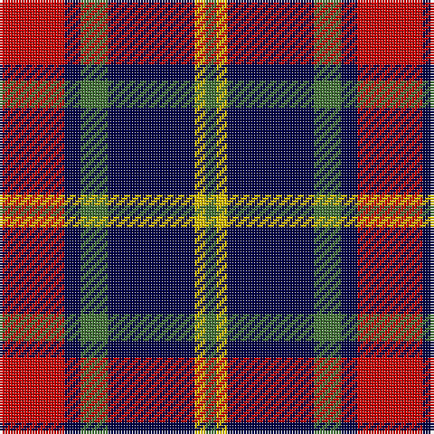

In pattern [GYBGBR](/stripes/gybgbr/).

This was sourced from tartans-authority.  It is a [6 stripe tartan](/stripes/stripes6/).

Original link http://www.tartansauthority.com/tartan-ferret/display/954/

## Also known as

This cloth is also recorded under:

- Dunbog Primary
- Dunbog, Primary School

## Attestations

This cloth appears in 3 source records; the oldest owns this page.

- 1985 October. — Dunbog Primary (School) (tartans-authority, [record](http://www.tartansauthority.com/tartan-ferret/display/954/))
- undated — Dunbog, Primary School (weddslist, [record](http://www.weddslist.com/cgi-bin/tartans/pg.pl?source=sts))
- undated — Dunbog Primary School Corporate Tartan Tartan Number: 954. Earliest known date: 1985 C. Armstrong is a pupil at the school. See products available Copyright © Blair Urquhart, Comrie, 2015 (house-of-tartan, [record](http://www.house-of-tartan.scotland.net/house/TartanViewjs.asp?colr=Def&tnam=954))

## Thread count
R/24 DB6 G10 DB32 Y4 G/4

## Palette
Each colour and the base-6 reference it is a variant of.

| Colour | Shade | Base |
|---|---|---|
| DB | <code style="background-color:#000048;">#000048</code> `oklch(18.2% 0.126 264.1)` <small>#000048</small> | B <code style="background-color:#2A418A;">#2A418A</code> |
| G | <code style="background-color:#447438;">#447438</code> `oklch(50.9% 0.104 139.6)` <small>#447438</small> | G <code style="background-color:#006100;">#006100</code> |
| R | <code style="background-color:#C80000;">#C80000</code> `oklch(52.3% 0.215 29.2)` <small>#C80000</small> | R <code style="background-color:#CC0000;">#CC0000</code> |
| Y | <code style="background-color:#E8C000;">#E8C000</code> `oklch(81.9% 0.168 93.7)` <small>#E8C000</small> | Y <code style="background-color:#F2BF00;">#F2BF00</code> |

# Sample pattern

## Nearest tartans

The nearest existing variants by ΔTartan distance, with this tartan at the top so the swatches line up against it.

ΔTartan

Tartan

Sett

—

<a href="/ttd/edit/#slug=r12db3g5db16ly2g2~x2">Dunbog Primary (School)</a> <a class="nn-out" href="/setts/s6/r12db3g5db16ly2g2~x2/" title="open its dictionary page">↗</a>

0.66

<a href="/ttd/edit/#slug=r5db35k25db8ly10r5~x2">University of Notre Dame</a> <a class="nn-out" href="/setts/s6/r5db35k25db8ly10r5~x2/" title="open its dictionary page">↗</a>

0.91

<a href="/ttd/edit/#slug=lb5o34k24o4r24o4~x2">Wcwm 759-3</a> <a class="nn-out" href="/setts/s6/lb5o34k24o4r24o4~x2/" title="open its dictionary page">↗</a>

0.98

<a href="/ttd/edit/#slug=k3lb3k3n10r1~x6">Greystone (Burberry Grey)</a> <a class="nn-out" href="/setts/s5/k3lb3k3n10r1~x6/" title="open its dictionary page">↗</a>

1.01

<a href="/ttd/edit/#slug=db5k1g1k1r3k1~x4">Clerk</a> <a class="nn-out" href="/setts/s6/db5k1g1k1r3k1~x4/" title="open its dictionary page">↗</a>

1.04

<a href="/ttd/edit/#slug=b2r12db2b6k6b1~x2">MacTavish</a> <a class="nn-out" href="/setts/s6/b2r12db2b6k6b1~x2/" title="open its dictionary page">↗</a>

1.04

<a href="/ttd/edit/#slug=b2r12db2b6k6b1">MacTavish</a> <a class="nn-out" href="/setts/s6/b2r12db2b6k6b1/" title="open its dictionary page">↗</a>

1.04

<a href="/ttd/edit/#slug=r8k18r6k18b27k2w3~x2">MacKean (Personal)</a> <a class="nn-out" href="/setts/s7/r8k18r6k18b27k2w3~x2/" title="open its dictionary page">↗</a>

1.07

<a href="/ttd/edit/#slug=db3r2g5r8db12w3~x2">Edinburgh Bus Company (Corporate)</a> <a class="nn-out" href="/setts/s6/db3r2g5r8db12w3~x2/" title="open its dictionary page">↗</a>

1.12

<a href="/ttd/edit/#slug=g3k15r8g2o8k2~x4">Thompson Black (Fashion)</a> <a class="nn-out" href="/setts/s6/g3k15r8g2o8k2~x4/" title="open its dictionary page">↗</a>

1.13

<a href="/ttd/edit/#slug=p3k1p8k6g8k1w2~x2">Baillie</a> <a class="nn-out" href="/setts/s7/p3k1p8k6g8k1w2~x2/" title="open its dictionary page">↗</a>

## Neighbour map

Every grey dot is one of 14299 variants placed by the first two principal components of the ΔTartan feature space (44% of its variance). Red is this tartan; blue dots are its nearest — click one to open its page.

<svg viewBox="0 0 640 380" role="img" style="max-width:100%;height:auto;border:1px solid #e0e0e0;border-radius:4px;display:block" xmlns="http://www.w3.org/2000/svg"><image href="/nn/cloud.v1.png" width="640" height="380"/><a href="/setts/s6/r5db35k25db8ly10r5~x2/"><circle cx="220.8" cy="221.1" r="4" fill="#3465a4"><title>University of Notre Dame</title></circle></a><a href="/setts/s6/lb5o34k24o4r24o4~x2/"><circle cx="190.9" cy="202.0" r="4" fill="#3465a4"><title>Wcwm 759-3</title></circle></a><a href="/setts/s5/k3lb3k3n10r1~x6/"><circle cx="231.0" cy="209.1" r="4" fill="#3465a4"><title>Greystone (Burberry Grey)</title></circle></a><a href="/setts/s6/db5k1g1k1r3k1~x4/"><circle cx="172.4" cy="233.1" r="4" fill="#3465a4"><title>Clerk</title></circle></a><a href="/setts/s6/b2r12db2b6k6b1~x2/"><circle cx="210.5" cy="195.6" r="4" fill="#3465a4"><title>MacTavish</title></circle></a><a href="/setts/s6/b2r12db2b6k6b1/"><circle cx="210.5" cy="195.6" r="4" fill="#3465a4"><title>MacTavish</title></circle></a><a href="/setts/s7/r8k18r6k18b27k2w3~x2/"><circle cx="230.3" cy="194.5" r="4" fill="#3465a4"><title>MacKean (Personal)</title></circle></a><a href="/setts/s6/db3r2g5r8db12w3~x2/"><circle cx="182.2" cy="229.9" r="4" fill="#3465a4"><title>Edinburgh Bus Company (Corporate)</title></circle></a><a href="/setts/s6/g3k15r8g2o8k2~x4/"><circle cx="201.2" cy="223.0" r="4" fill="#3465a4"><title>Thompson Black (Fashion)</title></circle></a><a href="/setts/s7/p3k1p8k6g8k1w2~x2/"><circle cx="148.2" cy="207.3" r="4" fill="#3465a4"><title>Baillie</title></circle></a><circle cx="223.9" cy="209.5" r="5" fill="#c00000"/></svg>

ID: /setts/s6/r12db3g5db16ly2g2~x2/
