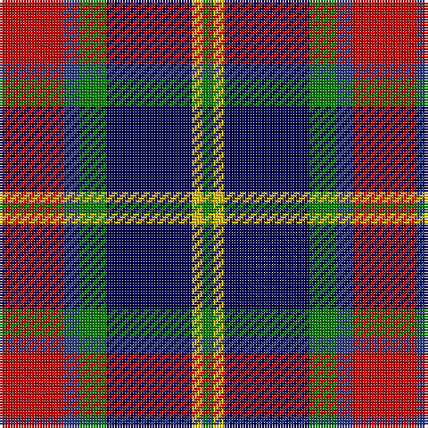

This page is one **sett** — a single exact thread-count. It belongs to the [tartan](/tartans/r12db3g5dbi16ly2g2/)
(the same proportion at any scale), whose colour order is pattern [GYBGBR](/stripes/gybgbr/).

Sourced from weddslist.  It is a [6 stripe tartan](/stripes/stripes6/).

Original link http://www.weddslist.com/cgi-bin/tartans/pg.pl?source=sts

## Thread count
R/24 B6 G10 DB32 Y4 G/4

## Palette

Palette: <strong>custom</strong>
<table><thead><tr><th>Colour</th><th>Threads</th><th>Shade</th><th>Base</th><th>OKLCh</th></tr></thead><tbody><tr><td>R/</td><td style="text-align:right;font-variant-numeric:tabular-nums">24</td><td><code style="background-color:#C00000;">#C00000</code> <small style="color:#888">#C00000</small></td><td>R <code style="background-color:#CC0000;">#CC0000</code></td><td><small style="color:#888">oklch(50.7% 0.208 29.2)</small></td></tr><tr><td>B</td><td style="text-align:right;font-variant-numeric:tabular-nums">6</td><td><code style="background-color:#304080;">#304080</code> <small style="color:#888">#304080</small></td><td>B <code style="background-color:#2A418A;">#2A418A</code></td><td><small style="color:#888">oklch(39.4% 0.109 270.2)</small></td></tr><tr><td>G</td><td style="text-align:right;font-variant-numeric:tabular-nums">10</td><td><code style="background-color:#008000;">#008000</code> <small style="color:#888">#008000</small></td><td>G <code style="background-color:#006100;">#006100</code></td><td><small style="color:#888">oklch(52.0% 0.177 142.5)</small></td></tr><tr><td>DB</td><td style="text-align:right;font-variant-numeric:tabular-nums">32</td><td><code style="background-color:#000050;">#000050</code> <small style="color:#888">#000050</small></td><td>B <code style="background-color:#2A418A;">#2A418A</code></td><td><small style="color:#888">oklch(19.5% 0.135 264.1)</small></td></tr><tr><td>Y</td><td style="text-align:right;font-variant-numeric:tabular-nums">4</td><td><code style="background-color:#F0C000;">#F0C000</code> <small style="color:#888">#F0C000</small></td><td>Y <code style="background-color:#F2BF00;">#F2BF00</code></td><td><small style="color:#888">oklch(82.7% 0.169 90.5)</small></td></tr><tr><td>G/</td><td style="text-align:right;font-variant-numeric:tabular-nums">4</td><td><code style="background-color:#008000;">#008000</code> <small style="color:#888">#008000</small></td><td>G <code style="background-color:#006100;">#006100</code></td><td><small style="color:#888">oklch(52.0% 0.177 142.5)</small></td></tr></tbody></table>

# Sample pattern

## Nearest tartans

The nearest existing variants by ΔTartan distance, with this tartan at the top so the swatches line up against it.

ΔTartan

Tartan

Sett

—

<a href="/ttd/edit/#slug=r12db3g5dbi16ly2g2~x2">Dunbog, Primary School</a> <a class="nn-out" href="/setts/s6/r12db3g5dbi16ly2g2~x2/" title="open its dictionary page">↗</a>

0.68

<a href="/ttd/edit/#slug=w6k29o29dp7k3r3~x2">Jewell of Kernow (Personal)</a> <a class="nn-out" href="/setts/s6/w6k29o29dp7k3r3~x2/" title="open its dictionary page">↗</a>

0.73

<a href="/ttd/edit/#slug=k2t1p6g6r1g1~x4">Wilson's, No 183</a> <a class="nn-out" href="/setts/s6/k2t1p6g6r1g1~x4/" title="open its dictionary page">↗</a>

0.81

<a href="/ttd/edit/#slug=r12dbi3g5db16ly2g2~x2">Dunbog Primary School Corporate Tartan Tartan Number: 954. Earliest known date: 1985 C. Armstrong is a pupil at the school. See products available Copyright © Blair Urquhart, Comrie, 2015</a> <a class="nn-out" href="/setts/s6/r12dbi3g5db16ly2g2~x2/" title="open its dictionary page">↗</a>

0.86

<a href="/ttd/edit/#slug=r2o8db2t4k4t1~x6">Thom(p)son's, Fancy</a> <a class="nn-out" href="/setts/s6/r2o8db2t4k4t1~x6/" title="open its dictionary page">↗</a>

0.87

<a href="/ttd/edit/#slug=k4t3g12p13ly2~x2">Wilson's, No 176</a> <a class="nn-out" href="/setts/s5/k4t3g12p13ly2~x2/" title="open its dictionary page">↗</a>

0.89

<a href="/ttd/edit/#slug=m3k17n11m2o20w2~x2">Commonwealth Games Council (Corp.)</a> <a class="nn-out" href="/setts/s6/m3k17n11m2o20w2~x2/" title="open its dictionary page">↗</a>

0.92

<a href="/ttd/edit/#slug=db15r6dg8k2w2k2~x6">Stovell (2015)</a> <a class="nn-out" href="/setts/s6/db15r6dg8k2w2k2~x6/" title="open its dictionary page">↗</a>

0.92

<a href="/ttd/edit/#slug=g6db11lb8k4lb8k27lb4r4~x2">Kervegant, Suzanne (Personal)</a> <a class="nn-out" href="/setts/s8/g6db11lb8k4lb8k27lb4r4~x2/" title="open its dictionary page">↗</a>

0.93

<a href="/ttd/edit/#slug=p6k3p21k23w3g24r3~x2">Colquhoun</a> <a class="nn-out" href="/setts/s7/p6k3p21k23w3g24r3~x2/" title="open its dictionary page">↗</a>

0.99

<a href="/ttd/edit/#slug=k4t3g13p12w2~x2">Wilson's No 148</a> <a class="nn-out" href="/setts/s5/k4t3g13p12w2~x2/" title="open its dictionary page">↗</a>

## Neighbour map

Every grey dot is one of 14359 variants placed by the first two principal components of the ΔTartan feature space (44% of its variance). Red is this tartan; blue dots are its nearest — click one to open its page.

<svg viewBox="0 0 640 380" role="img" style="max-width:100%;height:auto;border:1px solid #e0e0e0;border-radius:4px;display:block" xmlns="http://www.w3.org/2000/svg"><image href="/nn/cloud.v1.png" width="640" height="380"/><a href="/setts/s6/w6k29o29dp7k3r3~x2/"><circle cx="188.2" cy="178.4" r="4" fill="#3465a4"><title>Jewell of Kernow (Personal)</title></circle></a><a href="/setts/s6/k2t1p6g6r1g1~x4/"><circle cx="161.0" cy="206.7" r="4" fill="#3465a4"><title>Wilson's, No 183</title></circle></a><a href="/setts/s6/r12dbi3g5db16ly2g2~x2/"><circle cx="180.0" cy="200.4" r="4" fill="#3465a4"><title>Dunbog Primary School Corporate Tartan Tartan Number: 954. Earliest known date: 1985 C. Armstrong is a pupil at the school. See products available Copyright © Blair Urquhart, Comrie, 2015</title></circle></a><a href="/setts/s6/r2o8db2t4k4t1~x6/"><circle cx="135.0" cy="212.1" r="4" fill="#3465a4"><title>Thom(p)son's, Fancy</title></circle></a><a href="/setts/s5/k4t3g12p13ly2~x2/"><circle cx="135.2" cy="217.1" r="4" fill="#3465a4"><title>Wilson's, No 176</title></circle></a><a href="/setts/s6/m3k17n11m2o20w2~x2/"><circle cx="159.8" cy="192.3" r="4" fill="#3465a4"><title>Commonwealth Games Council (Corp.)</title></circle></a><a href="/setts/s6/db15r6dg8k2w2k2~x6/"><circle cx="182.0" cy="211.7" r="4" fill="#3465a4"><title>Stovell (2015)</title></circle></a><a href="/setts/s8/g6db11lb8k4lb8k27lb4r4~x2/"><circle cx="144.9" cy="185.8" r="4" fill="#3465a4"><title>Kervegant, Suzanne (Personal)</title></circle></a><a href="/setts/s7/p6k3p21k23w3g24r3~x2/"><circle cx="121.2" cy="186.9" r="4" fill="#3465a4"><title>Colquhoun</title></circle></a><a href="/setts/s5/k4t3g13p12w2~x2/"><circle cx="132.1" cy="217.2" r="4" fill="#3465a4"><title>Wilson's No 148</title></circle></a><circle cx="159.6" cy="194.5" r="5" fill="#c00000"/></svg>

ID: /setts/s6/r12db3g5dbi16ly2g2~x2/
