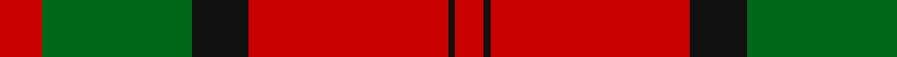
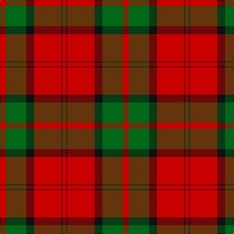

In pattern [RGKRKR](/patterns/rgkrkr/).

This was sourced from house-of-tartan.  It is a [6 stripes tartan](/stripes/stripes6/).

Original link http://www.house-of-tartan.scotland.net/house/TartanViewjs.asp?colr=Def&tnam=1472

## Thread count
R/12 G42 K16 R56 K2 R/8

## Palette
Each colour and its ΔE from the base-6 reference it is a variant of.

| Colour | Shade | Base | ΔE (OKLab) |
|---|---|---|---|
| G | <code style="background-color:#006818;">#006818</code> `#006818` | G <code style="background-color:#006400;">#006400</code> | 0.02 |
| K | <code style="background-color:#101010;">#101010</code> `#101010` | K <code style="background-color:#000000;">#000000</code> | 0.17 |
| R | <code style="background-color:#C80000;">#C80000</code> `#C80000` | R <code style="background-color:#C80000;">#C80000</code> | 0.00 |

# Sample pattern

## Nearest tartans

The nearest existing variants by ΔTartan distance.

1. [Caledonian - 1819 (Fashion?)](/setts/s6/r60b20r8g45r8b2-b440044-g006818-rc80000/) — ΔT 0.56
1. [Caledonian](/setts/s6/r120b40r16g90r16b4-b800080-g008000-rc00000/) — ΔT 0.71
1. [Dunbar](/setts/s6/r12g42k16r56g2r8-g004c00-k000000-rc80000/) — ΔT 0.74
1. [MacKintosh](/setts/s6/r70b20r10g40r10b3-b2c2c80-g006818-rc80000/) — ΔT 0.77
1. [Dunbar](/setts/s6/r12g42k16r56k2r8-g11450d-k000000-raa0000/) — ΔT 0.81
1. [Dunbar](/setts/s6/r12g42k16r56k2r8-g008000-k000000-rc00000/) — ΔT 0.88
1. [Caledonian District Tartan Tartan Number: 526. Earliest known date: 1819 In view of its widespread use as a foundation for other tartans it is perhaps not surprising that Wilson's named the Mackintosh tartan 'Caledonian'. They also called it 'Lovat or Fraser'. For this reason the tartan is not suitable for persons seeking a Caledonian tartan unless they are also Frasers of Lovat or Mackintoshes. See products available Copyright © Blair Urquhart, Comrie, 2015](/setts/s6/r120b40r16g90r16b4-b780078-g006818-rc80000/) — ΔT 0.90
1. [MacKintosh 3](/setts/s6/r136b36r18g68r18b6-b304080-g008000-rc00000/) — ΔT 0.92
1. [Caledonian](/setts/s6/r120b40r16g90r16b4-b5a008c-g005020-rdc0000/) — ΔT 0.94
1. [MacKintosh](/setts/s6/r48b12r6g24r8b2-b000064-g004c00-rc80000/) — ΔT 0.97

## Neighbour map

Every grey dot is one of 15726 variants placed by the first two principal components of the ΔTartan feature space (44% of its variance). Red is this tartan; blue dots are its nearest — click one to open its page.

<svg viewBox="0 0 640 380" role="img" style="max-width:100%;height:auto;border:1px solid #e0e0e0;border-radius:4px;display:block" xmlns="http://www.w3.org/2000/svg"><image href="/nn/cloud.v1.png" width="640" height="380"/><a href="/setts/s6/r60b20r8g45r8b2-b440044-g006818-rc80000/"><circle cx="378.9" cy="178.6" r="4" fill="#3465a4"><title>Caledonian - 1819 (Fashion?)</title></circle></a><a href="/setts/s6/r120b40r16g90r16b4-b800080-g008000-rc00000/"><circle cx="380.2" cy="178.1" r="4" fill="#3465a4"><title>Caledonian</title></circle></a><a href="/setts/s6/r12g42k16r56g2r8-g004c00-k000000-rc80000/"><circle cx="367.0" cy="176.8" r="4" fill="#3465a4"><title>Dunbar</title></circle></a><a href="/setts/s6/r70b20r10g40r10b3-b2c2c80-g006818-rc80000/"><circle cx="401.9" cy="187.5" r="4" fill="#3465a4"><title>MacKintosh</title></circle></a><a href="/setts/s6/r12g42k16r56k2r8-g11450d-k000000-raa0000/"><circle cx="378.3" cy="185.6" r="4" fill="#3465a4"><title>Dunbar</title></circle></a><a href="/setts/s6/r12g42k16r56k2r8-g008000-k000000-rc00000/"><circle cx="355.2" cy="173.3" r="4" fill="#3465a4"><title>Dunbar</title></circle></a><a href="/setts/s6/r120b40r16g90r16b4-b780078-g006818-rc80000/"><circle cx="387.7" cy="180.6" r="4" fill="#3465a4"><title>Caledonian District Tartan Tartan Number: 526. Earliest known date: 1819 In view of its widespread use as a foundation for other tartans it is perhaps not surprising that Wilson's named the Mackintosh tartan 'Caledonian'. They also called it 'Lovat or Fraser'. For this reason the tartan is not suitable for persons seeking a Caledonian tartan unless they are also Frasers of Lovat or Mackintoshes. See products available Copyright © Blair Urquhart, Comrie, 2015</title></circle></a><a href="/setts/s6/r136b36r18g68r18b6-b304080-g008000-rc00000/"><circle cx="420.0" cy="187.5" r="4" fill="#3465a4"><title>MacKintosh 3</title></circle></a><a href="/setts/s6/r120b40r16g90r16b4-b5a008c-g005020-rdc0000/"><circle cx="370.6" cy="172.3" r="4" fill="#3465a4"><title>Caledonian</title></circle></a><a href="/setts/s6/r48b12r6g24r8b2-b000064-g004c00-rc80000/"><circle cx="411.9" cy="179.7" r="4" fill="#3465a4"><title>MacKintosh</title></circle></a><circle cx="380.8" cy="182.2" r="5" fill="#c00000"/></svg>

ID: /setts/s6/r12g42k16r56k2r8-g006818-k101010-rc80000/
