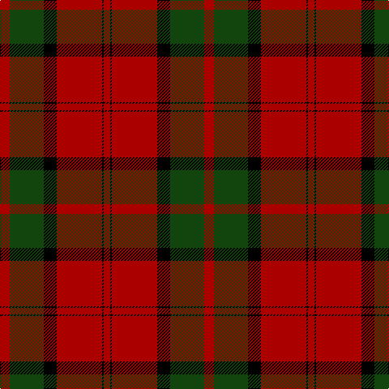

In pattern [RGKRKR](/patterns/rgkrkr/).

This was sourced from weddslist.  It is a [6 stripes tartan](/stripes/stripes6/).

Original link http://www.weddslist.com/cgi-bin/tartans/pg.pl?source=tinsel

## Attestations

This cloth appears in 2 source records; the oldest owns this page.

- undated — Dunbar (weddslist, [record](http://www.weddslist.com/cgi-bin/tartans/pg.pl?source=tinsel))
- undated — Dunbar (weddslist, [record](http://www.weddslist.com/cgi-bin/tartans/pg.pl?source=x))

## Thread count
DR/12 DG42 K16 DR56 K2 DR/8

## Palette
Each colour and its ΔE from the base-6 reference it is a variant of.

| Colour | Shade | Base | ΔE (OKLab) |
|---|---|---|---|
| DG | <code style="background-color:#11450D;">#11450D</code> `#11450D` | G <code style="background-color:#006100;">#006100</code> | 0.09 |
| DR | <code style="background-color:#AA0000;">#AA0000</code> `#AA0000` | R <code style="background-color:#CC0000;">#CC0000</code> | 0.07 |
| K | <code style="background-color:#000000;">#000000</code> `#000000` | K <code style="background-color:#000000;">#000000</code> | 0.00 |

# Sample pattern

## Nearest tartans

The nearest existing variants by ΔTartan distance.

1. [Dunbar](/setts/s6/r12g42k16r56g2r8-g004c00-k000000-rc80000/) — ΔT 0.64
1. [Dunbar Family Tartan Tartan Number: 1472. Earliest known date: 1842 The sett for this Lowland family first appeared in the Vestiarium Scoticum. There is also a Dunbar district tartan woven by Wilson's of Bannockburn around 1850. It is not possible to say whether Wilson's pattern was intended as a district or a family sett. The Chief of the Dunbars, Sir Jean Dunbar of Mochrum, once a jockey, lives in Florida, U.S.A. See products available Copyright © Blair Urquhart, Comrie, 2015](/setts/s6/r12g42k16r56k2r8-g006818-k101010-rc80000/) — ΔT 0.81
1. [Caledonian - 1819 (Fashion?)](/setts/s6/r60b20r8g45r8b2-b440044-g006818-rc80000/) — ΔT 1.02
1. [Maxwell](/setts/s7/r6g32r8k12r56g2r6-g11450d-k000000-raa0000/) — ΔT 1.02
1. [Maxwell](/setts/s7/r3g16r4k6r28g1r3-g11450d-k000000-raa0000/) — ΔT 1.02
1. [Rosser of Wales](/setts/s6/g16k57r36k2r4g2-g285800-k101010-rc80000/) — ΔT 1.03
1. [Dunbar](/setts/s6/r12g42k16r56k2r8-g008000-k000000-rc00000/) — ΔT 1.03
1. [Rosser (Welsh Name)](/setts/s6/r16k57r36k2r4r2-k101010-rc80000/) — ΔT 1.05
1. [MacKintosh](/setts/s6/r48b12r6g24r8b2-b000052-g11450d-raa0000/) — ΔT 1.08
1. [MacKintosh](/setts/s6/r48b12r6g24r8b2-b000064-g004c00-rc80000/) — ΔT 1.08

## Neighbour map

Every grey dot is one of 15726 variants placed by the first two principal components of the ΔTartan feature space (44% of its variance). Red is this tartan; blue dots are its nearest — click one to open its page.

<svg viewBox="0 0 640 380" role="img" style="max-width:100%;height:auto;border:1px solid #e0e0e0;border-radius:4px;display:block" xmlns="http://www.w3.org/2000/svg"><image href="/nn/cloud.v1.png" width="640" height="380"/><a href="/setts/s6/r12g42k16r56g2r8-g004c00-k000000-rc80000/"><circle cx="367.0" cy="176.8" r="4" fill="#3465a4"><title>Dunbar</title></circle></a><a href="/setts/s6/r12g42k16r56k2r8-g006818-k101010-rc80000/"><circle cx="380.8" cy="182.2" r="4" fill="#3465a4"><title>Dunbar Family Tartan Tartan Number: 1472. Earliest known date: 1842 The sett for this Lowland family first appeared in the Vestiarium Scoticum. There is also a Dunbar district tartan woven by Wilson's of Bannockburn around 1850. It is not possible to say whether Wilson's pattern was intended as a district or a family sett. The Chief of the Dunbars, Sir Jean Dunbar of Mochrum, once a jockey, lives in Florida, U.S.A. See products available Copyright © Blair Urquhart, Comrie, 2015</title></circle></a><a href="/setts/s6/r60b20r8g45r8b2-b440044-g006818-rc80000/"><circle cx="378.9" cy="178.6" r="4" fill="#3465a4"><title>Caledonian - 1819 (Fashion?)</title></circle></a><a href="/setts/s7/r6g32r8k12r56g2r6-g11450d-k000000-raa0000/"><circle cx="436.7" cy="167.9" r="4" fill="#3465a4"><title>Maxwell</title></circle></a><a href="/setts/s7/r3g16r4k6r28g1r3-g11450d-k000000-raa0000/"><circle cx="436.7" cy="167.9" r="4" fill="#3465a4"><title>Maxwell</title></circle></a><a href="/setts/s6/g16k57r36k2r4g2-g285800-k101010-rc80000/"><circle cx="357.6" cy="172.2" r="4" fill="#3465a4"><title>Rosser of Wales</title></circle></a><a href="/setts/s6/r12g42k16r56k2r8-g008000-k000000-rc00000/"><circle cx="355.2" cy="173.3" r="4" fill="#3465a4"><title>Dunbar</title></circle></a><a href="/setts/s6/r16k57r36k2r4r2-k101010-rc80000/"><circle cx="361.8" cy="166.5" r="4" fill="#3465a4"><title>Rosser (Welsh Name)</title></circle></a><a href="/setts/s6/r48b12r6g24r8b2-b000052-g11450d-raa0000/"><circle cx="431.0" cy="191.7" r="4" fill="#3465a4"><title>MacKintosh</title></circle></a><a href="/setts/s6/r48b12r6g24r8b2-b000064-g004c00-rc80000/"><circle cx="411.9" cy="179.7" r="4" fill="#3465a4"><title>MacKintosh</title></circle></a><circle cx="378.3" cy="185.6" r="5" fill="#c00000"/></svg>

ID: /setts/s6/r12g42k16r56k2r8-g11450d-k000000-raa0000/
