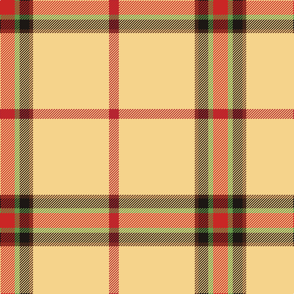

**Bands:** [RGKGYR](/stripes/rgkgyr/) · **Stripes:** [R G K DY LY R](/stripes/stripes6/) R G K DY LY R

This was sourced from register-of-tartans.  It is a [6 band tartan](/bands/bands6/).

Original link https://www.tartanregister.gov.uk/tartanDetails.aspx?ref=10900

## Register references

External register numbers recorded for this tartan.

- Scottish Register of Tartans: [10900](https://www.tartanregister.gov.uk/tartanDetails.aspx?ref=10900)

## Thread count
R/24 LG8 K16 T6 LY124 Ra/16

## Palette
Each colour and its ΔE from the base-6 reference it is a variant of.

| Colour | Shade | Base | ΔE (OKLab) |
|---|---|---|---|
| K | <code style="background-color:#1C1714;">#1C1714</code> `#1C1714` | K <code style="background-color:#000000;">#000000</code> | 0.21 |
| LG | <code style="background-color:#649848;">#649848</code> `#649848` | G <code style="background-color:#006100;">#006100</code> | 0.20 |
| LY | <code style="background-color:#F5D38B;">#F5D38B</code> `#F5D38B` | Y <code style="background-color:#F2BF00;">#F2BF00</code> | 0.09 |
| R | <code style="background-color:#CA2625;">#CA2625</code> `#CA2625` | R <code style="background-color:#CC0000;">#CC0000</code> | 0.02 |
| Ra | <code style="background-color:#B62531;">#B62531</code> `#B62531` | R <code style="background-color:#CC0000;">#CC0000</code> | 0.05 |
| T | <code style="background-color:#5D321F;">#5D321F</code> `#5D321F` | G <code style="background-color:#006100;">#006100</code> | 0.18 |

# Sample pattern

## Nearest tartans

The nearest existing variants by ΔTartan distance.

1. [Shawn Jones Afghan Memorial, The](/setts/s6/r12g4k8dr3ly62r8~x2/) — ΔT 0.86
1. [Hoa Sen](/setts/s8/ly8k2r23k1r17k1g4w3~x2/) — ΔT 1.63
1. [Saskatchewan Dress (Dance)](/setts/s8/ly2w1r2w26dy11g6k1w2~x2/) — ΔT 1.68
1. [Port Moresby City Pipes & Drums](/setts/s5/g2w3k12ly36r2~x2/) — ΔT 1.73
1. [Studio Wolf Polysun](/setts/s12/lo18r3w3r3lo2r1w1g1lo2ly1r1k1~x4/) — ΔT 1.82
1. [Tomomi](/setts/s5/w15r20ly2g1lg1~x4/) — ΔT 1.94
1. [Reekie, Charlene](/setts/s6/w43k5r3dg5ly27m5~x2/) — ΔT 1.99
1. [Reekie, Charlene (Personal)](/setts/s6/w43k5r3g5ly27dp5~x2/) — ΔT 1.99
1. [Virginia Military Institute (Milit.)](/setts/s9/r6w30r2k3r30g3r2w25r6~x2/) — ΔT 2.02
1. [Papalia, Special Dress](/setts/s6/o4w2r2r34w37k2~x2/) — ΔT 2.03

## Neighbour map

Every grey dot is one of 14313 variants placed by the first two principal components of the ΔTartan feature space (44% of its variance). Red is this tartan; blue dots are its nearest — click one to open its page.

<svg viewBox="0 0 640 380" role="img" style="max-width:100%;height:auto;border:1px solid #e0e0e0;border-radius:4px;display:block" xmlns="http://www.w3.org/2000/svg"><image href="/nn/cloud.v1.png" width="640" height="380"/><a href="/setts/s6/r12g4k8dr3ly62r8~x2/"><circle cx="340.8" cy="102.6" r="4" fill="#3465a4"><title>Shawn Jones Afghan Memorial, The</title></circle></a><a href="/setts/s8/ly8k2r23k1r17k1g4w3~x2/"><circle cx="384.7" cy="112.0" r="4" fill="#3465a4"><title>Hoa Sen</title></circle></a><a href="/setts/s8/ly2w1r2w26dy11g6k1w2~x2/"><circle cx="282.4" cy="76.4" r="4" fill="#3465a4"><title>Saskatchewan Dress (Dance)</title></circle></a><a href="/setts/s5/g2w3k12ly36r2~x2/"><circle cx="348.9" cy="128.4" r="4" fill="#3465a4"><title>Port Moresby City Pipes &amp; Drums</title></circle></a><a href="/setts/s12/lo18r3w3r3lo2r1w1g1lo2ly1r1k1~x4/"><circle cx="324.8" cy="62.4" r="4" fill="#3465a4"><title>Studio Wolf Polysun</title></circle></a><a href="/setts/s5/w15r20ly2g1lg1~x4/"><circle cx="290.2" cy="121.9" r="4" fill="#3465a4"><title>Tomomi</title></circle></a><a href="/setts/s6/w43k5r3dg5ly27m5~x2/"><circle cx="209.5" cy="114.0" r="4" fill="#3465a4"><title>Reekie, Charlene</title></circle></a><a href="/setts/s6/w43k5r3g5ly27dp5~x2/"><circle cx="215.2" cy="119.1" r="4" fill="#3465a4"><title>Reekie, Charlene (Personal)</title></circle></a><a href="/setts/s9/r6w30r2k3r30g3r2w25r6~x2/"><circle cx="237.0" cy="100.4" r="4" fill="#3465a4"><title>Virginia Military Institute (Milit.)</title></circle></a><a href="/setts/s6/o4w2r2r34w37k2~x2/"><circle cx="265.3" cy="108.6" r="4" fill="#3465a4"><title>Papalia, Special Dress</title></circle></a><circle cx="335.1" cy="92.5" r="5" fill="#c00000"/></svg>

ID: /setts/s6/r12g4k8dy3ly62r8~x2/
