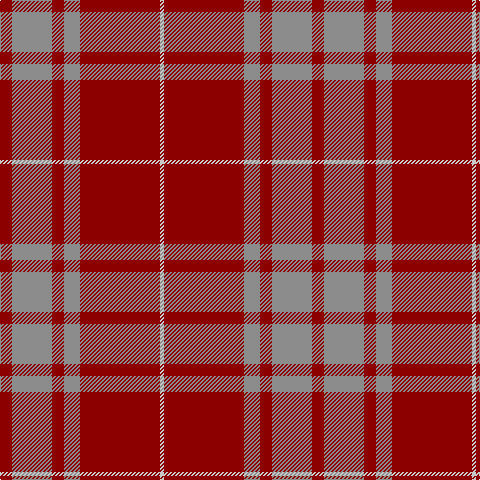

In pattern [RRRRRW](/patterns/rrrrrw/).

This was sourced from register-of-tartans.  It is a [6 stripes tartan](/stripes/stripes6/).

Original link https://www.tartanregister.gov.uk/tartanDetails.aspx?ref=2984

## Thread count
DR/12 N40 DR12 N16 DR80 Na/4

## Palette
Each colour and its ΔE from the base-6 reference it is a variant of.

| Colour | Shade | Base | ΔE (OKLab) |
|---|---|---|---|
| DR | <code style="background-color:#8C0000;">#8C0000</code> `#8C0000` | R <code style="background-color:#C80000;">#C80000</code> | 0.13 |
| N | <code style="background-color:#8C8C8C;">#8C8C8C</code> `#8C8C8C` | R <code style="background-color:#C80000;">#C80000</code> | 0.24 |
| Na | <code style="background-color:#C8C8C8;">#C8C8C8</code> `#C8C8C8` | W <code style="background-color:#F4F4F0;">#F4F4F0</code> | 0.13 |

# Sample pattern

ID: /setts/s6/r12ra40r12ra16r80w4-r8c0000-ra8c8c8c-wc8c8c8/
