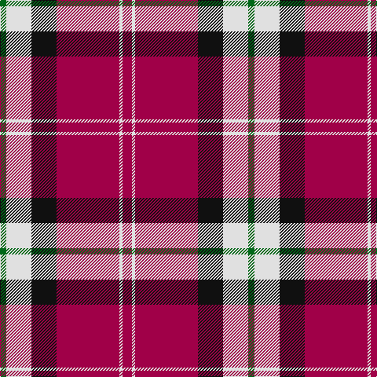

In pattern [GWKRWR](/patterns/gwkrwr/).

This was sourced from register-of-tartans.  It is a [6 stripes tartan](/stripes/stripes6/).

Original link https://www.tartanregister.gov.uk/tartanDetails.aspx?ref=3141

## Attestations

This cloth appears in 2 source records; the oldest owns this page.

- 01/01/2002 — Nisbet Dress Rose (Dance) (register-of-tartans, [record](https://www.tartanregister.gov.uk/tartanDetails.aspx?ref=3141))
- pre 2002 — Nisbet Dress, Rose (Dance) (tartans-authority, [record](http://www.tartansauthority.com/tartan-ferret/display/946/))

## Thread count
G/8 LN32 K32 R80 LN4 R/12

## Palette
Each colour and its ΔE from the base-6 reference it is a variant of.

| Colour | Shade | Base | ΔE (OKLab) |
|---|---|---|---|
| G | <code style="background-color:#006818;">#006818</code> `#006818` | G <code style="background-color:#006400;">#006400</code> | 0.02 |
| K | <code style="background-color:#101010;">#101010</code> `#101010` | K <code style="background-color:#000000;">#000000</code> | 0.17 |
| LN | <code style="background-color:#E0E0E0;">#E0E0E0</code> `#E0E0E0` | W <code style="background-color:#F4F4F0;">#F4F4F0</code> | 0.06 |
| N | <code style="background-color:#C0C0C0;">#C0C0C0</code> `#C0C0C0` | W <code style="background-color:#F4F4F0;">#F4F4F0</code> | 0.16 |
| R | <code style="background-color:#A00048;">#A00048</code> `#A00048` | R <code style="background-color:#C80000;">#C80000</code> | 0.11 |

# Sample pattern

## Nearest tartans

The nearest existing variants by ΔTartan distance.

1. [Superfast Ferries (Corporate)](/setts/s6/b4r64b24y16b24w4-b2c2c80-rc80000-we0e0e0-ye8c000/) — ΔT 0.84
1. [Suntan (Masai Shuka) (District?)](/setts/s6/k12r44b12w4b12w4-b38409c-k101010-rc80000-we0e0e0/) — ΔT 1.12
1. [Nesbit, Rose](/setts/s6/r12w6r74k32w32g8-g006818-k101010-rd05054-we8ccb8/) — ΔT 1.24
1. [Fazzolettone (Fashion?)](/setts/s7/w4b6r48b30w12b6y4-b1c1c50-rc80000-we0e0e0-ye8c000/) — ΔT 1.26
1. [Philippine Heritage (Corporate)](/setts/s5/b120w16y4w16r120-b2c2c80-rc80000-wfcfcfc-yfccc00/) — ΔT 1.27
1. [Fraser](/setts/s6/r4b24r4g24r48w2-b000050-g003000-rc00000-we0e0e0/) — ΔT 1.27
1. [Fraser VS](/setts/s6/r1b6r1g6r12w1-b000064-g004c00-rc80000-wd0d0d0/) — ΔT 1.29
1. [Philippine Heritage Corporate Tartan Tartan Number: 10660. Earliest known date: 16/07/2012 The colours of this tartan are taken from the flag of the Philippines. Colours: white represents peace and purity; yellow represents independence from Spain; blue represents patriotism and justice; red represents the blood spilt for freedom and independence. Developed for weaving by A Trivett on behalf of the Scottish Tartans Authority. See products available Copyright © Blair Urquhart, Comrie, 2015](/setts/s5/b120w16y4w16r120-b2c2c80-rc80000-we0e0e0-ye8c000/) — ΔT 1.31
1. [Philippine Heritage](/setts/s5/b120w16y4w16r120-b2c2c80-rc80000-we0e0e0-yc88c00/) — ΔT 1.33
1. [Citylink Gold (Corporate)](/setts/s8/r50b4r6y4r6b22w26y2-b506878-r880000-wf0e0cc-ybc8c00/) — ΔT 1.34

## Neighbour map

Every grey dot is one of 15726 variants placed by the first two principal components of the ΔTartan feature space (44% of its variance). Red is this tartan; blue dots are its nearest — click one to open its page.

<svg viewBox="0 0 640 380" role="img" style="max-width:100%;height:auto;border:1px solid #e0e0e0;border-radius:4px;display:block" xmlns="http://www.w3.org/2000/svg"><image href="/nn/cloud.v1.png" width="640" height="380"/><a href="/setts/s6/b4r64b24y16b24w4-b2c2c80-rc80000-we0e0e0-ye8c000/"><circle cx="279.1" cy="170.0" r="4" fill="#3465a4"><title>Superfast Ferries (Corporate)</title></circle></a><a href="/setts/s6/k12r44b12w4b12w4-b38409c-k101010-rc80000-we0e0e0/"><circle cx="265.5" cy="179.6" r="4" fill="#3465a4"><title>Suntan (Masai Shuka) (District?)</title></circle></a><a href="/setts/s6/r12w6r74k32w32g8-g006818-k101010-rd05054-we8ccb8/"><circle cx="267.1" cy="175.0" r="4" fill="#3465a4"><title>Nesbit, Rose</title></circle></a><a href="/setts/s7/w4b6r48b30w12b6y4-b1c1c50-rc80000-we0e0e0-ye8c000/"><circle cx="239.2" cy="160.7" r="4" fill="#3465a4"><title>Fazzolettone (Fashion?)</title></circle></a><a href="/setts/s5/b120w16y4w16r120-b2c2c80-rc80000-wfcfcfc-yfccc00/"><circle cx="291.3" cy="147.5" r="4" fill="#3465a4"><title>Philippine Heritage (Corporate)</title></circle></a><a href="/setts/s6/r4b24r4g24r48w2-b000050-g003000-rc00000-we0e0e0/"><circle cx="320.9" cy="162.0" r="4" fill="#3465a4"><title>Fraser</title></circle></a><a href="/setts/s6/r1b6r1g6r12w1-b000064-g004c00-rc80000-wd0d0d0/"><circle cx="280.9" cy="185.6" r="4" fill="#3465a4"><title>Fraser VS</title></circle></a><a href="/setts/s5/b120w16y4w16r120-b2c2c80-rc80000-we0e0e0-ye8c000/"><circle cx="298.8" cy="151.1" r="4" fill="#3465a4"><title>Philippine Heritage Corporate Tartan Tartan Number: 10660. Earliest known date: 16/07/2012 The colours of this tartan are taken from the flag of the Philippines. Colours: white represents peace and purity; yellow represents independence from Spain; blue represents patriotism and justice; red represents the blood spilt for freedom and independence. Developed for weaving by A Trivett on behalf of the Scottish Tartans Authority. See products available Copyright © Blair Urquhart, Comrie, 2015</title></circle></a><a href="/setts/s5/b120w16y4w16r120-b2c2c80-rc80000-we0e0e0-yc88c00/"><circle cx="300.2" cy="151.7" r="4" fill="#3465a4"><title>Philippine Heritage</title></circle></a><a href="/setts/s8/r50b4r6y4r6b22w26y2-b506878-r880000-wf0e0cc-ybc8c00/"><circle cx="303.4" cy="129.5" r="4" fill="#3465a4"><title>Citylink Gold (Corporate)</title></circle></a><circle cx="301.0" cy="154.6" r="5" fill="#c00000"/></svg>

ID: /setts/s6/r12w4r80k32w32g8-g006818-k101010-ra00048-we0e0e0/
