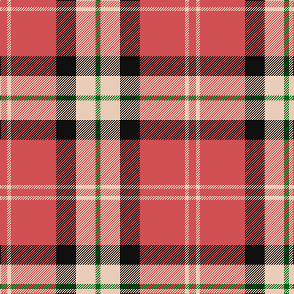

In pattern [GWKRWR](/patterns/gwkrwr/).

This was sourced from tartans-authority.  It is a [6 stripes tartan](/stripes/stripes6/).

Original link http://www.tartansauthority.com/tartan-ferret/display/8678/

## Thread count
DO/12 LR6 DO74 K32 LR32 G/8

## Palette
Each colour and its ΔE from the base-6 reference it is a variant of.

| Colour | Shade | Base | ΔE (OKLab) |
|---|---|---|---|
| DO | <code style="background-color:#D05054;">#D05054</code> `#D05054` | R <code style="background-color:#C80000;">#C80000</code> | 0.10 |
| G | <code style="background-color:#006818;">#006818</code> `#006818` | G <code style="background-color:#006400;">#006400</code> | 0.02 |
| K | <code style="background-color:#101010;">#101010</code> `#101010` | K <code style="background-color:#000000;">#000000</code> | 0.17 |
| LR | <code style="background-color:#E8CCB8;">#E8CCB8</code> `#E8CCB8` | W <code style="background-color:#F4F4F0;">#F4F4F0</code> | 0.11 |

# Sample pattern

ID: /setts/s6/r12w6r74k32w32g8-g006818-k101010-rd05054-we8ccb8/
