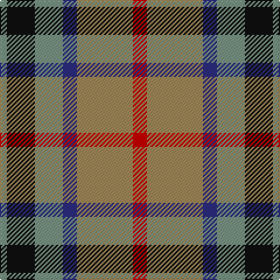

In pattern [GKGBYR](/patterns/gkgbyr/).

This was sourced from register-of-tartans.  It is a [6 stripes tartan](/stripes/stripes6/).

Original link https://www.tartanregister.gov.uk/tartanDetails.aspx?ref=4109

## Attestations

This cloth appears in 2 source records; the oldest owns this page.

- 01/01/2002 — Thompson (J.C.'s Fancy) (Personal) (register-of-tartans, [record](https://www.tartanregister.gov.uk/tartanDetails.aspx?ref=4109))
- pre 2002 — Thompson (J.C.'s Fancy) (Personal) (tartans-authority, [record](http://www.tartansauthority.com/tartan-ferret/display/286/))

## Thread count
LG/6 K24 LG24 DB12 LT48 R/12

## Palette
Each colour and its ΔE from the base-6 reference it is a variant of.

| Colour | Shade | Base | ΔE (OKLab) |
|---|---|---|---|
| DB | <code style="background-color:#2C2C80;">#2C2C80</code> `#2C2C80` | B <code style="background-color:#2C4084;">#2C4084</code> | 0.05 |
| K | <code style="background-color:#101010;">#101010</code> `#101010` | K <code style="background-color:#000000;">#000000</code> | 0.17 |
| LG | <code style="background-color:#789484;">#789484</code> `#789484` | G <code style="background-color:#006400;">#006400</code> | 0.23 |
| LT | <code style="background-color:#A08858;">#A08858</code> `#A08858` | Y <code style="background-color:#E8C000;">#E8C000</code> | 0.21 |
| R | <code style="background-color:#C80000;">#C80000</code> `#C80000` | R <code style="background-color:#C80000;">#C80000</code> | 0.00 |

# Sample pattern

## Nearest tartans

The nearest existing variants by ΔTartan distance.

1. [Utah Centennial](/setts/s8/w12r16g48r16b12ra16b16w6-b304080-g008000-rc00000-rac00020-we0e0e0/) — ΔT 0.93
1. [Thompson's Fancy Personal Tartan Tartan Number: 286. Earliest known date: pre 2003 Designed for his own use. See products available Copyright © Blair Urquhart, Comrie, 2015](/setts/s6/r12g48b12ba24k24ba6-b2c2c80-ba5c8ca8-g604000-k101010-rc80000/) — ΔT 1.00
1. [Canine All Dogs (Fashion)](/setts/s6/r10b6g24ba24r6y3-b2c2c80-ba1c1c50-g006818-rc80000-ye8c000/) — ΔT 1.03
1. [Cercle de Fermières Varennes](/setts/s6/b60r6w20g28r6ra60-b1870a4-g005448-rc8002c-rab07430-wffffff/) — ΔT 1.04
1. [Jardine #2](/setts/s5/b36r36g36ra4ba4-b2a2303-ba3c82af-g808080-rbe7832-radc0000/) — ΔT 1.05
1. [Strathblane (Fashion)](/setts/s5/g24k8w4r12ra6-g604000-k101010-r888888-rac80000-we0e0e0/) — ΔT 1.05
1. [Sikh](/setts/s8/r56k12r7k12r7g50b50y10-b2c2c80-g006818-k101010-rb84c00-ye8c000/) — ΔT 1.07
1. [Strathblane](/setts/s5/r24k8w4g12ra6-g808080-k000000-r806050-rac00000-we0e0e0/) — ΔT 1.08
1. [Strathblane](/setts/s8/r12w4k8g24k8w4r12ra6-g604000-k101010-r888888-rac80000-we0e0e0/) — ΔT 1.10
1. [Thom(p)son's, Fancy](/setts/s6/r12ra48b12ba24k24ba6-b304080-ba5480b0-k000000-rc00000-ra806050/) — ΔT 1.14

## Neighbour map

Every grey dot is one of 15726 variants placed by the first two principal components of the ΔTartan feature space (44% of its variance). Red is this tartan; blue dots are its nearest — click one to open its page.

<svg viewBox="0 0 640 380" role="img" style="max-width:100%;height:auto;border:1px solid #e0e0e0;border-radius:4px;display:block" xmlns="http://www.w3.org/2000/svg"><image href="/nn/cloud.v1.png" width="640" height="380"/><a href="/setts/s8/w12r16g48r16b12ra16b16w6-b304080-g008000-rc00000-rac00020-we0e0e0/"><circle cx="105.3" cy="189.3" r="4" fill="#3465a4"><title>Utah Centennial</title></circle></a><a href="/setts/s6/r12g48b12ba24k24ba6-b2c2c80-ba5c8ca8-g604000-k101010-rc80000/"><circle cx="160.7" cy="222.4" r="4" fill="#3465a4"><title>Thompson's Fancy Personal Tartan Tartan Number: 286. Earliest known date: pre 2003 Designed for his own use. See products available Copyright © Blair Urquhart, Comrie, 2015</title></circle></a><a href="/setts/s6/r10b6g24ba24r6y3-b2c2c80-ba1c1c50-g006818-rc80000-ye8c000/"><circle cx="139.1" cy="212.2" r="4" fill="#3465a4"><title>Canine All Dogs (Fashion)</title></circle></a><a href="/setts/s6/b60r6w20g28r6ra60-b1870a4-g005448-rc8002c-rab07430-wffffff/"><circle cx="144.0" cy="192.8" r="4" fill="#3465a4"><title>Cercle de Fermières Varennes</title></circle></a><a href="/setts/s5/b36r36g36ra4ba4-b2a2303-ba3c82af-g808080-rbe7832-radc0000/"><circle cx="160.8" cy="219.5" r="4" fill="#3465a4"><title>Jardine #2</title></circle></a><a href="/setts/s5/g24k8w4r12ra6-g604000-k101010-r888888-rac80000-we0e0e0/"><circle cx="172.6" cy="229.3" r="4" fill="#3465a4"><title>Strathblane (Fashion)</title></circle></a><a href="/setts/s8/r56k12r7k12r7g50b50y10-b2c2c80-g006818-k101010-rb84c00-ye8c000/"><circle cx="139.3" cy="186.9" r="4" fill="#3465a4"><title>Sikh</title></circle></a><a href="/setts/s5/r24k8w4g12ra6-g808080-k000000-r806050-rac00000-we0e0e0/"><circle cx="157.1" cy="222.1" r="4" fill="#3465a4"><title>Strathblane</title></circle></a><a href="/setts/s8/r12w4k8g24k8w4r12ra6-g604000-k101010-r888888-rac80000-we0e0e0/"><circle cx="85.2" cy="205.9" r="4" fill="#3465a4"><title>Strathblane</title></circle></a><a href="/setts/s6/r12ra48b12ba24k24ba6-b304080-ba5480b0-k000000-rc00000-ra806050/"><circle cx="132.6" cy="210.0" r="4" fill="#3465a4"><title>Thom(p)son's, Fancy</title></circle></a><circle cx="141.8" cy="210.8" r="5" fill="#c00000"/></svg>

ID: /setts/s6/r12y48b12g24k24g6-b2c2c80-g789484-k101010-rc80000-ya08858/
