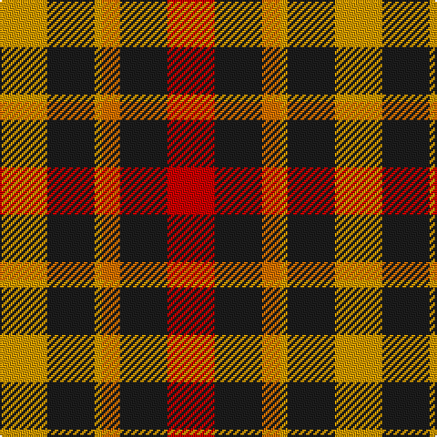

In pattern [RBRYBY](/patterns/rbryby/).

This was sourced from register-of-tartans.  It is a [6 stripes tartan](/stripes/stripes6/).

Original link https://www.tartanregister.gov.uk/tartanDetails.aspx?ref=5748

## Attestations

This cloth appears in 2 source records; the oldest owns this page.

- 01/01/2008 — Torana (register-of-tartans, [record](https://www.tartanregister.gov.uk/tartanDetails.aspx?ref=5748))
- 2008 — Torana (Fashion) (tartans-authority, [record](http://www.tartansauthority.com/tartan-ferret/display/7778/))

## Register references

External register numbers recorded for this tartan.

- Scottish Register of Tartans: [5748](https://www.tartanregister.gov.uk/tartanDetails.aspx?ref=5748)
- Scottish Tartans Authority (ITI): 7778

## Thread count
DY/26 K26 DY4 O10 K26 R/26

## Palette
Each colour and its ΔE from the base-6 reference it is a variant of.

| Colour | Shade | Base | ΔE (OKLab) |
|---|---|---|---|
| DY | <code style="background-color:#D09800;">#D09800</code> `#D09800` | Y <code style="background-color:#F2BF00;">#F2BF00</code> | 0.12 |
| K | <code style="background-color:#1C1C1C;">#1C1C1C</code> `#1C1C1C` | B <code style="background-color:#2A418A;">#2A418A</code> | 0.21 |
| O | <code style="background-color:#D87000;">#D87000</code> `#D87000` | R <code style="background-color:#CC0000;">#CC0000</code> | 0.16 |
| R | <code style="background-color:#C80000;">#C80000</code> `#C80000` | R <code style="background-color:#CC0000;">#CC0000</code> | 0.01 |

# Sample pattern

## Nearest tartans

The nearest existing variants by ΔTartan distance.

1. [Norwich No.028](/setts/s6/r6g5k5g5r6b1~b5c8ca8-g006818-k000000-rc80000~x4/) — ΔT 0.85
1. [Unidentified item](/setts/s5/g9w1r9k9r9~g005020-k101010-rdc0000-we0e0e0~x8/) — ΔT 0.98
1. [MacDuff](/setts/s7/r8b3k4g6r4k1r4~b5480b0-g008000-k000000-rc00000~x2/) — ΔT 1.03
1. [Unidentified, item](/setts/s5/g9w1r9k9r9~g008000-k000000-rc00000-we0e0e0~x8/) — ΔT 1.08
1. [MacTavish](/setts/s7/r6g1r6b1g3k3g3~b304080-g008000-k000000-rc00000~x4/) — ΔT 1.15
1. [Tulsa](/setts/s6/r14k3r14g13b8g13~b304080-g008000-k000000-rc00000~x2/) — ΔT 1.23
1. [MacDuff #5](/setts/s7/r8b3k4g6r4k1r4~b3c82af-g005020-k101010-rdc0000~x2/) — ΔT 1.24
1. [Aboyne II (Fashion)](/setts/s6/r2y1r5k4g5w1~g006818-k101010-rc80000-wfcfcfc-yfccc00~x4/) — ΔT 1.26
1. [Wcwm 1651](/setts/s7/r10k1r3g7k7g5y3~g6c6c00-k000000-r8c0000-yc89800~x4/) — ΔT 1.29
1. [Chivas Regal (Corporate)](/setts/s5/b2k2b2r5y1~b003c64-k101010-rb03000-ye8c000~x12/) — ΔT 1.29

## Neighbour map

Every grey dot is one of 15726 variants placed by the first two principal components of the ΔTartan feature space (44% of its variance). Red is this tartan; blue dots are its nearest — click one to open its page.

<svg viewBox="0 0 640 380" role="img" style="max-width:100%;height:auto;border:1px solid #e0e0e0;border-radius:4px;display:block" xmlns="http://www.w3.org/2000/svg"><image href="/nn/cloud.v1.png" width="640" height="380"/><a href="/setts/s6/r6g5k5g5r6b1~b5c8ca8-g006818-k000000-rc80000~x4/"><circle cx="148.8" cy="269.6" r="4" fill="#3465a4"><title>Norwich No.028</title></circle></a><a href="/setts/s5/g9w1r9k9r9~g005020-k101010-rdc0000-we0e0e0~x8/"><circle cx="211.9" cy="251.9" r="4" fill="#3465a4"><title>Unidentified item</title></circle></a><a href="/setts/s7/r8b3k4g6r4k1r4~b5480b0-g008000-k000000-rc00000~x2/"><circle cx="213.9" cy="233.5" r="4" fill="#3465a4"><title>MacDuff</title></circle></a><a href="/setts/s5/g9w1r9k9r9~g008000-k000000-rc00000-we0e0e0~x8/"><circle cx="192.3" cy="248.9" r="4" fill="#3465a4"><title>Unidentified, item</title></circle></a><a href="/setts/s7/r6g1r6b1g3k3g3~b304080-g008000-k000000-rc00000~x4/"><circle cx="222.7" cy="234.7" r="4" fill="#3465a4"><title>MacTavish</title></circle></a><a href="/setts/s6/r14k3r14g13b8g13~b304080-g008000-k000000-rc00000~x2/"><circle cx="164.0" cy="283.0" r="4" fill="#3465a4"><title>Tulsa</title></circle></a><a href="/setts/s7/r8b3k4g6r4k1r4~b3c82af-g005020-k101010-rdc0000~x2/"><circle cx="231.5" cy="236.4" r="4" fill="#3465a4"><title>MacDuff #5</title></circle></a><a href="/setts/s6/r2y1r5k4g5w1~g006818-k101010-rc80000-wfcfcfc-yfccc00~x4/"><circle cx="112.0" cy="224.2" r="4" fill="#3465a4"><title>Aboyne II (Fashion)</title></circle></a><a href="/setts/s7/r10k1r3g7k7g5y3~g6c6c00-k000000-r8c0000-yc89800~x4/"><circle cx="155.6" cy="220.7" r="4" fill="#3465a4"><title>Wcwm 1651</title></circle></a><a href="/setts/s5/b2k2b2r5y1~b003c64-k101010-rb03000-ye8c000~x12/"><circle cx="174.4" cy="262.5" r="4" fill="#3465a4"><title>Chivas Regal (Corporate)</title></circle></a><circle cx="162.5" cy="248.7" r="5" fill="#c00000"/></svg>

ID: /setts/s6/r13b13ra5y2b13y13~b1c1c1c-rc80000-rad87000-yd09800~x2/
