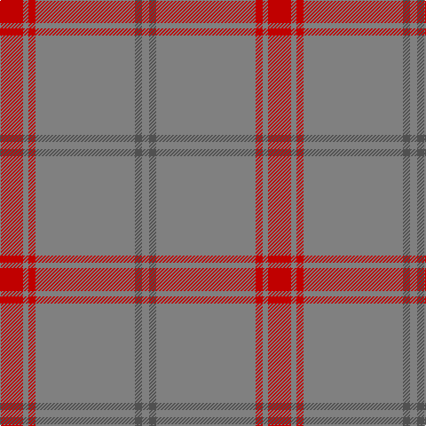

This page is one **sett** — a single exact thread-count. It belongs to the [tartan](/tartans/r13na3r4na56n4na4/)
(the same proportion at any scale), whose colour order is pattern [GBGRGR](/stripes/gbgrgr/).

Sourced from weddslist.  It is a [6 stripe tartan](/stripes/stripes6/).

Original link http://www.weddslist.com/cgi-bin/tartans/pg.pl?source=sts

## Also known as

This cloth is also recorded under:

- Auchairne grey
- Auchairne, Grey

## Thread count
R/26 Na6 R8 Na112 N8 Na/8

## Palette
Each colour and the base-6 reference it is a variant of.

| Colour | Shade | Base |
|---|---|---|
| N | <code style="background-color:#505050;">#505050</code> `oklch(43.1% 0.000 89.9)` <small>#505050</small> | B <code style="background-color:#2A418A;">#2A418A</code> |
| Na | <code style="background-color:#808080;">#808080</code> `oklch(60.0% 0.000 89.9)` <small>#808080</small> | G <code style="background-color:#006100;">#006100</code> |
| R | <code style="background-color:#C00000;">#C00000</code> `oklch(50.7% 0.208 29.2)` <small>#C00000</small> | R <code style="background-color:#CC0000;">#CC0000</code> |

# Sample pattern

## Nearest tartans

The nearest existing variants by ΔTartan distance, with this tartan at the top so the swatches line up against it.

ΔTartan

Tartan

Sett

—

<a href="/ttd/edit/#slug=r13y3r4y56n4y4~x2">Auchairne grey</a> <a class="nn-out" href="/setts/s6/r13y3r4y56n4y4~x2/" title="open its dictionary page">↗</a>

0.28

<a href="/ttd/edit/#slug=r13o3r4o56n4o4~x2">Auchairne Grey</a> <a class="nn-out" href="/setts/s6/r13o3r4o56n4o4~x2/" title="open its dictionary page">↗</a>

1.69

<a href="/ttd/edit/#slug=y60g13y9r8ly4~x2">Ballantyne (Personal)</a> <a class="nn-out" href="/setts/s5/y60g13y9r8ly4~x2/" title="open its dictionary page">↗</a>

1.84

<a href="/ttd/edit/#slug=n65k2n4lr2n10r24~x2">Norsemen (Corporate)</a> <a class="nn-out" href="/setts/s6/n65k2n4lr2n10r24~x2/" title="open its dictionary page">↗</a>

1.94

<a href="/ttd/edit/#slug=y40r8y4w2y4ly5~x2">Reid (1939)</a> <a class="nn-out" href="/setts/s6/y40r8y4w2y4ly5~x2/" title="open its dictionary page">↗</a>

2.07

<a href="/ttd/edit/#slug=o60dg13o9o8ly4~x2">Ballantyne Personal Tartan Tartan Number: 7563. Earliest known date: 2007 Andrew Ballantyne said, l finally decided to purchase a tartan of my own design. The first kilt was made for my father and he was very pleased with it. The fabric was designed online at House of Tartan and woven by Edgars, Perth. See products available Copyright © Blair Urquhart, Comrie, 2015</a> <a class="nn-out" href="/setts/s5/o60dg13o9o8ly4~x2/" title="open its dictionary page">↗</a>

2.11

<a href="/ttd/edit/#slug=o16lb8dy1lb2dy1lb1dy8o34w2~x2">Stuart of Bute St Colmac</a> <a class="nn-out" href="/setts/s9/o16lb8dy1lb2dy1lb1dy8o34w2~x2/" title="open its dictionary page">↗</a>

2.15

<a href="/ttd/edit/#slug=db3y1w1y25w1y1p3~x2">St Giles, Check</a> <a class="nn-out" href="/setts/s7/db3y1w1y25w1y1p3~x2/" title="open its dictionary page">↗</a>

2.18

<a href="/ttd/edit/#slug=w2o44dt8o2dt2o3r1~x2">Reece, Mathew</a> <a class="nn-out" href="/setts/s7/w2o44dt8o2dt2o3r1~x2/" title="open its dictionary page">↗</a>

2.20

<a href="/ttd/edit/#slug=o5g1o32r1o8r9o2g2g3r3g1~x2">Portosalvo (Corporate)</a> <a class="nn-out" href="/setts/s11/o5g1o32r1o8r9o2g2g3r3g1~x2/" title="open its dictionary page">↗</a>

2.21

<a href="/ttd/edit/#slug=y65r27w2y4ly5~x2">Perry, Arisaid</a> <a class="nn-out" href="/setts/s5/y65r27w2y4ly5~x2/" title="open its dictionary page">↗</a>

## Neighbour map

Every grey dot is one of 14299 variants placed by the first two principal components of the ΔTartan feature space (44% of its variance). Red is this tartan; blue dots are its nearest — click one to open its page.

<svg viewBox="0 0 640 380" role="img" style="max-width:100%;height:auto;border:1px solid #e0e0e0;border-radius:4px;display:block" xmlns="http://www.w3.org/2000/svg"><image href="/nn/cloud.v1.png" width="640" height="380"/><a href="/setts/s6/r13o3r4o56n4o4~x2/"><circle cx="603.4" cy="213.1" r="4" fill="#3465a4"><title>Auchairne Grey</title></circle></a><a href="/setts/s5/y60g13y9r8ly4~x2/"><circle cx="527.5" cy="225.8" r="4" fill="#3465a4"><title>Ballantyne (Personal)</title></circle></a><a href="/setts/s6/n65k2n4lr2n10r24~x2/"><circle cx="579.5" cy="186.5" r="4" fill="#3465a4"><title>Norsemen (Corporate)</title></circle></a><a href="/setts/s6/y40r8y4w2y4ly5~x2/"><circle cx="565.8" cy="187.6" r="4" fill="#3465a4"><title>Reid (1939)</title></circle></a><a href="/setts/s5/o60dg13o9o8ly4~x2/"><circle cx="506.7" cy="212.5" r="4" fill="#3465a4"><title>Ballantyne Personal Tartan Tartan Number: 7563. Earliest known date: 2007 Andrew Ballantyne said, l finally decided to purchase a tartan of my own design. The first kilt was made for my father and he was very pleased with it. The fabric was designed online at House of Tartan and woven by Edgars, Perth. See products available Copyright © Blair Urquhart, Comrie, 2015</title></circle></a><a href="/setts/s9/o16lb8dy1lb2dy1lb1dy8o34w2~x2/"><circle cx="529.0" cy="165.4" r="4" fill="#3465a4"><title>Stuart of Bute St Colmac</title></circle></a><a href="/setts/s7/db3y1w1y25w1y1p3~x2/"><circle cx="574.4" cy="153.7" r="4" fill="#3465a4"><title>St Giles, Check</title></circle></a><a href="/setts/s7/w2o44dt8o2dt2o3r1~x2/"><circle cx="626.0" cy="136.1" r="4" fill="#3465a4"><title>Reece, Mathew</title></circle></a><a href="/setts/s11/o5g1o32r1o8r9o2g2g3r3g1~x2/"><circle cx="539.1" cy="141.6" r="4" fill="#3465a4"><title>Portosalvo (Corporate)</title></circle></a><a href="/setts/s5/y65r27w2y4ly5~x2/"><circle cx="508.1" cy="174.4" r="4" fill="#3465a4"><title>Perry, Arisaid</title></circle></a><circle cx="609.4" cy="217.6" r="5" fill="#c00000"/></svg>

ID: /setts/s6/r13y3r4y56n4y4~x2/
