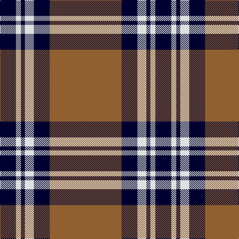

In pattern [KWKWKR](/patterns/kwkwkr/).

This was sourced from weddslist.  It is a [6 stripes tartan](/stripes/stripes6/).

Original link http://www.weddslist.com/cgi-bin/tartans/pg.pl?source=sts

## Thread count
DB/32 LN10 DB8 LN18 DB32 LT/144

## Palette
Each colour and its ΔE from the base-6 reference it is a variant of.

| Colour | Shade | Base | ΔE (OKLab) |
|---|---|---|---|
| DB | <code style="background-color:#000030;">#000030</code> `#000030` | K <code style="background-color:#000000;">#000000</code> | 0.17 |
| LN | <code style="background-color:#E0E0E0;">#E0E0E0</code> `#E0E0E0` | W <code style="background-color:#F4F4F0;">#F4F4F0</code> | 0.06 |
| LT | <code style="background-color:#906030;">#906030</code> `#906030` | R <code style="background-color:#C80000;">#C80000</code> | 0.15 |

# Sample pattern

## Nearest tartans

The nearest existing variants by ΔTartan distance.

1. [Wcwm 1166-2](/setts/s6/b88y6b8w6b8y88-b3c2010-wc8c8c8-yc09898/) — ΔT 0.95
1. [Korner-Macpherson (Personal)](/setts/s7/g10r6g70k56g8k22g4-g808080-k101010-rc80000/) — ΔT 1.10
1. [Stutterheim (Corporate)](/setts/s6/k4y18b44k3y10k4-b2c2c80-k101010-yfccc00/) — ΔT 1.15
1. [Cornish Flag (District)](/setts/s5/w10k40w20k2r4-k101010-rc80000-we0e0e0/) — ΔT 1.16
1. [MacKnight (Name)](/setts/s9/k24y2k4y12k8y6k8y42r8-k101010-rc80000-ya0a0a0/) — ΔT 1.16
1. [Gretna Football Club (Corporate)](/setts/s7/w36k8w36k95w4k4r6-k101010-rc80000-wfcfcdc/) — ΔT 1.18
1. [Highland Park High School (Texas)](/setts/s9/b76w4b24w4b8w8y8w4y72-b1c1c50-we0e0e0-ye0a126/) — ΔT 1.18
1. [Loch Tummel](/setts/s5/g76w18g6k18w6-g603800-k101010-wfcfcfc/) — ΔT 1.22
1. [West Point Regimental Tartan Tartan Number: 1130. Earliest known date: 1986 Wemyss means cave and probably originates from the caves beneath MacDuff castle. There is a long and interesting article on the family of Wemyss in William Anderson's 'The Scottish Nation' published by A Fullarton in 1874. See products available Copyright © Blair Urquhart, Comrie, 2015](/setts/s8/k78r6k6r6k24r60y6r6-k101010-r888888-ye8c000/) — ΔT 1.22
1. [Bro-Wened](/setts/s6/k86r20w6k6w30b6-b202060-k101010-r880000-wf8e8d8/) — ΔT 1.24

## Neighbour map

Every grey dot is one of 15726 variants placed by the first two principal components of the ΔTartan feature space (44% of its variance). Red is this tartan; blue dots are its nearest — click one to open its page.

<svg viewBox="0 0 640 380" role="img" style="max-width:100%;height:auto;border:1px solid #e0e0e0;border-radius:4px;display:block" xmlns="http://www.w3.org/2000/svg"><image href="/nn/cloud.v1.png" width="640" height="380"/><a href="/setts/s6/b88y6b8w6b8y88-b3c2010-wc8c8c8-yc09898/"><circle cx="345.7" cy="180.2" r="4" fill="#3465a4"><title>Wcwm 1166-2</title></circle></a><a href="/setts/s7/g10r6g70k56g8k22g4-g808080-k101010-rc80000/"><circle cx="345.8" cy="187.5" r="4" fill="#3465a4"><title>Korner-Macpherson (Personal)</title></circle></a><a href="/setts/s6/k4y18b44k3y10k4-b2c2c80-k101010-yfccc00/"><circle cx="296.7" cy="178.5" r="4" fill="#3465a4"><title>Stutterheim (Corporate)</title></circle></a><a href="/setts/s5/w10k40w20k2r4-k101010-rc80000-we0e0e0/"><circle cx="324.3" cy="184.2" r="4" fill="#3465a4"><title>Cornish Flag (District)</title></circle></a><a href="/setts/s9/k24y2k4y12k8y6k8y42r8-k101010-rc80000-ya0a0a0/"><circle cx="324.4" cy="160.6" r="4" fill="#3465a4"><title>MacKnight (Name)</title></circle></a><a href="/setts/s7/w36k8w36k95w4k4r6-k101010-rc80000-wfcfcdc/"><circle cx="344.9" cy="146.7" r="4" fill="#3465a4"><title>Gretna Football Club (Corporate)</title></circle></a><a href="/setts/s9/b76w4b24w4b8w8y8w4y72-b1c1c50-we0e0e0-ye0a126/"><circle cx="313.7" cy="141.5" r="4" fill="#3465a4"><title>Highland Park High School (Texas)</title></circle></a><a href="/setts/s5/g76w18g6k18w6-g603800-k101010-wfcfcfc/"><circle cx="383.2" cy="195.4" r="4" fill="#3465a4"><title>Loch Tummel</title></circle></a><a href="/setts/s8/k78r6k6r6k24r60y6r6-k101010-r888888-ye8c000/"><circle cx="349.2" cy="182.1" r="4" fill="#3465a4"><title>West Point Regimental Tartan Tartan Number: 1130. Earliest known date: 1986 Wemyss means cave and probably originates from the caves beneath MacDuff castle. There is a long and interesting article on the family of Wemyss in William Anderson's 'The Scottish Nation' published by A Fullarton in 1874. See products available Copyright © Blair Urquhart, Comrie, 2015</title></circle></a><a href="/setts/s6/k86r20w6k6w30b6-b202060-k101010-r880000-wf8e8d8/"><circle cx="315.5" cy="163.9" r="4" fill="#3465a4"><title>Bro-Wened</title></circle></a><circle cx="361.0" cy="170.2" r="5" fill="#c00000"/></svg>

ID: /setts/s6/r144k32w18k8w10k32-k000030-r906030-we0e0e0/
