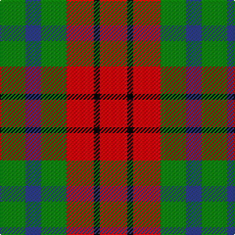

In pattern [GBGRKR](/stripes/gbgrkr/).

This was sourced from weddslist.  It is a [6 stripe tartan](/stripes/stripes6/).

Original link http://www.weddslist.com/cgi-bin/tartans/pg.pl?source=sts

## Attestations

This cloth appears in 2 source records; the oldest owns this page.

- undated — Tulsa (weddslist, [record](http://www.weddslist.com/cgi-bin/tartans/pg.pl?source=sts))
- undated — Tulsa District Tartan Tartan Number: 712. Earliest known date: 1978 The tartan was designed by Richard Crawford, Chinnubbie McIntosh, and Bea Notley, and supported by the Mayor of Tulsa, Robert J. La Fortune who issued a proclamation to 'endorse and ordain the establishment of the Tulsa tartan'. Tulsa is situated on the Arkansas River in Oklahoma, a State much settled by Scots. See products available Copyright © Blair Urquhart, Comrie, 2015 (house-of-tartan, [record](http://www.house-of-tartan.scotland.net/house/TartanViewjs.asp?colr=Def&tnam=712))

## Thread count
R/28 K6 R28 G26 B16 G/26

## Palette
Each colour and the base-6 reference it is a variant of.

| Colour | Shade | Base |
|---|---|---|
| B | <code style="background-color:#304080;">#304080</code> `oklch(39.4% 0.109 270.2)` <small>#304080</small> | B <code style="background-color:#2A418A;">#2A418A</code> |
| G | <code style="background-color:#008000;">#008000</code> `oklch(52.0% 0.177 142.5)` <small>#008000</small> | G <code style="background-color:#006100;">#006100</code> |
| K | <code style="background-color:#000000;">#000000</code> `oklch(0.0% 0.000 0.0)` <small>#000000</small> | K <code style="background-color:#000000;">#000000</code> |
| R | <code style="background-color:#C00000;">#C00000</code> `oklch(50.7% 0.208 29.2)` <small>#C00000</small> | R <code style="background-color:#CC0000;">#CC0000</code> |

# Sample pattern

## Nearest tartans

The nearest existing variants by ΔTartan distance.

1. [Norwich No.028](/setts/s6/r6g5k5g5r6t1~x4/) — ΔT 1.04
1. [Torana](/setts/s6/r13dt13o5lo2dt13lo13~x2/) — ΔT 1.24
1. [Tulsa, City of](/setts/s6/dg14db8dg14r14k3r14~x2/) — ΔT 1.28
1. [MacDuff](/setts/s7/r10db6k8g10r6g3r6~x2/) — ΔT 1.30
1. [MacDonagh](/setts/s7/r20g29db10g16r6g10k19~x2/) — ΔT 1.35
1. [MacDuff #3](/setts/s7/r10db6k8dg10r6dg3r6~x2/) — ΔT 1.39
1. [MacDonagh (Name)](/setts/s7/r20dg29db10dg16r6dg10k19~x2/) — ΔT 1.42
1. [Wilson's No.203](/setts/s4/t2r4g5ly1~x4/) — ΔT 1.43
1. [Stewart, Plaid](/setts/s7/r2g4db8r9g9k2r2~x2/) — ΔT 1.53
1. [Chivas Regal](/setts/s5/dt6k6dt6r14ly3~x2/) — ΔT 1.56

## Neighbour map

Every grey dot is one of 14299 variants placed by the first two principal components of the ΔTartan feature space (44% of its variance). Red is this tartan; blue dots are its nearest — click one to open its page.

<svg viewBox="0 0 640 380" role="img" style="max-width:100%;height:auto;border:1px solid #e0e0e0;border-radius:4px;display:block" xmlns="http://www.w3.org/2000/svg"><image href="/nn/cloud.v1.png" width="640" height="380"/><a href="/setts/s6/r6g5k5g5r6t1~x4/"><circle cx="150.2" cy="266.2" r="4" fill="#3465a4"><title>Norwich No.028</title></circle></a><a href="/setts/s6/r13dt13o5lo2dt13lo13~x2/"><circle cx="163.6" cy="245.4" r="4" fill="#3465a4"><title>Torana</title></circle></a><a href="/setts/s6/dg14db8dg14r14k3r14~x2/"><circle cx="182.4" cy="290.0" r="4" fill="#3465a4"><title>Tulsa, City of</title></circle></a><a href="/setts/s7/r10db6k8g10r6g3r6~x2/"><circle cx="115.7" cy="283.1" r="4" fill="#3465a4"><title>MacDuff</title></circle></a><a href="/setts/s7/r20g29db10g16r6g10k19~x2/"><circle cx="197.2" cy="275.4" r="4" fill="#3465a4"><title>MacDonagh</title></circle></a><a href="/setts/s7/r10db6k8dg10r6dg3r6~x2/"><circle cx="136.2" cy="289.3" r="4" fill="#3465a4"><title>MacDuff #3</title></circle></a><a href="/setts/s7/r20dg29db10dg16r6dg10k19~x2/"><circle cx="209.5" cy="280.1" r="4" fill="#3465a4"><title>MacDonagh (Name)</title></circle></a><a href="/setts/s4/t2r4g5ly1~x4/"><circle cx="177.5" cy="277.0" r="4" fill="#3465a4"><title>Wilson's No.203</title></circle></a><a href="/setts/s7/r2g4db8r9g9k2r2~x2/"><circle cx="146.0" cy="246.5" r="4" fill="#3465a4"><title>Stewart, Plaid</title></circle></a><a href="/setts/s5/dt6k6dt6r14ly3~x2/"><circle cx="160.9" cy="268.3" r="4" fill="#3465a4"><title>Chivas Regal</title></circle></a><circle cx="165.2" cy="281.6" r="5" fill="#c00000"/></svg>

ID: /setts/s6/r14k3r14g13db8g13~x2/
