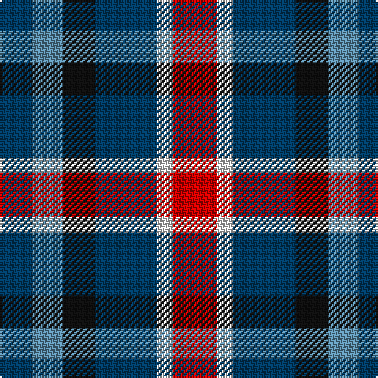

This page is one **sett** — a single exact thread-count. It belongs to the [tartan](/tartans/r14ln5db20k10b10db10/)
(the same proportion at any scale), whose colour order is pattern [BBKBWR](/stripes/bbkbwr/).

Sourced from tartans-authority.  It is a [6 stripe tartan](/stripes/stripes6/).

Original link http://www.tartansauthority.com/tartan-ferret/display/7564/

## Also known as

This cloth is also recorded under:

- Gandy of Myrton Clan/Family

3 attestations — the source records this cloth was collapsed from (oldest owns this page)

<ul>
<li>2008 — Gandy of Myrton (Name) (tartans-authority, <a href="http://www.tartansauthority.com/tartan-ferret/display/7564/">record</a>)</li>
<li>undated — Gandy of Myrton (register-of-tartans, <a href="https://www.tartanregister.gov.uk/tartanDetails.aspx?ref=5590">record</a>)</li>
<li>undated — Gandy of Myrton Clan/Family Tartan Tartan Number: 7564. Earliest known date: 2008 Professor Gandy wrote, I wanted to make a family tartan and celebrates my being gazetted by Lyon as chief of the territorial house of the Gandys of Myrton on 19th August 2005. The tartan alludes to the tartan of a fairly remote cousin, the Earl of Cawdor (whose tartan we hitherto wore) and the principal colours of our arms. See products available Copyright © Blair Urquhart, Comrie, 2015 (house-of-tartan, <a href="http://www.house-of-tartan.scotland.net/house/TartanViewjs.asp?colr=Def&tnam=7564">record</a>)</li>
</ul>

## Register references

External register numbers recorded for this tartan.

- Scottish Register of Tartans: [5590](https://www.tartanregister.gov.uk/tartanDetails.aspx?ref=5590)
- Scottish Tartans Authority (ITI): 7564

## Thread count
R/28 LN10 DB40 K20 B20 DB/20

## Palette
Each colour and the base-6 reference it is a variant of.

| Colour | Shade | Base |
|---|---|---|
| B | <code style="background-color:#5C8CA8;">#5C8CA8</code> `oklch(61.7% 0.067 235.0)` <small>#5C8CA8</small> | B <code style="background-color:#2A418A;">#2A418A</code> |
| DB | <code style="background-color:#003C64;">#003C64</code> `oklch(34.5% 0.089 246.0)` <small>#003C64</small> | B <code style="background-color:#2A418A;">#2A418A</code> |
| K | <code style="background-color:#101010;">#101010</code> `oklch(17.3% 0.000 89.9)` <small>#101010</small> | K <code style="background-color:#000000;">#000000</code> |
| LN | <code style="background-color:#E0E0E0;">#E0E0E0</code> `oklch(90.7% 0.000 89.9)` <small>#E0E0E0</small> | W <code style="background-color:#F7F7F7;">#F7F7F7</code> |
| R | <code style="background-color:#C80000;">#C80000</code> `oklch(52.3% 0.215 29.2)` <small>#C80000</small> | R <code style="background-color:#CC0000;">#CC0000</code> |

# Sample pattern

## Nearest tartans

The nearest existing variants by ΔTartan distance, with this tartan at the top so the swatches line up against it.

ΔTartan

Tartan

Sett

—

<a href="/ttd/edit/#slug=r14w5dt20k10t10dt10~x2">Gandy of Myrton (Name)</a> <a class="nn-out" href="/setts/s6/r14w5dt20k10t10dt10~x2/" title="open its dictionary page">↗</a>

0.96

<a href="/ttd/edit/#slug=lo2db4k1db4m4lo4db1~x8">Isle of Gigha (District)</a> <a class="nn-out" href="/setts/s7/lo2db4k1db4m4lo4db1~x8/" title="open its dictionary page">↗</a>

1.21

<a href="/ttd/edit/#slug=k4n4lo1n4r4db4w1~x8">Blackdown Hills Corporate Tartan Tartan Number: 6711. Earliest known date: 1991 The Blackdown Hills on the Devon/Somerset border were designated as an Area of Outstanding Natural Beauty (AONB) in 1991 and this tartan was designed to celebrate that occasion. Designed at Coldharbour Mill at Cullompton in Devon. See products available Copyright © Blair Urquhart, Comrie, 2015</a> <a class="nn-out" href="/setts/s7/k4n4lo1n4r4db4w1~x8/" title="open its dictionary page">↗</a>

1.23

<a href="/ttd/edit/#slug=r9dt6db13dt21y18w4~x2">Fox-Eves Wedding</a> <a class="nn-out" href="/setts/s6/r9dt6db13dt21y18w4~x2/" title="open its dictionary page">↗</a>

1.30

<a href="/ttd/edit/#slug=o5db4ly1db4k4dy4w1~x4">Devon Companion</a> <a class="nn-out" href="/setts/s7/o5db4ly1db4k4dy4w1~x4/" title="open its dictionary page">↗</a>

1.30

<a href="/ttd/edit/#slug=dp3k3dp3dg6ly2~x2">Austin (Wilson's No 173)</a> <a class="nn-out" href="/setts/s5/dp3k3dp3dg6ly2~x2/" title="open its dictionary page">↗</a>

1.31

<a href="/ttd/edit/#slug=n14r4n14t15db13w3~x2">Blue</a> <a class="nn-out" href="/setts/s6/n14r4n14t15db13w3~x2/" title="open its dictionary page">↗</a>

1.32

<a href="/ttd/edit/#slug=r5t12ly11dt21lo5~x2">Inspiration</a> <a class="nn-out" href="/setts/s5/r5t12ly11dt21lo5~x2/" title="open its dictionary page">↗</a>

1.36

<a href="/ttd/edit/#slug=o5db4ly1db4k4dr4w1~x4">Devon Companion District Tartan Tartan Number: 1283. Earliest known date: 1984 The Devon Original and Devon Companion owe their origin to the success of the Cornish St Piran sett, which was woven by Coldharbour Mill in the early 1980's. The accreditation certificate was presented to the Mayor of Barnstaple in 1991. In a poem describing the tartan, Miss M. Miles says, &quot;So, in the mind, Devon's beauty is retrieved By contemplating Devon's tartan's weave.&quot; See products available Copyright © Blair Urquhart, Comrie, 2015</a> <a class="nn-out" href="/setts/s7/o5db4ly1db4k4dr4w1~x4/" title="open its dictionary page">↗</a>

1.37

<a href="/ttd/edit/#slug=k19t10dp19dg40ly10">Gala Water Old</a> <a class="nn-out" href="/setts/s5/k19t10dp19dg40ly10/" title="open its dictionary page">↗</a>

1.38

<a href="/ttd/edit/#slug=g15dg18db23w4r8~x2">Friebe (2014)</a> <a class="nn-out" href="/setts/s5/g15dg18db23w4r8~x2/" title="open its dictionary page">↗</a>

## Neighbour map

Every grey dot is one of 14299 variants placed by the first two principal components of the ΔTartan feature space (44% of its variance). Red is this tartan; blue dots are its nearest — click one to open its page.

<svg viewBox="0 0 640 380" role="img" style="max-width:100%;height:auto;border:1px solid #e0e0e0;border-radius:4px;display:block" xmlns="http://www.w3.org/2000/svg"><image href="/nn/cloud.v1.png" width="640" height="380"/><a href="/setts/s7/lo2db4k1db4m4lo4db1~x8/"><circle cx="115.5" cy="249.7" r="4" fill="#3465a4"><title>Isle of Gigha (District)</title></circle></a><a href="/setts/s7/k4n4lo1n4r4db4w1~x8/"><circle cx="59.1" cy="244.9" r="4" fill="#3465a4"><title>Blackdown Hills Corporate Tartan Tartan Number: 6711. Earliest known date: 1991 The Blackdown Hills on the Devon/Somerset border were designated as an Area of Outstanding Natural Beauty (AONB) in 1991 and this tartan was designed to celebrate that occasion. Designed at Coldharbour Mill at Cullompton in Devon. See products available Copyright © Blair Urquhart, Comrie, 2015</title></circle></a><a href="/setts/s6/r9dt6db13dt21y18w4~x2/"><circle cx="123.0" cy="254.4" r="4" fill="#3465a4"><title>Fox-Eves Wedding</title></circle></a><a href="/setts/s7/o5db4ly1db4k4dy4w1~x4/"><circle cx="53.1" cy="230.2" r="4" fill="#3465a4"><title>Devon Companion</title></circle></a><a href="/setts/s5/dp3k3dp3dg6ly2~x2/"><circle cx="93.6" cy="304.0" r="4" fill="#3465a4"><title>Austin (Wilson's No 173)</title></circle></a><a href="/setts/s6/n14r4n14t15db13w3~x2/"><circle cx="148.1" cy="261.9" r="4" fill="#3465a4"><title>Blue</title></circle></a><a href="/setts/s5/r5t12ly11dt21lo5~x2/"><circle cx="98.1" cy="246.4" r="4" fill="#3465a4"><title>Inspiration</title></circle></a><a href="/setts/s7/o5db4ly1db4k4dr4w1~x4/"><circle cx="55.3" cy="231.8" r="4" fill="#3465a4"><title>Devon Companion District Tartan Tartan Number: 1283. Earliest known date: 1984 The Devon Original and Devon Companion owe their origin to the success of the Cornish St Piran sett, which was woven by Coldharbour Mill in the early 1980's. The accreditation certificate was presented to the Mayor of Barnstaple in 1991. In a poem describing the tartan, Miss M. Miles says, &quot;So, in the mind, Devon's beauty is retrieved By contemplating Devon's tartan's weave.&quot; See products available Copyright © Blair Urquhart, Comrie, 2015</title></circle></a><a href="/setts/s5/k19t10dp19dg40ly10/"><circle cx="113.5" cy="261.2" r="4" fill="#3465a4"><title>Gala Water Old</title></circle></a><a href="/setts/s5/g15dg18db23w4r8~x2/"><circle cx="91.2" cy="249.9" r="4" fill="#3465a4"><title>Friebe (2014)</title></circle></a><circle cx="104.1" cy="267.0" r="5" fill="#c00000"/></svg>

ID: /setts/s6/r14w5dt20k10t10dt10~x2/
