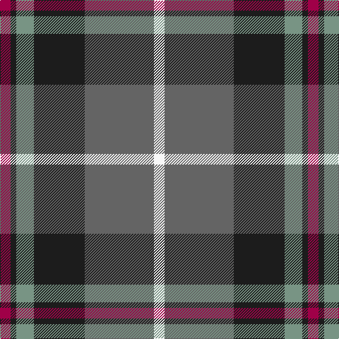

In pattern [RBGBBW](/patterns/rbgbbw/).

This was sourced from register-of-tartans.  It is a [6 stripes tartan](/stripes/stripes6/).

Original link https://www.tartanregister.gov.uk/tartanDetails.aspx?ref=11448

## Thread count
R/15 K8 LG25 K72 N98 W/15

## Palette
Each colour and its ΔE from the base-6 reference it is a variant of.

| Colour | Shade | Base | ΔE (OKLab) |
|---|---|---|---|
| K | <code style="background-color:#1C1C1C;">#1C1C1C</code> `#1C1C1C` | B <code style="background-color:#2A418A;">#2A418A</code> | 0.21 |
| LG | <code style="background-color:#789484;">#789484</code> `#789484` | G <code style="background-color:#006100;">#006100</code> | 0.24 |
| N | <code style="background-color:#646464;">#646464</code> `#646464` | B <code style="background-color:#2A418A;">#2A418A</code> | 0.16 |
| R | <code style="background-color:#A00048;">#A00048</code> `#A00048` | R <code style="background-color:#CC0000;">#CC0000</code> | 0.12 |
| W | <code style="background-color:#F8F8F8;">#F8F8F8</code> `#F8F8F8` | W <code style="background-color:#F7F7F7;">#F7F7F7</code> | 0.00 |

# Sample pattern

## Nearest tartans

The nearest existing variants by ΔTartan distance.

1. [Afternoon Tea / Darjeeling](/setts/s6/w15g98b72r25b8y15-b202060-g406054-r880000-wfcfcfc-yfccc00/) — ΔT 0.45
1. [Afternoon Tea / Darjeeling](/setts/s6/w15g98b72r25b8y15-b14283c-g005448-r800028-wf0e0c8-yffe600/) — ΔT 0.72
1. [Commonwealth Games Council (Corp.)](/setts/s6/r6k34b22r4ra40w4-b484848-k101010-rb468ac-ra888888-we0e0e0/) — ΔT 0.74
1. [Afternoon Tea / Afternoon Tea](/setts/s6/w15k8r25k72g98y15-g408060-k1c1714-r781638-we0e0e0-yc89800/) — ΔT 0.76
1. [Canine All Dogs](/setts/s6/r10b6g48ba48r8y4-b2888c4-ba2c2c80-g006818-rc80000-ye8c000/) — ΔT 0.76
1. [Ritchie, Stephen James (Personal)](/setts/s7/b8ba38y4k38ba4y50w4-b2888c4-ba5c5c5c-k101010-wc4c4c4-ya0a0a0/) — ΔT 0.79
1. [Balfour Family Tartan Tartan Number: 683. Earliest known date: 1984 Presented by William Balfour. See products available Copyright © Blair Urquhart, Comrie, 2015](/setts/s6/b60y6g22y6r66ra12-b2c2c80-g604000-r888888-rac80000-ye8c000/) — ΔT 0.89
1. [State Seal of Washington (Fashion)](/setts/s7/b10g56w10k40y10b94y8-b1474b4-g604000-k101010-we8ccb8-ybc8c00/) — ΔT 0.90
1. [Douglas, brown](/setts/s5/k14b6r60ba60w6-b5480b0-ba102040-k000000-r806050-we0e0e0/) — ΔT 0.95
1. [MacFadzean/MacPhedran](/setts/s7/g12b48w4k48g52r8g8-b2c2c80-g408060-k101010-rc80000-wf8f8f8/) — ΔT 0.96

## Neighbour map

Every grey dot is one of 15726 variants placed by the first two principal components of the ΔTartan feature space (44% of its variance). Red is this tartan; blue dots are its nearest — click one to open its page.

<svg viewBox="0 0 640 380" role="img" style="max-width:100%;height:auto;border:1px solid #e0e0e0;border-radius:4px;display:block" xmlns="http://www.w3.org/2000/svg"><image href="/nn/cloud.v1.png" width="640" height="380"/><a href="/setts/s6/w15g98b72r25b8y15-b202060-g406054-r880000-wfcfcfc-yfccc00/"><circle cx="199.7" cy="178.9" r="4" fill="#3465a4"><title>Afternoon Tea / Darjeeling</title></circle></a><a href="/setts/s6/w15g98b72r25b8y15-b14283c-g005448-r800028-wf0e0c8-yffe600/"><circle cx="202.4" cy="185.3" r="4" fill="#3465a4"><title>Afternoon Tea / Darjeeling</title></circle></a><a href="/setts/s6/r6k34b22r4ra40w4-b484848-k101010-rb468ac-ra888888-we0e0e0/"><circle cx="156.8" cy="190.0" r="4" fill="#3465a4"><title>Commonwealth Games Council (Corp.)</title></circle></a><a href="/setts/s6/w15k8r25k72g98y15-g408060-k1c1714-r781638-we0e0e0-yc89800/"><circle cx="198.3" cy="179.5" r="4" fill="#3465a4"><title>Afternoon Tea / Afternoon Tea</title></circle></a><a href="/setts/s6/r10b6g48ba48r8y4-b2888c4-ba2c2c80-g006818-rc80000-ye8c000/"><circle cx="214.9" cy="185.1" r="4" fill="#3465a4"><title>Canine All Dogs</title></circle></a><a href="/setts/s7/b8ba38y4k38ba4y50w4-b2888c4-ba5c5c5c-k101010-wc4c4c4-ya0a0a0/"><circle cx="171.8" cy="166.4" r="4" fill="#3465a4"><title>Ritchie, Stephen James (Personal)</title></circle></a><a href="/setts/s6/b60y6g22y6r66ra12-b2c2c80-g604000-r888888-rac80000-ye8c000/"><circle cx="195.8" cy="185.3" r="4" fill="#3465a4"><title>Balfour Family Tartan Tartan Number: 683. Earliest known date: 1984 Presented by William Balfour. See products available Copyright © Blair Urquhart, Comrie, 2015</title></circle></a><a href="/setts/s7/b10g56w10k40y10b94y8-b1474b4-g604000-k101010-we8ccb8-ybc8c00/"><circle cx="215.1" cy="174.3" r="4" fill="#3465a4"><title>State Seal of Washington (Fashion)</title></circle></a><a href="/setts/s5/k14b6r60ba60w6-b5480b0-ba102040-k000000-r806050-we0e0e0/"><circle cx="213.4" cy="200.1" r="4" fill="#3465a4"><title>Douglas, brown</title></circle></a><a href="/setts/s7/g12b48w4k48g52r8g8-b2c2c80-g408060-k101010-rc80000-wf8f8f8/"><circle cx="189.7" cy="184.5" r="4" fill="#3465a4"><title>MacFadzean/MacPhedran</title></circle></a><circle cx="208.6" cy="181.1" r="5" fill="#c00000"/></svg>

ID: /setts/s6/r15b8g25b72ba98w15-b1c1c1c-ba646464-g789484-ra00048-wf8f8f8/
