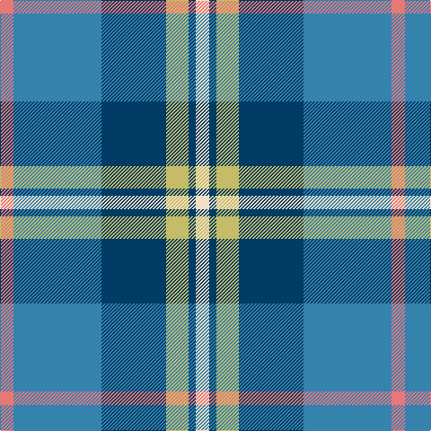

In pattern [RBBYBW](/patterns/rbbybw/).

This was sourced from register-of-tartans.  It is a [6 stripes tartan](/stripes/stripes6/).

Original link https://www.tartanregister.gov.uk/tartanDetails.aspx?ref=11277

## Register references

External register numbers recorded for this tartan.

- Scottish Register of Tartans: [11277](https://www.tartanregister.gov.uk/tartanDetails.aspx?ref=11277)

## Thread count
LR/15 B98 DB72 LG25 DB8 W/15

## Palette
Each colour and its ΔE from the base-6 reference it is a variant of.

| Colour | Shade | Base | ΔE (OKLab) |
|---|---|---|---|
| B | <code style="background-color:#3682AF;">#3682AF</code> `#3682AF` | B <code style="background-color:#2A418A;">#2A418A</code> | 0.19 |
| DB | <code style="background-color:#003C64;">#003C64</code> `#003C64` | B <code style="background-color:#2A418A;">#2A418A</code> | 0.08 |
| LG | <code style="background-color:#C4BC68;">#C4BC68</code> `#C4BC68` | Y <code style="background-color:#F2BF00;">#F2BF00</code> | 0.08 |
| LR | <code style="background-color:#E87878;">#E87878</code> `#E87878` | R <code style="background-color:#CC0000;">#CC0000</code> | 0.19 |
| W | <code style="background-color:#F0E0C8;">#F0E0C8</code> `#F0E0C8` | W <code style="background-color:#F7F7F7;">#F7F7F7</code> | 0.07 |

# Sample pattern

## Nearest tartans

The nearest existing variants by ΔTartan distance.

1. [Afternoon Tea / Mint Tea](/setts/s6/w15y98b72ba25b8ya15~b003c64-ba1474b4-wffffff-y48a4c0-yaf8e38c/) — ΔT 0.69
1. [Highlands Country Club](/setts/s7/g5b15ba11w2ba1w1ga4~b304080-ba5480b0-g008000-ga003000-we0e0e0~x4/) — ΔT 0.87
1. [Highlands Country Club Corporate Tartan Tartan Number: 687. Earliest known date: 1984 Weft uses a dark green. See products available Copyright © Blair Urquhart, Comrie, 2015](/setts/s7/g5b15ba11w2ba1w1ga4~b2c2c80-ba5c8ca8-g006818-ga003820-we0e0e0~x4/) — ΔT 0.88
1. [Eeraerts, Laurent (Personal)](/setts/s6/w3b12ba1g15r3w1~b3474fc-ba2c2c80-g006818-r9c68a4-wffffff~x4/) — ΔT 0.93
1. [Jamieson, Robert (Personal)](/setts/s5/w6y6b21ba32r3~b1474b4-ba003c64-rc8002c-wc0c0c0-ybc8c00~x2/) — ΔT 0.98
1. [Emond, Kenneth (Personal)](/setts/s5/b36ba21y4w12bb2~b003c64-ba5c8ca8-bb5a008c-wc0c0c0-yffe600~x2/) — ΔT 0.98
1. [State Seal of Washington (Fashion)](/setts/s7/b5g28w5k20y5b47y4~b1474b4-g604000-k101010-we8ccb8-ybc8c00~x2/) — ΔT 1.05
1. [Rhode Island, State of](/setts/s7/b4ba28b11w2b2g14y2~b14283c-ba1474b4-g408060-we0e0e0-ye8c000~x2/) — ΔT 1.06
1. [Sterling (Name)](/setts/s5/g11y10b11ba33w3~b003c64-ba1474b4-g006818-wfcfcfc-ybc8c00~x2/) — ΔT 1.06
1. [MacThomas](/setts/s7/b5r3b32k16g32ra3g5~b1474b4-g1b835d-k101010-rcb15ab-rabb62ce~x2/) — ΔT 1.07

## Neighbour map

Every grey dot is one of 15726 variants placed by the first two principal components of the ΔTartan feature space (44% of its variance). Red is this tartan; blue dots are its nearest — click one to open its page.

<svg viewBox="0 0 640 380" role="img" style="max-width:100%;height:auto;border:1px solid #e0e0e0;border-radius:4px;display:block" xmlns="http://www.w3.org/2000/svg"><image href="/nn/cloud.v1.png" width="640" height="380"/><a href="/setts/s6/w15y98b72ba25b8ya15~b003c64-ba1474b4-wffffff-y48a4c0-yaf8e38c/"><circle cx="189.5" cy="179.5" r="4" fill="#3465a4"><title>Afternoon Tea / Mint Tea</title></circle></a><a href="/setts/s7/g5b15ba11w2ba1w1ga4~b304080-ba5480b0-g008000-ga003000-we0e0e0~x4/"><circle cx="195.4" cy="173.1" r="4" fill="#3465a4"><title>Highlands Country Club</title></circle></a><a href="/setts/s7/g5b15ba11w2ba1w1ga4~b2c2c80-ba5c8ca8-g006818-ga003820-we0e0e0~x4/"><circle cx="188.2" cy="169.9" r="4" fill="#3465a4"><title>Highlands Country Club Corporate Tartan Tartan Number: 687. Earliest known date: 1984 Weft uses a dark green. See products available Copyright © Blair Urquhart, Comrie, 2015</title></circle></a><a href="/setts/s6/w3b12ba1g15r3w1~b3474fc-ba2c2c80-g006818-r9c68a4-wffffff~x4/"><circle cx="201.4" cy="163.9" r="4" fill="#3465a4"><title>Eeraerts, Laurent (Personal)</title></circle></a><a href="/setts/s5/w6y6b21ba32r3~b1474b4-ba003c64-rc8002c-wc0c0c0-ybc8c00~x2/"><circle cx="238.1" cy="210.2" r="4" fill="#3465a4"><title>Jamieson, Robert (Personal)</title></circle></a><a href="/setts/s5/b36ba21y4w12bb2~b003c64-ba5c8ca8-bb5a008c-wc0c0c0-yffe600~x2/"><circle cx="237.3" cy="179.1" r="4" fill="#3465a4"><title>Emond, Kenneth (Personal)</title></circle></a><a href="/setts/s7/b5g28w5k20y5b47y4~b1474b4-g604000-k101010-we8ccb8-ybc8c00~x2/"><circle cx="216.1" cy="174.6" r="4" fill="#3465a4"><title>State Seal of Washington (Fashion)</title></circle></a><a href="/setts/s7/b4ba28b11w2b2g14y2~b14283c-ba1474b4-g408060-we0e0e0-ye8c000~x2/"><circle cx="243.2" cy="175.8" r="4" fill="#3465a4"><title>Rhode Island, State of</title></circle></a><a href="/setts/s5/g11y10b11ba33w3~b003c64-ba1474b4-g006818-wfcfcfc-ybc8c00~x2/"><circle cx="226.0" cy="214.6" r="4" fill="#3465a4"><title>Sterling (Name)</title></circle></a><a href="/setts/s7/b5r3b32k16g32ra3g5~b1474b4-g1b835d-k101010-rcb15ab-rabb62ce~x2/"><circle cx="208.7" cy="192.9" r="4" fill="#3465a4"><title>MacThomas</title></circle></a><circle cx="205.2" cy="183.4" r="5" fill="#c00000"/></svg>

ID: /setts/s6/r15b98ba72y25ba8w15~b3682af-ba003c64-re87878-wf0e0c8-yc4bc68/
