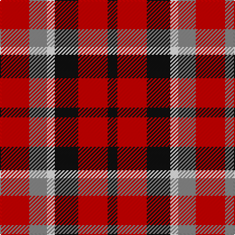

In pattern [KRKWRR](/stripes/krkwrr/).

This was sourced from register-of-tartans.  It is a [6 stripe tartan](/stripes/stripes6/).

Original link https://www.tartanregister.gov.uk/tartanDetails.aspx?ref=11069

## Attestations

This cloth appears in 2 source records; the oldest owns this page.

- 01/04/2014 — Eastern Kentucky University (register-of-tartans, [record](https://www.tartanregister.gov.uk/tartanDetails.aspx?ref=11069))
- 2014 — Eastern Kentucky University (tartans-authority, [record](http://www.tartansauthority.com/tartan-ferret/display/11069/))

## Register references

External register numbers recorded for this tartan.

- Scottish Register of Tartans: [11069](https://www.tartanregister.gov.uk/tartanDetails.aspx?ref=11069)

## Thread count
R/30 N18 W8 K24 R30 K/10

## Palette
Each colour and the base-6 reference it is a variant of.

| Colour | Shade | Base |
|---|---|---|
| K | <code style="background-color:#101010;">#101010</code> `oklch(17.3% 0.000 89.9)` <small>#101010</small> | K <code style="background-color:#000000;">#000000</code> |
| N | <code style="background-color:#888888;">#888888</code> `oklch(62.7% 0.000 89.9)` <small>#888888</small> | R <code style="background-color:#CC0000;">#CC0000</code> |
| R | <code style="background-color:#C80000;">#C80000</code> `oklch(52.3% 0.215 29.2)` <small>#C80000</small> | R <code style="background-color:#CC0000;">#CC0000</code> |
| W | <code style="background-color:#FFFFFF;">#FFFFFF</code> `oklch(100.0% 0.000 89.9)` <small>#FFFFFF</small> | W <code style="background-color:#F7F7F7;">#F7F7F7</code> |

# Sample pattern

## Nearest tartans

The nearest existing variants by ΔTartan distance, with this tartan at the top so the swatches line up against it.

ΔTartan

Tartan

Sett

—

<a href="/ttd/edit/#slug=r15o9w4k12r15k5~x2">Eastern Kentucky University</a> <a class="nn-out" href="/setts/s6/r15o9w4k12r15k5~x2/" title="open its dictionary page">↗</a>

1.36

<a href="/ttd/edit/#slug=r10db6k8dg10r6dg3r6~x2">MacDuff #3</a> <a class="nn-out" href="/setts/s7/r10db6k8dg10r6dg3r6~x2/" title="open its dictionary page">↗</a>

1.37

<a href="/ttd/edit/#slug=r25k13w8db5~x2">Hamby Sport (Personal)</a> <a class="nn-out" href="/setts/s4/r25k13w8db5~x2/" title="open its dictionary page">↗</a>

1.38

<a href="/ttd/edit/#slug=r8t3k4dg6r4k1r4~x2">MacDuff #5</a> <a class="nn-out" href="/setts/s7/r8t3k4dg6r4k1r4~x2/" title="open its dictionary page">↗</a>

1.42

<a href="/ttd/edit/#slug=r13dt13o5lo2dt13lo13~x2">Torana</a> <a class="nn-out" href="/setts/s6/r13dt13o5lo2dt13lo13~x2/" title="open its dictionary page">↗</a>

1.44

<a href="/ttd/edit/#slug=r8t3k4g6r4k1r4~x2">MacDuff</a> <a class="nn-out" href="/setts/s7/r8t3k4g6r4k1r4~x2/" title="open its dictionary page">↗</a>

1.44

<a href="/ttd/edit/#slug=r4dg4r1db4r4~x2">Gow</a> <a class="nn-out" href="/setts/s5/r4dg4r1db4r4~x2/" title="open its dictionary page">↗</a>

1.47

<a href="/ttd/edit/#slug=g12r11dp12r3dp8g8dp8~x2">Fiddes (Corrected)</a> <a class="nn-out" href="/setts/s7/g12r11dp12r3dp8g8dp8~x2/" title="open its dictionary page">↗</a>

1.51

<a href="/ttd/edit/#slug=r10db6k8g10r6g3r6~x2">MacDuff</a> <a class="nn-out" href="/setts/s7/r10db6k8g10r6g3r6~x2/" title="open its dictionary page">↗</a>

1.52

<a href="/ttd/edit/#slug=db5r17dg16k10db10r17db5~x2">MacNaughton (Logan)</a> <a class="nn-out" href="/setts/s7/db5r17dg16k10db10r17db5~x2/" title="open its dictionary page">↗</a>

1.53

<a href="/ttd/edit/#slug=dg9w1r9k9r9~x8">Unidentified item</a> <a class="nn-out" href="/setts/s5/dg9w1r9k9r9~x8/" title="open its dictionary page">↗</a>

## Neighbour map

Every grey dot is one of 14299 variants placed by the first two principal components of the ΔTartan feature space (44% of its variance). Red is this tartan; blue dots are its nearest — click one to open its page.

<svg viewBox="0 0 640 380" role="img" style="max-width:100%;height:auto;border:1px solid #e0e0e0;border-radius:4px;display:block" xmlns="http://www.w3.org/2000/svg"><image href="/nn/cloud.v1.png" width="640" height="380"/><a href="/setts/s7/r10db6k8dg10r6dg3r6~x2/"><circle cx="136.2" cy="289.3" r="4" fill="#3465a4"><title>MacDuff #3</title></circle></a><a href="/setts/s4/r25k13w8db5~x2/"><circle cx="195.6" cy="244.9" r="4" fill="#3465a4"><title>Hamby Sport (Personal)</title></circle></a><a href="/setts/s7/r8t3k4dg6r4k1r4~x2/"><circle cx="231.8" cy="232.8" r="4" fill="#3465a4"><title>MacDuff #5</title></circle></a><a href="/setts/s6/r13dt13o5lo2dt13lo13~x2/"><circle cx="163.6" cy="245.4" r="4" fill="#3465a4"><title>Torana</title></circle></a><a href="/setts/s7/r8t3k4g6r4k1r4~x2/"><circle cx="214.6" cy="228.7" r="4" fill="#3465a4"><title>MacDuff</title></circle></a><a href="/setts/s5/r4dg4r1db4r4~x2/"><circle cx="220.8" cy="309.4" r="4" fill="#3465a4"><title>Gow</title></circle></a><a href="/setts/s7/g12r11dp12r3dp8g8dp8~x2/"><circle cx="150.2" cy="281.0" r="4" fill="#3465a4"><title>Fiddes (Corrected)</title></circle></a><a href="/setts/s7/r10db6k8g10r6g3r6~x2/"><circle cx="115.7" cy="283.1" r="4" fill="#3465a4"><title>MacDuff</title></circle></a><a href="/setts/s7/db5r17dg16k10db10r17db5~x2/"><circle cx="131.3" cy="273.2" r="4" fill="#3465a4"><title>MacNaughton (Logan)</title></circle></a><a href="/setts/s5/dg9w1r9k9r9~x8/"><circle cx="212.4" cy="247.6" r="4" fill="#3465a4"><title>Unidentified item</title></circle></a><circle cx="173.6" cy="261.0" r="5" fill="#c00000"/></svg>

ID: /setts/s6/r15o9w4k12r15k5~x2/
