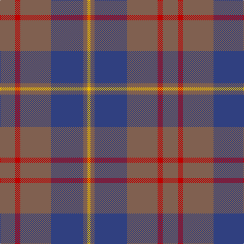

In pattern [RRRBRY](/patterns/rrrbry/).

This was sourced from weddslist.  It is a [6 stripes tartan](/stripes/stripes6/).

Original link http://www.weddslist.com/cgi-bin/tartans/pg.pl?source=sts

## Thread count
LT/30 R10 LT60 B64 LT8 Y/6

## Palette
Each colour and its ΔE from the base-6 reference it is a variant of.

| Colour | Shade | Base | ΔE (OKLab) |
|---|---|---|---|
| B | <code style="background-color:#304080;">#304080</code> `#304080` | B <code style="background-color:#2A418A;">#2A418A</code> | 0.02 |
| LT | <code style="background-color:#806050;">#806050</code> `#806050` | R <code style="background-color:#CC0000;">#CC0000</code> | 0.17 |
| R | <code style="background-color:#C00000;">#C00000</code> `#C00000` | R <code style="background-color:#CC0000;">#CC0000</code> | 0.03 |
| Y | <code style="background-color:#F0C000;">#F0C000</code> `#F0C000` | Y <code style="background-color:#F2BF00;">#F2BF00</code> | 0.00 |

# Sample pattern

## Nearest tartans

The nearest existing variants by ΔTartan distance.

1. [Devlin, Craig (Personal)](/setts/s6/g8w3b6ba11b30ba5~b5c5c5c-ba2c2c80-g006818-we0e0e0~x2/) — ΔT 1.10
1. [Dege of Saville Row](/setts/s6/g11b1g3ba1b9r1~b202060-ba2c2c80-g604000-rc80000~x4/) — ΔT 1.17
1. [Balfour blue & brown](/setts/s6/b18y2r6y2r19ra3~b304080-r806050-rac00000-yf0c000~x2/) — ΔT 1.18
1. [Cameron Hunting Brown Clan Tartan Tartan Number: 1745. Earliest known date: 1916 Nothing See products available Copyright © Blair Urquhart, Comrie, 2015](/setts/s6/g15r5g30b32g4y3~b2c2c80-g604000-rc80000-ye8c000~x2/) — ΔT 1.25
1. [Cameron Hunting](/setts/s6/b15r5b30ba32b4y3~b4c3428-ba1474b4-rc80000-yd09800~x2/) — ΔT 1.28
1. [MacArthur-Fox, dress](/setts/s6/b2r16ba3r3ba13ra2~b5480b0-ba304080-r800000-rac00000~x4/) — ΔT 1.42
1. [London Regiment](/setts/s6/g34b27r3b27g34w3~b2c2c80-g603800-rc80000-wfcfcfc~x2/) — ΔT 1.52
1. [Dama Classic](/setts/s8/g30y3g3y3g12b30k3b5~b2e2e2e-g615e57-k181818-ye2d1a3~x2/) — ΔT 1.57
1. [Rob Roy (Film) (Corporate)](/setts/s6/b3g1b10g4ga10b2~b708490-g003820-ga604000~x4/) — ΔT 1.57
1. [Unidentified 21](/setts/s7/b13k3b20r70b20r30w3~b304080-k000000-r806050-we0e0e0~x2/) — ΔT 1.60

## Neighbour map

Every grey dot is one of 15726 variants placed by the first two principal components of the ΔTartan feature space (44% of its variance). Red is this tartan; blue dots are its nearest — click one to open its page.

<svg viewBox="0 0 640 380" role="img" style="max-width:100%;height:auto;border:1px solid #e0e0e0;border-radius:4px;display:block" xmlns="http://www.w3.org/2000/svg"><image href="/nn/cloud.v1.png" width="640" height="380"/><a href="/setts/s6/g8w3b6ba11b30ba5~b5c5c5c-ba2c2c80-g006818-we0e0e0~x2/"><circle cx="356.0" cy="236.1" r="4" fill="#3465a4"><title>Devlin, Craig (Personal)</title></circle></a><a href="/setts/s6/g11b1g3ba1b9r1~b202060-ba2c2c80-g604000-rc80000~x4/"><circle cx="398.6" cy="237.4" r="4" fill="#3465a4"><title>Dege of Saville Row</title></circle></a><a href="/setts/s6/b18y2r6y2r19ra3~b304080-r806050-rac00000-yf0c000~x2/"><circle cx="316.2" cy="222.9" r="4" fill="#3465a4"><title>Balfour blue &amp; brown</title></circle></a><a href="/setts/s6/g15r5g30b32g4y3~b2c2c80-g604000-rc80000-ye8c000~x2/"><circle cx="354.7" cy="231.9" r="4" fill="#3465a4"><title>Cameron Hunting Brown Clan Tartan Tartan Number: 1745. Earliest known date: 1916 Nothing See products available Copyright © Blair Urquhart, Comrie, 2015</title></circle></a><a href="/setts/s6/b15r5b30ba32b4y3~b4c3428-ba1474b4-rc80000-yd09800~x2/"><circle cx="347.4" cy="231.0" r="4" fill="#3465a4"><title>Cameron Hunting</title></circle></a><a href="/setts/s6/b2r16ba3r3ba13ra2~b5480b0-ba304080-r800000-rac00000~x4/"><circle cx="347.4" cy="239.4" r="4" fill="#3465a4"><title>MacArthur-Fox, dress</title></circle></a><a href="/setts/s6/g34b27r3b27g34w3~b2c2c80-g603800-rc80000-wfcfcfc~x2/"><circle cx="342.4" cy="250.9" r="4" fill="#3465a4"><title>London Regiment</title></circle></a><a href="/setts/s8/g30y3g3y3g12b30k3b5~b2e2e2e-g615e57-k181818-ye2d1a3~x2/"><circle cx="334.2" cy="207.3" r="4" fill="#3465a4"><title>Dama Classic</title></circle></a><a href="/setts/s6/b3g1b10g4ga10b2~b708490-g003820-ga604000~x4/"><circle cx="333.0" cy="260.1" r="4" fill="#3465a4"><title>Rob Roy (Film) (Corporate)</title></circle></a><a href="/setts/s7/b13k3b20r70b20r30w3~b304080-k000000-r806050-we0e0e0~x2/"><circle cx="460.1" cy="198.0" r="4" fill="#3465a4"><title>Unidentified 21</title></circle></a><circle cx="378.2" cy="238.7" r="5" fill="#c00000"/></svg>

ID: /setts/s6/r15ra5r30b32r4y3~b304080-r806050-rac00000-yf0c000~x2/
