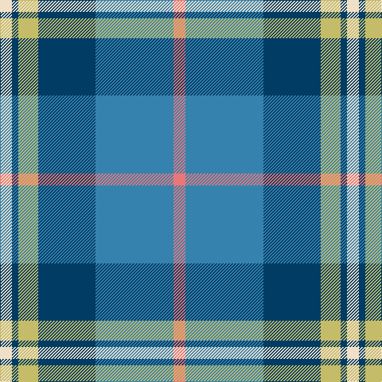

In pattern [RBBYBW](/stripes/rbbybw/).

This was sourced from register-of-tartans.  It is a [6 stripe tartan](/stripes/stripes6/).

Original link https://www.tartanregister.gov.uk/tartanDetails.aspx?ref=11277

## Register references

External register numbers recorded for this tartan.

- Scottish Register of Tartans: [11277](https://www.tartanregister.gov.uk/tartanDetails.aspx?ref=11277)

## Thread count
W/15 DB8 LG25 DB72 B98 LR/15

## Palette
Each colour and the base-6 reference it is a variant of.

| Colour | Shade | Base |
|---|---|---|
| B | <code style="background-color:#3682AF;">#3682AF</code> `oklch(57.9% 0.101 238.2)` <small>#3682AF</small> | B <code style="background-color:#2A418A;">#2A418A</code> |
| DB | <code style="background-color:#003C64;">#003C64</code> `oklch(34.5% 0.089 246.0)` <small>#003C64</small> | B <code style="background-color:#2A418A;">#2A418A</code> |
| LG | <code style="background-color:#C4BC68;">#C4BC68</code> `oklch(78.4% 0.107 103.7)` <small>#C4BC68</small> | Y <code style="background-color:#F2BF00;">#F2BF00</code> |
| LR | <code style="background-color:#E87878;">#E87878</code> `oklch(70.0% 0.139 21.2)` <small>#E87878</small> | R <code style="background-color:#CC0000;">#CC0000</code> |
| W | <code style="background-color:#F0E0C8;">#F0E0C8</code> `oklch(91.3% 0.036 78.1)` <small>#F0E0C8</small> | W <code style="background-color:#F7F7F7;">#F7F7F7</code> |

# Sample pattern

## Nearest tartans

The nearest existing variants by ΔTartan distance.

1. [Afternoon Tea / Mint Tea](/setts/s6/w15lg98dt72b25dt8ly15/) — ΔT 0.69
1. [Highlands Country Club](/setts/s7/g5db15t11w2t1w1dg4~x4/) — ΔT 0.87
1. [Eeraerts, Laurent (Personal)](/setts/s6/w3b12db1g15m3w1~x4/) — ΔT 0.93
1. [Jamieson, Robert (Personal)](/setts/s5/lb6lo6b21dt32r3~x2/) — ΔT 0.98
1. [Emond, Kenneth (Personal)](/setts/s5/dt36t21ly4lb12dp2~x2/) — ΔT 0.98
1. [State Seal of Washington (Fashion)](/setts/s7/b5dy28lb5k20lo5b47lo4~x2/) — ΔT 1.05
1. [Rhode Island, State of](/setts/s7/dt4b28dt11w2dt2g14ly2~x2/) — ΔT 1.06
1. [Sterling (Name)](/setts/s5/g11lo10dt11b33w3~x2/) — ΔT 1.06
1. [MacThomas](/setts/s7/g5m3g32k16b32m3b5~x2/) — ΔT 1.07
1. [DeLoughery (Personal)](/setts/s6/db20k6lo4db3g20w2~x2/) — ΔT 1.08

## Neighbour map

Every grey dot is one of 14299 variants placed by the first two principal components of the ΔTartan feature space (44% of its variance). Red is this tartan; blue dots are its nearest — click one to open its page.

<svg viewBox="0 0 640 380" role="img" style="max-width:100%;height:auto;border:1px solid #e0e0e0;border-radius:4px;display:block" xmlns="http://www.w3.org/2000/svg"><image href="/nn/cloud.v1.png" width="640" height="380"/><a href="/setts/s6/w15lg98dt72b25dt8ly15/"><circle cx="193.2" cy="181.5" r="4" fill="#3465a4"><title>Afternoon Tea / Mint Tea</title></circle></a><a href="/setts/s7/g5db15t11w2t1w1dg4~x4/"><circle cx="198.8" cy="178.2" r="4" fill="#3465a4"><title>Highlands Country Club</title></circle></a><a href="/setts/s6/w3b12db1g15m3w1~x4/"><circle cx="205.0" cy="164.7" r="4" fill="#3465a4"><title>Eeraerts, Laurent (Personal)</title></circle></a><a href="/setts/s5/lb6lo6b21dt32r3~x2/"><circle cx="241.1" cy="213.8" r="4" fill="#3465a4"><title>Jamieson, Robert (Personal)</title></circle></a><a href="/setts/s5/dt36t21ly4lb12dp2~x2/"><circle cx="240.4" cy="179.8" r="4" fill="#3465a4"><title>Emond, Kenneth (Personal)</title></circle></a><a href="/setts/s7/b5dy28lb5k20lo5b47lo4~x2/"><circle cx="219.0" cy="176.9" r="4" fill="#3465a4"><title>State Seal of Washington (Fashion)</title></circle></a><a href="/setts/s7/dt4b28dt11w2dt2g14ly2~x2/"><circle cx="246.6" cy="181.4" r="4" fill="#3465a4"><title>Rhode Island, State of</title></circle></a><a href="/setts/s5/g11lo10dt11b33w3~x2/"><circle cx="229.0" cy="218.8" r="4" fill="#3465a4"><title>Sterling (Name)</title></circle></a><a href="/setts/s7/g5m3g32k16b32m3b5~x2/"><circle cx="212.2" cy="198.7" r="4" fill="#3465a4"><title>MacThomas</title></circle></a><a href="/setts/s6/db20k6lo4db3g20w2~x2/"><circle cx="206.8" cy="203.1" r="4" fill="#3465a4"><title>DeLoughery (Personal)</title></circle></a><circle cx="208.3" cy="186.1" r="5" fill="#c00000"/></svg>

ID: /setts/s6/r15t98dt72ly25dt8w15/
