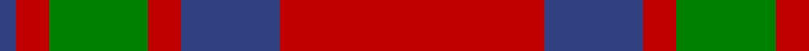
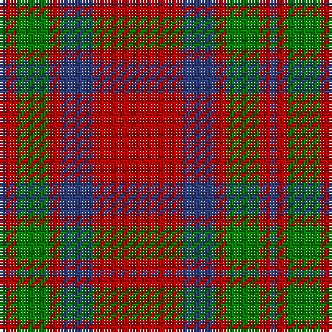

In pattern [BRGRBR](/patterns/brgrbr/).

This was sourced from weddslist.  It is a [6 stripes tartan](/stripes/stripes6/).

Original link http://www.weddslist.com/cgi-bin/tartans/pg.pl?source=sts

## Thread count
B/2 R4 G12 R4 B12 R/32

## Palette
Each colour and its ΔE from the base-6 reference it is a variant of.

| Colour | Shade | Base | ΔE (OKLab) |
|---|---|---|---|
| B | <code style="background-color:#304080;">#304080</code> `#304080` | B <code style="background-color:#2A418A;">#2A418A</code> | 0.02 |
| G | <code style="background-color:#008000;">#008000</code> `#008000` | G <code style="background-color:#006100;">#006100</code> | 0.10 |
| R | <code style="background-color:#C00000;">#C00000</code> `#C00000` | R <code style="background-color:#CC0000;">#CC0000</code> | 0.03 |

# Sample pattern

## Nearest tartans

The nearest existing variants by ΔTartan distance.

1. [MacKintosh Plaid](/setts/s6/r16b6r2g6r2b1x2~b2c2c80-g285800-rc80000/) — ΔT 0.43
1. [MacKintosh Clan Tartan Tartan Number: 521. Earliest known date: 1815 D.C. Stewart wrote, "This is one of the few ancient tartans too well authenticated to admit of doubt or question." The earliest publication is attributed to Logan but he may well have known of the sample, sealed with signature of the chief, which existed in the collection of the Highland Society of London, dating around 1815. The chief of the MacKintoshes is also chief of Clan Chattan. Logan wrote, "The chief also wears a particular tartan of a very showy pattern", which has now been registered with Lord Lyon (1947) as 'Clan Chattan (Chief)'. The clan tartan has likewise been registered as 'Clan Chattan'. See products available Copyright © Blair Urquhart, Comrie, 2015](/setts/s6/r22b5r2g11r3b1x2~b2c2c80-g006818-rc80000/) — ΔT 0.59
1. [Grant of Lurg](/setts/s6/b2r25g10r2b10r2x2~b304080-g008000-rc00000/) — ΔT 0.60
1. [MacKintosh 3](/setts/s6/r68b18r9g34r9b3x2~b304080-g008000-rc00000/) — ΔT 0.63
1. [MacKintosh](/setts/s6/r70b20r10g40r10b3~b2c2c80-g006818-rc80000/) — ΔT 0.63
1. [MacKintosh 1](/setts/s6/r22b5r2g11r3b1x2~b304080-g008000-rc00000/) — ΔT 0.67
1. [Grant of Lurg Artifact Tartan Tartan Number: 527. Earliest known date: pre 1859 Owned by the family Dunbar. Count not given. A plaid. Previously marked 'Unidentified' See products available Copyright © Blair Urquhart, Comrie, 2015](/setts/s6/b2r25g10r2b10r2x2~b2c2c80-g006818-rc80000/) — ΔT 0.72
1. [MacKintosh #2](/setts/s6/r68b18r9g34r9b3x2~b2c4084-g005020-rdc0000/) — ΔT 0.74
1. [Auld Reekie](/setts/s6/b4r3b3r22g8r2x2~b2c2c80-g006818-rc80000/) — ΔT 0.82
1. [Crawford](/setts/s7/r6w2r30g12r3g12r3x2~g006818-ra00048-wc0c0c0/) — ΔT 0.86

## Neighbour map

Every grey dot is one of 15726 variants placed by the first two principal components of the ΔTartan feature space (44% of its variance). Red is this tartan; blue dots are its nearest — click one to open its page.

<svg viewBox="0 0 640 380" role="img" style="max-width:100%;height:auto;border:1px solid #e0e0e0;border-radius:4px;display:block" xmlns="http://www.w3.org/2000/svg"><image href="/nn/cloud.v1.png" width="640" height="380"/><a href="/setts/s6/r16b6r2g6r2b1x2~b2c2c80-g285800-rc80000/"><circle cx="403.3" cy="203.0" r="4" fill="#3465a4"><title>MacKintosh Plaid</title></circle></a><a href="/setts/s6/r22b5r2g11r3b1x2~b2c2c80-g006818-rc80000/"><circle cx="424.6" cy="186.8" r="4" fill="#3465a4"><title>MacKintosh Clan Tartan Tartan Number: 521. Earliest known date: 1815 D.C. Stewart wrote, &quot;This is one of the few ancient tartans too well authenticated to admit of doubt or question.&quot; The earliest publication is attributed to Logan but he may well have known of the sample, sealed with signature of the chief, which existed in the collection of the Highland Society of London, dating around 1815. The chief of the MacKintoshes is also chief of Clan Chattan. Logan wrote, &quot;The chief also wears a particular tartan of a very showy pattern&quot;, which has now been registered with Lord Lyon (1947) as 'Clan Chattan (Chief)'. The clan tartan has likewise been registered as 'Clan Chattan'. See products available Copyright © Blair Urquhart, Comrie, 2015</title></circle></a><a href="/setts/s6/b2r25g10r2b10r2x2~b304080-g008000-rc00000/"><circle cx="370.3" cy="208.9" r="4" fill="#3465a4"><title>Grant of Lurg</title></circle></a><a href="/setts/s6/r68b18r9g34r9b3x2~b304080-g008000-rc00000/"><circle cx="419.5" cy="190.6" r="4" fill="#3465a4"><title>MacKintosh 3</title></circle></a><a href="/setts/s6/r70b20r10g40r10b3~b2c2c80-g006818-rc80000/"><circle cx="401.5" cy="190.7" r="4" fill="#3465a4"><title>MacKintosh</title></circle></a><a href="/setts/s6/r22b5r2g11r3b1x2~b304080-g008000-rc00000/"><circle cx="425.5" cy="188.1" r="4" fill="#3465a4"><title>MacKintosh 1</title></circle></a><a href="/setts/s6/b2r25g10r2b10r2x2~b2c2c80-g006818-rc80000/"><circle cx="365.9" cy="206.3" r="4" fill="#3465a4"><title>Grant of Lurg Artifact Tartan Tartan Number: 527. Earliest known date: pre 1859 Owned by the family Dunbar. Count not given. A plaid. Previously marked 'Unidentified' See products available Copyright © Blair Urquhart, Comrie, 2015</title></circle></a><a href="/setts/s6/r68b18r9g34r9b3x2~b2c4084-g005020-rdc0000/"><circle cx="413.3" cy="184.8" r="4" fill="#3465a4"><title>MacKintosh #2</title></circle></a><a href="/setts/s6/b4r3b3r22g8r2x2~b2c2c80-g006818-rc80000/"><circle cx="418.0" cy="211.2" r="4" fill="#3465a4"><title>Auld Reekie</title></circle></a><a href="/setts/s7/r6w2r30g12r3g12r3x2~g006818-ra00048-wc0c0c0/"><circle cx="426.8" cy="205.8" r="4" fill="#3465a4"><title>Crawford</title></circle></a><circle cx="403.1" cy="204.4" r="5" fill="#c00000"/></svg>

ID: /setts/s6/r16b6r2g6r2b1x2~b304080-g008000-rc00000/
