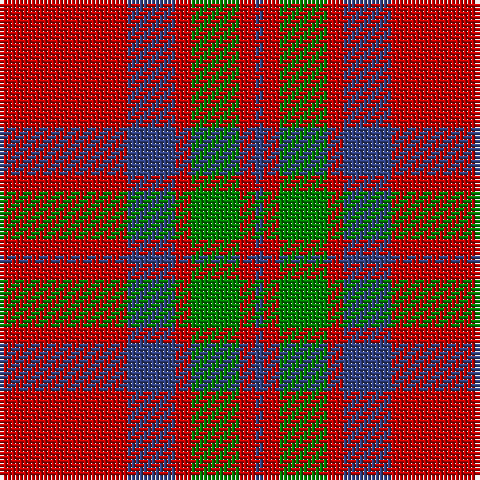

In pattern [BRGRBR](/stripes/brgrbr/).

This was sourced from weddslist.  It is a [6 stripe tartan](/stripes/stripes6/).

Original link http://www.weddslist.com/cgi-bin/tartans/pg.pl?source=sts

## Thread count
R/32 B12 R4 G12 R4 B/2

## Palette
Each colour and the base-6 reference it is a variant of.

| Colour | Shade | Base |
|---|---|---|
| B | <code style="background-color:#304080;">#304080</code> `oklch(39.4% 0.109 270.2)` <small>#304080</small> | B <code style="background-color:#2A418A;">#2A418A</code> |
| G | <code style="background-color:#008000;">#008000</code> `oklch(52.0% 0.177 142.5)` <small>#008000</small> | G <code style="background-color:#006100;">#006100</code> |
| R | <code style="background-color:#C00000;">#C00000</code> `oklch(50.7% 0.208 29.2)` <small>#C00000</small> | R <code style="background-color:#CC0000;">#CC0000</code> |

# Sample pattern

## Nearest tartans

The nearest existing variants by ΔTartan distance.

1. [MacKintosh Plaid](/setts/s6/r16db6r2dg6r2db1~x2/) — ΔT 0.44
1. [Grant of Lurg](/setts/s6/db2r25g10r2db10r2~x2/) — ΔT 0.60
1. [MacKintosh 3](/setts/s6/r68db18r9g34r9db3~x2/) — ΔT 0.63
1. [MacKintosh](/setts/s6/r70db20r10g40r10db3/) — ΔT 0.63
1. [MacKintosh 1](/setts/s6/r22db5r2g11r3db1~x2/) — ΔT 0.67
1. [MacKintosh #2](/setts/s6/r68db18r9dg34r9db3~x2/) — ΔT 0.74
1. [Auld Reekie](/setts/s6/db4r3db3r22g8r2~x2/) — ΔT 0.82
1. [Crawford](/setts/s7/m6lb2m30g12m3g12m3~x2/) — ΔT 0.86
1. [Crawford (Clan)](/setts/s7/m6w2m30g12m3g12m3~x2/) — ΔT 0.86
1. [Robertson - 1988 (Corporate)](/setts/s7/r2db1r16db4r1g10r1~x4/) — ΔT 0.89

## Neighbour map

Every grey dot is one of 14299 variants placed by the first two principal components of the ΔTartan feature space (44% of its variance). Red is this tartan; blue dots are its nearest — click one to open its page.

<svg viewBox="0 0 640 380" role="img" style="max-width:100%;height:auto;border:1px solid #e0e0e0;border-radius:4px;display:block" xmlns="http://www.w3.org/2000/svg"><image href="/nn/cloud.v1.png" width="640" height="380"/><a href="/setts/s6/r16db6r2dg6r2db1~x2/"><circle cx="402.9" cy="199.9" r="4" fill="#3465a4"><title>MacKintosh Plaid</title></circle></a><a href="/setts/s6/db2r25g10r2db10r2~x2/"><circle cx="370.3" cy="206.8" r="4" fill="#3465a4"><title>Grant of Lurg</title></circle></a><a href="/setts/s6/r68db18r9g34r9db3~x2/"><circle cx="419.1" cy="187.8" r="4" fill="#3465a4"><title>MacKintosh 3</title></circle></a><a href="/setts/s6/r70db20r10g40r10db3/"><circle cx="401.2" cy="187.7" r="4" fill="#3465a4"><title>MacKintosh</title></circle></a><a href="/setts/s6/r22db5r2g11r3db1~x2/"><circle cx="425.0" cy="185.2" r="4" fill="#3465a4"><title>MacKintosh 1</title></circle></a><a href="/setts/s6/r68db18r9dg34r9db3~x2/"><circle cx="412.7" cy="180.5" r="4" fill="#3465a4"><title>MacKintosh #2</title></circle></a><a href="/setts/s6/db4r3db3r22g8r2~x2/"><circle cx="417.3" cy="207.2" r="4" fill="#3465a4"><title>Auld Reekie</title></circle></a><a href="/setts/s7/m6lb2m30g12m3g12m3~x2/"><circle cx="426.8" cy="203.4" r="4" fill="#3465a4"><title>Crawford</title></circle></a><a href="/setts/s7/m6w2m30g12m3g12m3~x2/"><circle cx="420.8" cy="200.3" r="4" fill="#3465a4"><title>Crawford (Clan)</title></circle></a><a href="/setts/s7/r2db1r16db4r1g10r1~x4/"><circle cx="375.6" cy="177.4" r="4" fill="#3465a4"><title>Robertson - 1988 (Corporate)</title></circle></a><circle cx="402.7" cy="201.7" r="5" fill="#c00000"/></svg>

ID: /setts/s6/r16db6r2g6r2db1~x2/
