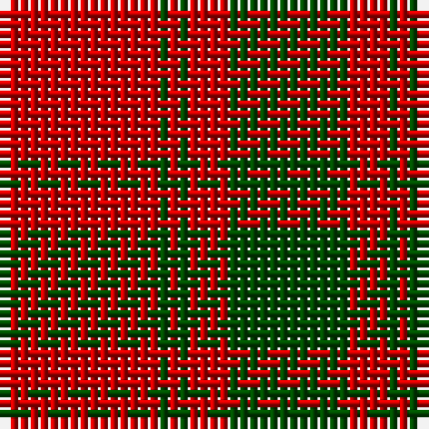

**Bands:** [RGRGRG](/stripes/rgrgrg/) · **Stripes:** [R DG R DG R DG](/stripes/stripes6/) R DG R DG R DG

This was sourced from weddslist.  It is a [6 band tartan](/bands/bands6/).

Original link http://www.weddslist.com/cgi-bin/tartans/pg.pl?source=rb

## Also known as

This cloth is also recorded under:

- MacQuarrie
- MacQuarrie #5

## Attestations

This cloth appears in 2 source records; the oldest owns this page.

- undated — MacQuarrie (weddslist, [record](http://www.weddslist.com/cgi-bin/tartans/pg.pl?source=rb))
- undated — MacQuarie (weddslist, [record](http://www.weddslist.com/cgi-bin/tartans/pg.pl?source=x))

## Register references

External register numbers recorded for this tartan.

- Scottish Register of Tartans: [1166](https://www.tartanregister.gov.uk/tartanDetails.aspx?ref=1166)
- Scottish Register of Tartans: [1758](https://www.tartanregister.gov.uk/tartanDetails.aspx?ref=1758)
- Scottish Register of Tartans: [2307](https://www.tartanregister.gov.uk/tartanDetails.aspx?ref=2307)
- Scottish Register of Tartans: [2540](https://www.tartanregister.gov.uk/tartanDetails.aspx?ref=2540)
- Scottish Register of Tartans: [2625](https://www.tartanregister.gov.uk/tartanDetails.aspx?ref=2625)
- Scottish Register of Tartans: [2666](https://www.tartanregister.gov.uk/tartanDetails.aspx?ref=2666)
- Scottish Register of Tartans: [2862](https://www.tartanregister.gov.uk/tartanDetails.aspx?ref=2862)
- Scottish Register of Tartans: [3808](https://www.tartanregister.gov.uk/tartanDetails.aspx?ref=3808)
- Scottish Register of Tartans: [982](https://www.tartanregister.gov.uk/tartanDetails.aspx?ref=982)
- Scottish Tartans Authority (ITI): 1429
- Scottish Tartans Authority (ITI): 218
- Scottish Tartans World Register: 1010
- Scottish Tartans World Register: 1042
- Scottish Tartans World Register: 127
- Scottish Tartans World Register: 1429
- Scottish Tartans World Register: 1585
- Scottish Tartans World Register: 218
- Scottish Tartans World Register: 2218
- Scottish Tartans World Register: 737
- Scottish Tartans World Register: 897

## Variants

Other setts woven to the same stripe pattern.

- [Erskine](/setts/s6/dg6r1dg24r28dg1r4~x2/)
- [MacQuarrie 7](/setts/s6/r16dg1r1dg1r4dg12~x2/)
- [Unidentified NW Highlands](/setts/s6/dg2r2dg15r16dg2r2~x2/)

## Thread count
R/16 G1 R1 G1 R4 G/12

## Palette
Each colour and its ΔE from the base-6 reference it is a variant of.

| Colour | Shade | Base | ΔE (OKLab) |
|---|---|---|---|
| G | <code style="background-color:#004C00;">#004C00</code> `#004C00` | G <code style="background-color:#006100;">#006100</code> | 0.07 |
| R | <code style="background-color:#C80000;">#C80000</code> `#C80000` | R <code style="background-color:#CC0000;">#CC0000</code> | 0.01 |

# Sample pattern

## Nearest tartans

The nearest existing variants by ΔTartan distance.

1. [MacQuarrie 7](/setts/s6/r16dg1r1dg1r4dg12~x2/) — ΔT 0.31
1. [MacQuarrie #5](/setts/s6/r16g1r1g1r4g12~x4/) — ΔT 0.43
1. [Cameron](/setts/s6/r2dg6r2dg6r16ly1~x2/) — ΔT 0.97
1. [Cameron (Clan)](/setts/s6/r2g6r2g6r16ly1~x4/) — ΔT 1.01
1. [Crawford](/setts/s7/r6lb2r30dg12r3dg12r3/) — ΔT 1.01
1. [Cameron Clan D](/setts/s6/r1dg6r1dg6r15ly1~x2/) — ΔT 1.03
1. [Cameron](/setts/s6/r2g6r2g6r16ly1~x2/) — ΔT 1.14
1. [Livingstone](/setts/s10/dg14r4dg2r2dg2r4dg19r30dg2r9~x2/) — ΔT 1.17
1. [Erskine](/setts/s6/dg6r1dg24r28dg1r4~x2/) — ΔT 1.21
1. [MacKintosh 1](/setts/s6/r22db5r2g11r3db1~x2/) — ΔT 1.25

## Neighbour map

Every grey dot is one of 14299 variants placed by the first two principal components of the ΔTartan feature space (44% of its variance). Red is this tartan; blue dots are its nearest — click one to open its page.

<svg viewBox="0 0 640 380" role="img" style="max-width:100%;height:auto;border:1px solid #e0e0e0;border-radius:4px;display:block" xmlns="http://www.w3.org/2000/svg"><image href="/nn/cloud.v1.png" width="640" height="380"/><a href="/setts/s6/r16dg1r1dg1r4dg12~x2/"><circle cx="455.0" cy="215.4" r="4" fill="#3465a4"><title>MacQuarrie 7</title></circle></a><a href="/setts/s6/r16g1r1g1r4g12~x4/"><circle cx="456.7" cy="215.1" r="4" fill="#3465a4"><title>MacQuarrie #5</title></circle></a><a href="/setts/s6/r2dg6r2dg6r16ly1~x2/"><circle cx="414.6" cy="198.6" r="4" fill="#3465a4"><title>Cameron</title></circle></a><a href="/setts/s6/r2g6r2g6r16ly1~x4/"><circle cx="421.8" cy="202.2" r="4" fill="#3465a4"><title>Cameron (Clan)</title></circle></a><a href="/setts/s7/r6lb2r30dg12r3dg12r3/"><circle cx="417.2" cy="193.4" r="4" fill="#3465a4"><title>Crawford</title></circle></a><a href="/setts/s6/r1dg6r1dg6r15ly1~x2/"><circle cx="394.4" cy="195.3" r="4" fill="#3465a4"><title>Cameron Clan D</title></circle></a><a href="/setts/s6/r2g6r2g6r16ly1~x2/"><circle cx="416.7" cy="200.8" r="4" fill="#3465a4"><title>Cameron</title></circle></a><a href="/setts/s10/dg14r4dg2r2dg2r4dg19r30dg2r9~x2/"><circle cx="409.1" cy="187.6" r="4" fill="#3465a4"><title>Livingstone</title></circle></a><a href="/setts/s6/dg6r1dg24r28dg1r4~x2/"><circle cx="434.3" cy="195.1" r="4" fill="#3465a4"><title>Erskine</title></circle></a><a href="/setts/s6/r22db5r2g11r3db1~x2/"><circle cx="425.0" cy="185.2" r="4" fill="#3465a4"><title>MacKintosh 1</title></circle></a><circle cx="451.9" cy="212.8" r="5" fill="#c00000"/></svg>

ID: /setts/s6/r16dg1r1dg1r4dg12/
