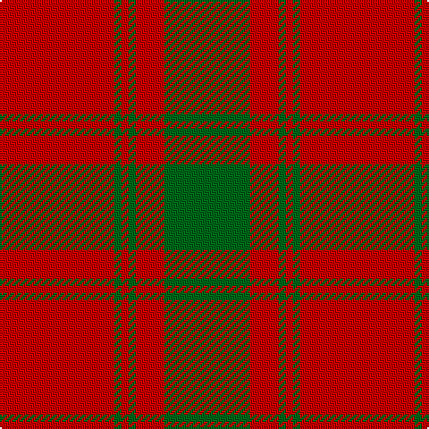

This page is one **sett** — a single exact thread-count. It belongs to the [tartan](/tartans/r16g1r1g1r4g12/)
(the same proportion at any scale), whose colour order is pattern [GRGRGR](/stripes/grgrgr/).

Sourced from register-of-tartans.  It is a [6 stripe tartan](/stripes/stripes6/).

Original link https://www.tartanregister.gov.uk/tartanDetails.aspx?ref=2732

## Also known as

This cloth is also recorded under:

- MacQuarrie
- MacQuarrie #5

2 attestations — the source records this cloth was collapsed from (oldest owns this page)

<ul>
<li>01/01/1886 — MacQuarrie #5 (register-of-tartans, <a href="https://www.tartanregister.gov.uk/tartanDetails.aspx?ref=2732">record</a>)</li>
<li>1886 — MacQuarrie - 1886 (Clan) (tartans-authority, <a href="http://www.tartansauthority.com/tartan-ferret/display/892/">record</a>)</li>
</ul>

## Register references

External register numbers recorded for this tartan.

- Scottish Register of Tartans: [2732](https://www.tartanregister.gov.uk/tartanDetails.aspx?ref=2732)
- Scottish Tartans Authority (ITI): 892
- Scottish Tartans World Register: 892

## Thread count
R/64 G4 R4 G4 R16 G/48

## Palette

Palette: <strong>Tartan Register</strong>
<table><thead><tr><th>Colour</th><th>Threads</th><th>Shade</th><th>Base</th><th>OKLCh</th></tr></thead><tbody><tr><td>R/</td><td style="text-align:right;font-variant-numeric:tabular-nums">64</td><td><code style="background-color:#C80000;">#C80000</code> <small style="color:#888">#C80000</small></td><td>R <code style="background-color:#CC0000;">#CC0000</code></td><td><small style="color:#888">oklch(52.3% 0.215 29.2)</small></td></tr><tr><td>G</td><td style="text-align:right;font-variant-numeric:tabular-nums">4</td><td><code style="background-color:#006818;">#006818</code> <small style="color:#888">#006818</small></td><td>G <code style="background-color:#006100;">#006100</code></td><td><small style="color:#888">oklch(45.0% 0.142 145.0)</small></td></tr><tr><td>R</td><td style="text-align:right;font-variant-numeric:tabular-nums">4</td><td><code style="background-color:#C80000;">#C80000</code> <small style="color:#888">#C80000</small></td><td>R <code style="background-color:#CC0000;">#CC0000</code></td><td><small style="color:#888">oklch(52.3% 0.215 29.2)</small></td></tr><tr><td>G</td><td style="text-align:right;font-variant-numeric:tabular-nums">4</td><td><code style="background-color:#006818;">#006818</code> <small style="color:#888">#006818</small></td><td>G <code style="background-color:#006100;">#006100</code></td><td><small style="color:#888">oklch(45.0% 0.142 145.0)</small></td></tr><tr><td>R</td><td style="text-align:right;font-variant-numeric:tabular-nums">16</td><td><code style="background-color:#C80000;">#C80000</code> <small style="color:#888">#C80000</small></td><td>R <code style="background-color:#CC0000;">#CC0000</code></td><td><small style="color:#888">oklch(52.3% 0.215 29.2)</small></td></tr><tr><td>G/</td><td style="text-align:right;font-variant-numeric:tabular-nums">48</td><td><code style="background-color:#006818;">#006818</code> <small style="color:#888">#006818</small></td><td>G <code style="background-color:#006100;">#006100</code></td><td><small style="color:#888">oklch(45.0% 0.142 145.0)</small></td></tr></tbody></table>

# Sample pattern

## Nearest tartans

The nearest existing variants by ΔTartan distance, with this tartan at the top so the swatches line up against it.

ΔTartan

Tartan

Sett

—

<a href="/ttd/edit/#slug=r16g1r1g1r4g12~x4">MacQuarrie #5</a> <a class="nn-out" href="/setts/s6/r16g1r1g1r4g12~x4/" title="open its dictionary page">↗</a>

0.43

<a href="/ttd/edit/#slug=r16dg1r1dg1r4dg12">MacQuarrie</a> <a class="nn-out" href="/setts/s6/r16dg1r1dg1r4dg12/" title="open its dictionary page">↗</a>

0.64

<a href="/ttd/edit/#slug=r16dg1r1dg1r4dg12~x2">MacQuarrie 7</a> <a class="nn-out" href="/setts/s6/r16dg1r1dg1r4dg12~x2/" title="open its dictionary page">↗</a>

0.95

<a href="/ttd/edit/#slug=r2g6r2g6r16ly1~x4">Cameron (Clan)</a> <a class="nn-out" href="/setts/s6/r2g6r2g6r16ly1~x4/" title="open its dictionary page">↗</a>

1.02

<a href="/ttd/edit/#slug=r2g6r2g6r16ly1~x2">Cameron</a> <a class="nn-out" href="/setts/s6/r2g6r2g6r16ly1~x2/" title="open its dictionary page">↗</a>

1.09

<a href="/ttd/edit/#slug=r2dg6r2dg6r16ly1~x2">Cameron</a> <a class="nn-out" href="/setts/s6/r2dg6r2dg6r16ly1~x2/" title="open its dictionary page">↗</a>

1.14

<a href="/ttd/edit/#slug=r6lb2r30dg12r3dg12r3">Crawford</a> <a class="nn-out" href="/setts/s7/r6lb2r30dg12r3dg12r3/" title="open its dictionary page">↗</a>

1.15

<a href="/ttd/edit/#slug=r1dg6r1dg6r15ly1~x2">Cameron Clan D</a> <a class="nn-out" href="/setts/s6/r1dg6r1dg6r15ly1~x2/" title="open its dictionary page">↗</a>

1.20

<a href="/ttd/edit/#slug=r48db2r3g28r4db2~x2">MacKintosh 2</a> <a class="nn-out" href="/setts/s6/r48db2r3g28r4db2~x2/" title="open its dictionary page">↗</a>

1.24

<a href="/ttd/edit/#slug=dy48lo9dy6lo9dy12lo4dy2lo16~x2">Yellow Pencil (Corporate)</a> <a class="nn-out" href="/setts/s8/dy48lo9dy6lo9dy12lo4dy2lo16~x2/" title="open its dictionary page">↗</a>

1.24

<a href="/ttd/edit/#slug=g6r1g24r28g1r4~x2">Erskine (Vestiarium Scoticum)</a> <a class="nn-out" href="/setts/s6/g6r1g24r28g1r4~x2/" title="open its dictionary page">↗</a>

## Neighbour map

Every grey dot is one of 14299 variants placed by the first two principal components of the ΔTartan feature space (44% of its variance). Red is this tartan; blue dots are its nearest — click one to open its page.

<svg viewBox="0 0 640 380" role="img" style="max-width:100%;height:auto;border:1px solid #e0e0e0;border-radius:4px;display:block" xmlns="http://www.w3.org/2000/svg"><image href="/nn/cloud.v1.png" width="640" height="380"/><a href="/setts/s6/r16dg1r1dg1r4dg12/"><circle cx="451.9" cy="212.8" r="4" fill="#3465a4"><title>MacQuarrie</title></circle></a><a href="/setts/s6/r16dg1r1dg1r4dg12~x2/"><circle cx="455.0" cy="215.4" r="4" fill="#3465a4"><title>MacQuarrie 7</title></circle></a><a href="/setts/s6/r2g6r2g6r16ly1~x4/"><circle cx="421.8" cy="202.2" r="4" fill="#3465a4"><title>Cameron (Clan)</title></circle></a><a href="/setts/s6/r2g6r2g6r16ly1~x2/"><circle cx="416.7" cy="200.8" r="4" fill="#3465a4"><title>Cameron</title></circle></a><a href="/setts/s6/r2dg6r2dg6r16ly1~x2/"><circle cx="414.6" cy="198.6" r="4" fill="#3465a4"><title>Cameron</title></circle></a><a href="/setts/s7/r6lb2r30dg12r3dg12r3/"><circle cx="417.2" cy="193.4" r="4" fill="#3465a4"><title>Crawford</title></circle></a><a href="/setts/s6/r1dg6r1dg6r15ly1~x2/"><circle cx="394.4" cy="195.3" r="4" fill="#3465a4"><title>Cameron Clan D</title></circle></a><a href="/setts/s6/r48db2r3g28r4db2~x2/"><circle cx="466.9" cy="170.2" r="4" fill="#3465a4"><title>MacKintosh 2</title></circle></a><a href="/setts/s8/dy48lo9dy6lo9dy12lo4dy2lo16~x2/"><circle cx="476.5" cy="188.9" r="4" fill="#3465a4"><title>Yellow Pencil (Corporate)</title></circle></a><a href="/setts/s6/g6r1g24r28g1r4~x2/"><circle cx="444.6" cy="199.6" r="4" fill="#3465a4"><title>Erskine (Vestiarium Scoticum)</title></circle></a><circle cx="456.7" cy="215.1" r="5" fill="#c00000"/></svg>

ID: /setts/s6/r16g1r1g1r4g12~x4/
