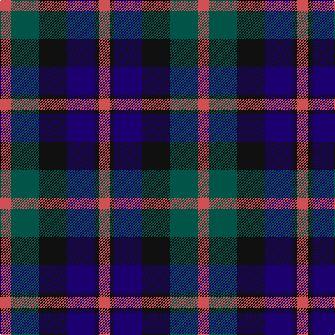

In pattern [RGKBKR](/patterns/rgkbkr/).

This was sourced from tartans-authority.  It is a [6 stripes tartan](/stripes/stripes6/).

Original link http://www.tartansauthority.com/tartan-ferret/display/3017/

## Attestations

This cloth appears in 2 source records; the oldest owns this page.

- pre 2002 — Atholl Highlanders (Military) (tartans-authority, [record](http://www.tartansauthority.com/tartan-ferret/display/3017/))
- undated — Atholl Highlanders (register-of-tartans, [record](https://www.tartanregister.gov.uk/tartanDetails.aspx?ref=5144))

## Thread count
DO/16 G40 K40 DB40 K6 DO/16

## Palette
Each colour and its ΔE from the base-6 reference it is a variant of.

| Colour | Shade | Base | ΔE (OKLab) |
|---|---|---|---|
| DB | <code style="background-color:#1C0070;">#1C0070</code> `#1C0070` | B <code style="background-color:#2C4084;">#2C4084</code> | 0.14 |
| DO | <code style="background-color:#D05054;">#D05054</code> `#D05054` | R <code style="background-color:#C80000;">#C80000</code> | 0.10 |
| G | <code style="background-color:#005448;">#005448</code> `#005448` | G <code style="background-color:#006400;">#006400</code> | 0.11 |
| K | <code style="background-color:#101010;">#101010</code> `#101010` | K <code style="background-color:#000000;">#000000</code> | 0.17 |

# Sample pattern

ID: /setts/s6/r16g40k40b40k6r16-b1c0070-g005448-k101010-rd05054/
