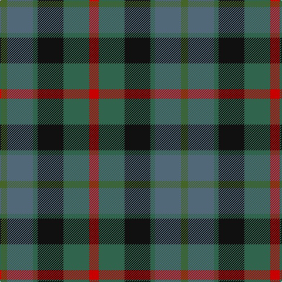

In pattern [GBGKGR](/patterns/gbgkgr/).

This was sourced from register-of-tartans.  It is a [6 stripes tartan](/stripes/stripes6/).

Original link https://www.tartanregister.gov.uk/tartanDetails.aspx?ref=586

## Thread count
G/12 N44 Ga8 K44 Ga44 R/16

## Palette
Each colour and its ΔE from the base-6 reference it is a variant of.

| Colour | Shade | Base | ΔE (OKLab) |
|---|---|---|---|
| G | <code style="background-color:#446428;">#446428</code> `#446428` | G <code style="background-color:#006100;">#006100</code> | 0.07 |
| Ga | <code style="background-color:#30644C;">#30644C</code> `#30644C` | G <code style="background-color:#006100;">#006100</code> | 0.09 |
| K | <code style="background-color:#101010;">#101010</code> `#101010` | K <code style="background-color:#000000;">#000000</code> | 0.17 |
| N | <code style="background-color:#506878;">#506878</code> `#506878` | B <code style="background-color:#2A418A;">#2A418A</code> | 0.14 |
| R | <code style="background-color:#C80000;">#C80000</code> `#C80000` | R <code style="background-color:#CC0000;">#CC0000</code> | 0.01 |

# Sample pattern

## Nearest tartans

The nearest existing variants by ΔTartan distance.

1. [Birse](/setts/s6/k8g32k28y6b32r8-b105880-g00643c-k101010-rc80000-ybc8c00/) — ΔT 0.87
1. [Tennant (Clan)](/setts/s7/r4g28b28k28ga28g28r4-b1474b4-g604000-ga006818-k101010-rc80000/) — ΔT 0.91
1. [Tennant Family Tartan Tartan Number: 1653. Earliest known date: 1930 MacGregor-Hastie made few notes about his sample collection. In December 1967, Captain Tennant wrote to the Scottish Tartans Society, saying, ".. and I have no objection to other Tennants wearing it (Tennant tartan) but their problem will be to get hold of it ... I don't know of any other Tennant tartan and that is why I think my father designed this one." The head of the Tennant family is Lord Glenconner, descended from John Tennant of Blairston, Ayr. (1635). See products available Copyright © Blair Urquhart, Comrie, 2015](/setts/s7/r4g28b28k28ga28g28r4-b2c2c80-g604000-ga006818-k101010-rc80000/) — ΔT 0.98
1. [Breon (Jersey Shore, Pennsylvania) (Personal)](/setts/s5/b50g50k12ba20r12-b5f749c-ba433a5a-g23321b-k1c1714-rb62531/) — ΔT 1.01
1. [Forres](/setts/s6/g8y4g20k16b20r4-b4c3428-g006818-k101010-r880000-yd09800/) — ΔT 1.20
1. [Styrian (Fashion)](/setts/s5/g16b38ga58r32ra8-b5c5c5c-g006818-ga003820-r888888-ra880000/) — ΔT 1.20
1. [Casely (Name)](/setts/s6/r16g44k44g8b44y12-b506878-g30644c-k101010-re87878-ye0b000/) — ΔT 1.23
1. [Rothesay](/setts/s7/g8b24y4k20ga20y6ga4-b5c5c5c-g006818-ga8c7038-k101010-yd09800/) — ΔT 1.25
1. [McEachem (Name)](/setts/s6/b28w4r24ba40g40w4-b5c5c5c-ba003c64-g006818-rc80000-we0e0e0/) — ΔT 1.25
1. [Saorsa (Corporate)](/setts/s6/b22g30k4ba10bb6ba22-b202060-ba5c5c5c-bb1c0070-g408060-k101010/) — ΔT 1.27

## Neighbour map

Every grey dot is one of 15726 variants placed by the first two principal components of the ΔTartan feature space (44% of its variance). Red is this tartan; blue dots are its nearest — click one to open its page.

<svg viewBox="0 0 640 380" role="img" style="max-width:100%;height:auto;border:1px solid #e0e0e0;border-radius:4px;display:block" xmlns="http://www.w3.org/2000/svg"><image href="/nn/cloud.v1.png" width="640" height="380"/><a href="/setts/s6/k8g32k28y6b32r8-b105880-g00643c-k101010-rc80000-ybc8c00/"><circle cx="123.6" cy="250.2" r="4" fill="#3465a4"><title>Birse</title></circle></a><a href="/setts/s7/r4g28b28k28ga28g28r4-b1474b4-g604000-ga006818-k101010-rc80000/"><circle cx="148.8" cy="248.6" r="4" fill="#3465a4"><title>Tennant (Clan)</title></circle></a><a href="/setts/s7/r4g28b28k28ga28g28r4-b2c2c80-g604000-ga006818-k101010-rc80000/"><circle cx="164.8" cy="255.2" r="4" fill="#3465a4"><title>Tennant Family Tartan Tartan Number: 1653. Earliest known date: 1930 MacGregor-Hastie made few notes about his sample collection. In December 1967, Captain Tennant wrote to the Scottish Tartans Society, saying, &quot;.. and I have no objection to other Tennants wearing it (Tennant tartan) but their problem will be to get hold of it ... I don't know of any other Tennant tartan and that is why I think my father designed this one.&quot; The head of the Tennant family is Lord Glenconner, descended from John Tennant of Blairston, Ayr. (1635). See products available Copyright © Blair Urquhart, Comrie, 2015</title></circle></a><a href="/setts/s5/b50g50k12ba20r12-b5f749c-ba433a5a-g23321b-k1c1714-rb62531/"><circle cx="161.1" cy="276.0" r="4" fill="#3465a4"><title>Breon (Jersey Shore, Pennsylvania) (Personal)</title></circle></a><a href="/setts/s6/g8y4g20k16b20r4-b4c3428-g006818-k101010-r880000-yd09800/"><circle cx="164.0" cy="263.8" r="4" fill="#3465a4"><title>Forres</title></circle></a><a href="/setts/s5/g16b38ga58r32ra8-b5c5c5c-g006818-ga003820-r888888-ra880000/"><circle cx="191.9" cy="266.3" r="4" fill="#3465a4"><title>Styrian (Fashion)</title></circle></a><a href="/setts/s6/r16g44k44g8b44y12-b506878-g30644c-k101010-re87878-ye0b000/"><circle cx="95.5" cy="240.7" r="4" fill="#3465a4"><title>Casely (Name)</title></circle></a><a href="/setts/s7/g8b24y4k20ga20y6ga4-b5c5c5c-g006818-ga8c7038-k101010-yd09800/"><circle cx="101.7" cy="225.6" r="4" fill="#3465a4"><title>Rothesay</title></circle></a><a href="/setts/s6/b28w4r24ba40g40w4-b5c5c5c-ba003c64-g006818-rc80000-we0e0e0/"><circle cx="127.2" cy="218.6" r="4" fill="#3465a4"><title>McEachem (Name)</title></circle></a><a href="/setts/s6/b22g30k4ba10bb6ba22-b202060-ba5c5c5c-bb1c0070-g408060-k101010/"><circle cx="182.1" cy="254.4" r="4" fill="#3465a4"><title>Saorsa (Corporate)</title></circle></a><circle cx="129.7" cy="258.2" r="5" fill="#c00000"/></svg>

ID: /setts/s6/r16g44k44g8b44ga12-b506878-g30644c-ga446428-k101010-rc80000/
