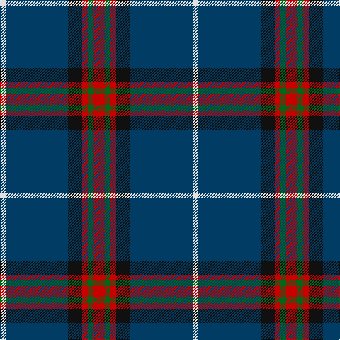

In pattern [RGRKBW](/patterns/rgrkbw/).

This was sourced from register-of-tartans.  It is a [6 stripes tartan](/stripes/stripes6/).

Original link https://www.tartanregister.gov.uk/tartanDetails.aspx?ref=3485

## Attestations

This cloth appears in 2 source records; the oldest owns this page.

- 01/01/2006 — Reese (Personal) (register-of-tartans, [record](https://www.tartanregister.gov.uk/tartanDetails.aspx?ref=3485))
- pre 2006 — Reese (Personal) (tartans-authority, [record](http://www.tartansauthority.com/tartan-ferret/display/6915/))

## Thread count
LN/8 DB88 K20 R8 G8 R/16

## Palette
Each colour and its ΔE from the base-6 reference it is a variant of.

| Colour | Shade | Base | ΔE (OKLab) |
|---|---|---|---|
| DB | <code style="background-color:#003C64;">#003C64</code> `#003C64` | B <code style="background-color:#2A418A;">#2A418A</code> | 0.08 |
| G | <code style="background-color:#006818;">#006818</code> `#006818` | G <code style="background-color:#006100;">#006100</code> | 0.02 |
| K | <code style="background-color:#101010;">#101010</code> `#101010` | K <code style="background-color:#000000;">#000000</code> | 0.17 |
| LN | <code style="background-color:#E0E0E0;">#E0E0E0</code> `#E0E0E0` | W <code style="background-color:#F7F7F7;">#F7F7F7</code> | 0.07 |
| R | <code style="background-color:#C80000;">#C80000</code> `#C80000` | R <code style="background-color:#CC0000;">#CC0000</code> | 0.01 |

# Sample pattern

## Nearest tartans

The nearest existing variants by ΔTartan distance.

1. [Vance (Family Association)](/setts/s6/r16b96w8g52b8k12-b304080-g008000-k000000-rc00000-we0e0e0/) — ΔT 0.96
1. [Glasgow, University of](/setts/s8/b4w4k4y4k14g8b44k4-b2c2c80-g006818-k101010-we0e0e0-ybc8c00/) — ΔT 1.04
1. [City of Rome Pipe Band (Corporate)](/setts/s7/r12y6k88b45k6b6ya6-b2c2c80-k101010-r901c38-yd87c00-yae8c000/) — ΔT 1.14
1. [Croy, Jake (Personal)](/setts/s8/b20k14w4wa4k54ba14w4ba14-b505050-ba1870a4-k1c1714-w82cffd-wae8ccb8/) — ΔT 1.14
1. [Burt #2 (Name)](/setts/s9/b16w4k16g24r4b6r4b48r4-b2c2c80-g006818-k101010-rc80000-we0e0e0/) — ΔT 1.18
1. [Marion (Personal)](/setts/s6/b10g16k10ba64w4r4-b9050d8-ba1c1c50-g006818-k101010-rc80000-we0e0e0/) — ΔT 1.23
1. [Glen Moray](/setts/s8/b4y4b52ya12g12ya12r4ya4-b2c2c80-g8c7038-rc80000-ybc8c00-yaa08858/) — ΔT 1.23
1. [Dege, of Saville Row](/setts/s6/r44b4r12ba4b36ra4-b000050-ba304080-r806050-rac00000/) — ΔT 1.25
1. [Chestico](/setts/s7/b40g2b2g2ga16k2w6-b202060-g603800-ga003820-k101010-wfcfcfc/) — ΔT 1.27
1. [Glasgow, University of](/setts/s8/b4w4k4g4k14ga8b44k4-b304080-g908000-ga008000-k000000-we0e0e0/) — ΔT 1.28

## Neighbour map

Every grey dot is one of 15726 variants placed by the first two principal components of the ΔTartan feature space (44% of its variance). Red is this tartan; blue dots are its nearest — click one to open its page.

<svg viewBox="0 0 640 380" role="img" style="max-width:100%;height:auto;border:1px solid #e0e0e0;border-radius:4px;display:block" xmlns="http://www.w3.org/2000/svg"><image href="/nn/cloud.v1.png" width="640" height="380"/><a href="/setts/s6/r16b96w8g52b8k12-b304080-g008000-k000000-rc00000-we0e0e0/"><circle cx="273.9" cy="176.7" r="4" fill="#3465a4"><title>Vance (Family Association)</title></circle></a><a href="/setts/s8/b4w4k4y4k14g8b44k4-b2c2c80-g006818-k101010-we0e0e0-ybc8c00/"><circle cx="298.8" cy="162.9" r="4" fill="#3465a4"><title>Glasgow, University of</title></circle></a><a href="/setts/s7/r12y6k88b45k6b6ya6-b2c2c80-k101010-r901c38-yd87c00-yae8c000/"><circle cx="332.8" cy="163.5" r="4" fill="#3465a4"><title>City of Rome Pipe Band (Corporate)</title></circle></a><a href="/setts/s8/b20k14w4wa4k54ba14w4ba14-b505050-ba1870a4-k1c1714-w82cffd-wae8ccb8/"><circle cx="263.0" cy="166.5" r="4" fill="#3465a4"><title>Croy, Jake (Personal)</title></circle></a><a href="/setts/s9/b16w4k16g24r4b6r4b48r4-b2c2c80-g006818-k101010-rc80000-we0e0e0/"><circle cx="284.0" cy="168.2" r="4" fill="#3465a4"><title>Burt #2 (Name)</title></circle></a><a href="/setts/s6/b10g16k10ba64w4r4-b9050d8-ba1c1c50-g006818-k101010-rc80000-we0e0e0/"><circle cx="314.2" cy="149.3" r="4" fill="#3465a4"><title>Marion (Personal)</title></circle></a><a href="/setts/s8/b4y4b52ya12g12ya12r4ya4-b2c2c80-g8c7038-rc80000-ybc8c00-yaa08858/"><circle cx="303.2" cy="154.3" r="4" fill="#3465a4"><title>Glen Moray</title></circle></a><a href="/setts/s6/r44b4r12ba4b36ra4-b000050-ba304080-r806050-rac00000/"><circle cx="327.1" cy="206.2" r="4" fill="#3465a4"><title>Dege, of Saville Row</title></circle></a><a href="/setts/s7/b40g2b2g2ga16k2w6-b202060-g603800-ga003820-k101010-wfcfcfc/"><circle cx="348.7" cy="141.5" r="4" fill="#3465a4"><title>Chestico</title></circle></a><a href="/setts/s8/b4w4k4g4k14ga8b44k4-b304080-g908000-ga008000-k000000-we0e0e0/"><circle cx="271.9" cy="153.0" r="4" fill="#3465a4"><title>Glasgow, University of</title></circle></a><circle cx="319.3" cy="174.5" r="5" fill="#c00000"/></svg>

ID: /setts/s6/r16g8r8k20b88w8-b003c64-g006818-k101010-rc80000-we0e0e0/
