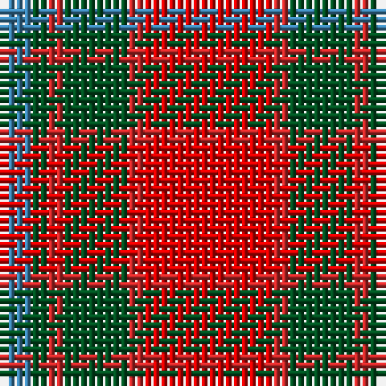

In pattern [BGRGRR](/patterns/bgrgrr/).

This was sourced from register-of-tartans.  It is a [6 stripes tartan](/stripes/stripes6/).

Original link https://www.tartanregister.gov.uk/tartanDetails.aspx?ref=3008

## Thread count
B/4 G2 R2 G8 R2 Ra/16

## Palette
Each colour and its ΔE from the base-6 reference it is a variant of.

| Colour | Shade | Base | ΔE (OKLab) |
|---|---|---|---|
| B | <code style="background-color:#3C82AF;">#3C82AF</code> `#3C82AF` | B <code style="background-color:#2C4084;">#2C4084</code> | 0.20 |
| G | <code style="background-color:#005020;">#005020</code> `#005020` | G <code style="background-color:#006400;">#006400</code> | 0.08 |
| R | <code style="background-color:#C82828;">#C82828</code> `#C82828` | R <code style="background-color:#C80000;">#C80000</code> | 0.03 |
| Ra | <code style="background-color:#DC0000;">#DC0000</code> `#DC0000` | R <code style="background-color:#C80000;">#C80000</code> | 0.04 |

# Sample pattern

ID: /setts/s6/r16ra2g8ra2g2b4-b3c82af-g005020-rdc0000-rac82828/
