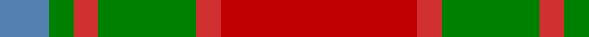
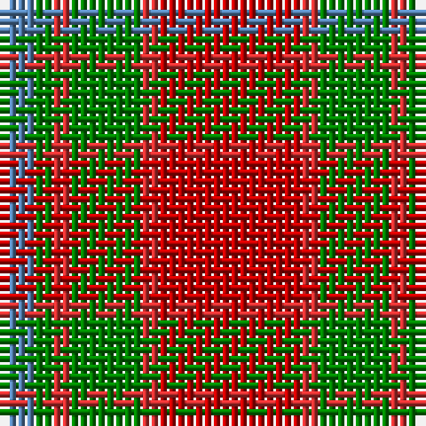

In pattern [BGRGRR](/patterns/bgrgrr/).

This was sourced from weddslist.  It is a [6 stripes tartan](/stripes/stripes6/).

Original link http://www.weddslist.com/cgi-bin/tartans/pg.pl?source=sts

## Thread count
B/4 G2 R2 G8 R2 Ra/16

## Palette
Each colour and its ΔE from the base-6 reference it is a variant of.

| Colour | Shade | Base | ΔE (OKLab) |
|---|---|---|---|
| B | <code style="background-color:#5480B0;">#5480B0</code> `#5480B0` | B <code style="background-color:#2A418A;">#2A418A</code> | 0.19 |
| G | <code style="background-color:#008000;">#008000</code> `#008000` | G <code style="background-color:#006100;">#006100</code> | 0.10 |
| R | <code style="background-color:#D03030;">#D03030</code> `#D03030` | R <code style="background-color:#CC0000;">#CC0000</code> | 0.04 |
| Ra | <code style="background-color:#C00000;">#C00000</code> `#C00000` | R <code style="background-color:#CC0000;">#CC0000</code> | 0.03 |

# Sample pattern

## Nearest tartans

The nearest existing variants by ΔTartan distance.

1. [Moray of Abercairney](/setts/s6/r16ra2g8ra2g2b4-b3c82af-g005020-rdc0000-rac82828/) — ΔT 0.64
1. [Lennox](/setts/s7/g8y4g40r8ra40r4ra8-g006818-r880000-rac80000-yb8b8b8/) — ΔT 0.95
1. [Lennox District Tartan Tartan Number: 935. Earliest known date: pre 1600 Families with the surname 'Lennox' are usually considered related to Clans Stewart or MacFarlane. Some of this surname also choose to wear the distinctive and ancient 'Lennox' tartan. D W Stewart reproduced the sett from a 'lost' portrait of the Countess of Lennox dating from the 16th century. See products available Copyright © Blair Urquhart, Comrie, 2015](/setts/s7/g4w2g20r4ra20r2ra4-g006818-r880000-rac80000-we0e0e0/) — ΔT 1.03
1. [Moray of Abercairney](/setts/s5/r16ra2g8ra2b8-b304080-g008000-rc00000-rad03030/) — ΔT 1.05
1. [Loch Rannoch #2](/setts/s8/g48ga4g10r28ga4r10y34g4-g604000-ga289c18-re86000-ydc943c/) — ΔT 1.13
1. [MacNab 5](/setts/s7/g12r4ra4g8ra4r24k2-g008000-k000000-rc00000-ra900030/) — ΔT 1.14
1. [MacNab 6](/setts/s7/g56r14ra14g28ra14r96k8-g008000-k000000-rc00000-ra802040/) — ΔT 1.21
1. [MacNab #3](/setts/s7/g12r4ra4g8ra4r24k2-g005020-k101010-rdc0000-ra960028/) — ΔT 1.22
1. [Manhattan Ethnic](/setts/s7/y72b30y18r62ya10b8r32-b441800-re87878-ya08858-yabc8c00/) — ΔT 1.23
1. [MacNab (Crimson)](/setts/s7/g56r14ra14g28ra14r96k8-g005020-k101010-rdc0000-ra781c38/) — ΔT 1.24

## Neighbour map

Every grey dot is one of 15726 variants placed by the first two principal components of the ΔTartan feature space (44% of its variance). Red is this tartan; blue dots are its nearest — click one to open its page.

<svg viewBox="0 0 640 380" role="img" style="max-width:100%;height:auto;border:1px solid #e0e0e0;border-radius:4px;display:block" xmlns="http://www.w3.org/2000/svg"><image href="/nn/cloud.v1.png" width="640" height="380"/><a href="/setts/s6/r16ra2g8ra2g2b4-b3c82af-g005020-rdc0000-rac82828/"><circle cx="271.5" cy="207.6" r="4" fill="#3465a4"><title>Moray of Abercairney</title></circle></a><a href="/setts/s7/g8y4g40r8ra40r4ra8-g006818-r880000-rac80000-yb8b8b8/"><circle cx="284.2" cy="196.5" r="4" fill="#3465a4"><title>Lennox</title></circle></a><a href="/setts/s7/g4w2g20r4ra20r2ra4-g006818-r880000-rac80000-we0e0e0/"><circle cx="276.4" cy="193.0" r="4" fill="#3465a4"><title>Lennox District Tartan Tartan Number: 935. Earliest known date: pre 1600 Families with the surname 'Lennox' are usually considered related to Clans Stewart or MacFarlane. Some of this surname also choose to wear the distinctive and ancient 'Lennox' tartan. D W Stewart reproduced the sett from a 'lost' portrait of the Countess of Lennox dating from the 16th century. See products available Copyright © Blair Urquhart, Comrie, 2015</title></circle></a><a href="/setts/s5/r16ra2g8ra2b8-b304080-g008000-rc00000-rad03030/"><circle cx="242.3" cy="233.9" r="4" fill="#3465a4"><title>Moray of Abercairney</title></circle></a><a href="/setts/s8/g48ga4g10r28ga4r10y34g4-g604000-ga289c18-re86000-ydc943c/"><circle cx="268.1" cy="186.4" r="4" fill="#3465a4"><title>Loch Rannoch #2</title></circle></a><a href="/setts/s7/g12r4ra4g8ra4r24k2-g008000-k000000-rc00000-ra900030/"><circle cx="287.8" cy="190.2" r="4" fill="#3465a4"><title>MacNab 5</title></circle></a><a href="/setts/s7/g56r14ra14g28ra14r96k8-g008000-k000000-rc00000-ra802040/"><circle cx="288.9" cy="186.7" r="4" fill="#3465a4"><title>MacNab 6</title></circle></a><a href="/setts/s7/g12r4ra4g8ra4r24k2-g005020-k101010-rdc0000-ra960028/"><circle cx="297.9" cy="191.0" r="4" fill="#3465a4"><title>MacNab #3</title></circle></a><a href="/setts/s7/y72b30y18r62ya10b8r32-b441800-re87878-ya08858-yabc8c00/"><circle cx="245.0" cy="218.3" r="4" fill="#3465a4"><title>Manhattan Ethnic</title></circle></a><a href="/setts/s7/g56r14ra14g28ra14r96k8-g005020-k101010-rdc0000-ra781c38/"><circle cx="297.9" cy="187.4" r="4" fill="#3465a4"><title>MacNab (Crimson)</title></circle></a><circle cx="278.0" cy="212.9" r="5" fill="#c00000"/></svg>

ID: /setts/s6/r16ra2g8ra2g2b4-b5480b0-g008000-rc00000-rad03030/
